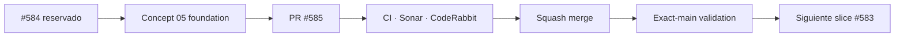

# BRVTAL — Último deploy

  
  
  

> **Development dashboard** · snapshot de **solo el deploy actual** para Issue #584 / PR #585.

## Progress convention

- ✅ ~~Struck through~~ = completed and verified through the required delivery gates.
- 🚧 Normal text = pending or currently in progress.

## Estado del deploy

| Señal | Estado | Evidencia |
| --- | --- | --- |
| Work line | 🚧 **#584 · Concept 05 foundation** | PR #585 · parent #583 |
| Base exacta | ✅ ~~main validado~~ | `6e21a23c3418d2ba91483009aca79dddc3daf233` |
| Versión | 🚧 **0.1.25** | cambio de producto/runtime público |
| Producción | 🚧 pendiente de merge + observación | sin migración de datos |

## Huella del cambio

<!-- brvtal:git-delta -->

| Archivos | Inserciones | Eliminaciones | Neto |
| ---: | ---: | ---: | ---: |
| **10** | **+905** | **−45** | **+860** |

## Calidad y entrega

<!-- brvtal:gate-plan -->

| Control | Estado / contrato |
| --- | --- |
| Gates | **preflight · coordination · fast[PHP+JS] · database · chromium · real-stack · webkit** |
| Reservation | Issue #584 · `work/issue-584` · UUID activo en PR |
| PR integrity | **PR + snapshot exacto** contra `main` |
| BRVTAL CI | 🚧 head actual: contratos, Chromium, MariaDB y real-stack pasan; README exacto se corrige en este commit |
| Sonar / CodeRabbit | 🚧 Quality Gate Sonar pasa; quedan findings nuevos de estilo por clasificar/corregir; CodeRabbit sin threads bloqueantes registrados |
| Exact-main | **CI del SHA exacto de main** después del squash merge |

## Flujo de entrega

## Qué se hizo

- Se añadió el root contract `data-concept="05"` para aislar la nueva identidad pública.
- Se incorporaron tokens semánticos, frame/grid editorial y utilidades de textura física.
- Se añadió motion GSAP reutilizable con reduced-motion y modo determinístico de prueba visual.
- Se añadió dressing público Concept 05: navegación editorial desktop/mobile y numeración de módulos existentes.
- Se añadió la sección Connected usando el grafo relacional real ya expuesto por BRVTAL, sin relaciones ficticias.
- Se mantuvieron los datos existentes y no se introdujeron migraciones ni contenido falso.
- Se añadieron contratos PHP específicos para foundation/dressing y el resto de la suite permanece verde.

## Archivos modificados en este deploy

- `README.md` — snapshot exacto de PR #585.
- `config/public_home.php` — integración Concept 05, dressing y Connected.
- `config/version.php` — versión 0.1.25.
- `css/public-concept05-home.css` — composición/dressing público Concept 05.
- `css/public-concept05-tokens.css` — tokens, grid, frame y texturas.
- `js/public-concept05-connected.js` — hidratación de Connected con datos reales.
- `js/public-concept05-motion.js` — motion/reduced-motion/visual-test.
- `package.json` — versión 0.1.25.
- `tests/public-concept05-dressing-contract.php` — contrato de dressing.
- `tests/public-concept05-foundation-contract.php` — contrato de foundation.

## Validación

- Base exacta: `6e21a23c3418d2ba91483009aca79dddc3daf233`.
- PR #585: preflight, coordination, PHP/JS, MariaDB, Chromium, real-stack y WebKit TOTP pasaron en el head anterior; el único fallo canónico fue el snapshot README desactualizado.
- Sonar Quality Gate pasó; no hay Security Hotspots nuevos.
- Antes del merge se revalidará el head estable, findings accionables y estado actual de `main`.

## Qué sigue

| Lane | Trabajo |
| --- | --- |
| **NOW** | 🚧 [#584](https://github.com/pl0n3r/brvtal/issues/584) / PR #585 · cerrar foundation Concept 05 y gates. |
| **NEXT** | 🚧 [#583](https://github.com/pl0n3r/brvtal/issues/583) · siguiente slice visual, empezando por Hero/primera composición administrable. |
| **LATER** | 🚧 [#398](https://github.com/pl0n3r/brvtal/issues/398), [#399](https://github.com/pl0n3r/brvtal/issues/399), [#422](https://github.com/pl0n3r/brvtal/issues/422) · archivo cultural público conectado. |
| **BLOCKED / EXTERNAL** | 🚧 Ningún bloqueo externo activo para #584. |

## Panorama general pendiente

| Lane | Frente | Issues |
| --- | --- | --- |
| **NOW** | 🚧 Concept 05 foundation | 🚧 [#584](https://github.com/pl0n3r/brvtal/issues/584) |
| **NEXT** | 🚧 fidelidad visual Concept 05 | 🚧 [#583](https://github.com/pl0n3r/brvtal/issues/583) |
| **LATER** | 🚧 cultural archive + Home | 🚧 [#398](https://github.com/pl0n3r/brvtal/issues/398), [#399](https://github.com/pl0n3r/brvtal/issues/399), [#422](https://github.com/pl0n3r/brvtal/issues/422) |
