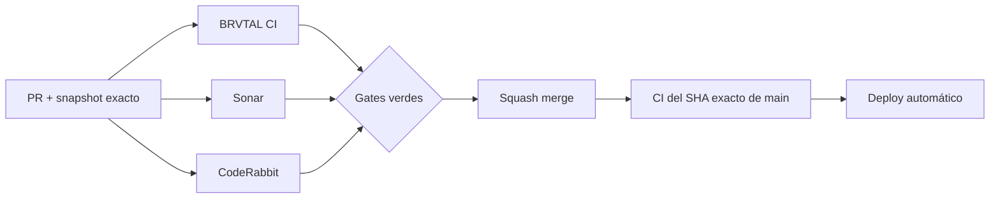

  

# BRVTAL — Último deploy

<strong>Sonar · risk burn-down closure</strong>

  

> Este README representa **solo el deploy actual**. Se reemplaza en el siguiente deploy y no funciona como changelog acumulativo.

## Estado del deploy

| Señal | Estado | Evidencia |
| --- | --- | --- |
| Base exacta | ✅ **VALIDATED IN CODE** | `main` `45d195de05e263f06264b57e2131572e5396774f` · BRVTAL CI #1106 |
| Alcance | 🧪 **#451** | cierre del burn-down Sonar por riesgo |
| Riesgo | ✅ **P0–P2 cubiertos** | seguridad, reliability y HIGH mantenibilidad documentados |
| Sonar main | 🧹 **2.044 issues residuales** | deuda MEDIUM/LOW principalmente mecánica; 0 security hotspots |
| Producción | ⚪ **No validada** | este deploy documental no implica validación de producción |

## Flujo de entrega

## Qué se hizo

- Cierra el objetivo de **#451** como burn-down por riesgo, no como intento de borrar masivamente cada aviso histórico de estilo.
- Deja registrados como cubiertos los bloques P0, P1 y P2 ya validados en PRs acotados.
- Registra el baseline fresco de Sonar en `main`: **2.044 issues** bajo el período actual y **0 security hotspots**.
- Formaliza **Clean as You Code**: ningún PR debe introducir issues accionables nuevos.
- La deuda MEDIUM/LOW puramente mecánica se seguirá corrigiendo oportunísticamente o en slices acotados con validación de comportamiento.
- Un nuevo hallazgo de seguridad, reliability o impacto alto vuelve a tratarse como issue focalizado; no se esconderá dentro de deuda mecánica.

## Archivos modificados en este deploy

- `AGENTS.md` — política durable de Sonar risk-first + Clean as You Code tras #451.
- `README.md` — snapshot exacto del cierre de #451 y panorama actualizado.

## Validación

- Base exacta `45d195de05e263f06264b57e2131572e5396774f` pasó BRVTAL CI #1106 con `fast`, Chromium y `validate`.
- Sonar sobre esa base pasó Quality Gate y reportó **0 security hotspots**.
- Este branch debe pasar BRVTAL CI / validate, Sonar y CodeRabbit antes de merge.
- Tras squash merge se verificará BRVTAL CI sobre el SHA exacto resultante de `main`.
- No se declara **VALIDATED IN PRODUCTION** desde CI.

## Qué sigue

1. Cerrar #451 después del squash merge y del exact-main CI.
2. Implementar #481 IndexNow como notificación SEO event-driven sobre cambios públicos reales.
3. Retomar #398 y profundizar el archivo cultural mediante relaciones explícitas.

## Panorama general pendiente

| Frente | Estado / siguiente foco |
| --- | --- |
| 🔎 **SEO / IndexNow** | #481 · próximo slice preparado |
| 🗃️ **Archivo cultural** | #398 · profundizar navegación relacional tras TRANSMISSIONS |
| 🎛️ **Apariencia** | #149 · completar Light en módulos modernos |
| 🖼️ **Hero Slider** | #221 integridad editorial · #480 regresión visual desktop |
| 🔐 **Seguridad editorial** | #257, #216, #174, #193 |
| 📈 **Analytics** | #427 · completar eventos `brvtal_*` en GTM/GA4 |
| ✍️ **Content / edición** | #224, #252 |
| 🧾 **Activity / operaciones** | #232, #195 |
| 📚 **Bulk Actions** | #275 · registros >500 sin falsa exhaustividad |
| 🌐 **Idioma** | #212 · español canónico + inglés automático por fases |
| 💾 **Backups** | #389 · scheduling seguro + Drive opcional |

---

BRVTAL · Rave till Grave · deploy snapshot

