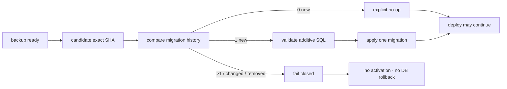

# BRVTAL — Último deploy

  
  
  

> Snapshot de **solo el deploy actual**: #674 elimina la selección manual de migraciones del adapter Factory y deriva el delta aditivo desde el release exacto servido hacia el candidato. Este PR no ejecuta el cutover ni habilita deploy automático por `push`. Base exacta `main 4b0e0c89ab09d80963af169aca18165fe9fbcd03` / v0.1.53 GREEN.

## Progress convention

- ✅ ~~Struck through~~ = completed and verified through the required delivery gates.
- 🚧 Normal text = pending or currently in progress.

## Estado del deploy

| Señal | Estado | Evidencia |
| --- | --- | --- |
| Work line | 🚧 **#674 · deterministic additive migration selection** | `work/issue-674`; reserva `d57afba2-2309-4ecd-8a84-2c79bc389739` |
| Base exacta | ✅ ~~main v0.1.53 GREEN~~ | `4b0e0c89ab09d80963af169aca18165fe9fbcd03` |
| Versión producto | ✅ ~~v0.1.53 sin cambio~~ | repository-only; deploy automático sigue cerrado |
| Selección | 🚧 **release servido → release candidato** | 0 nuevas = no-op; 1 = valida/aplica; >1 = fail-closed |
| Historial | 🚧 **inmutable por nombre + checksum** | cambiar o retirar una migración previa aborta |
| SQL aditivo | 🚧 **defense in depth** | DROP/TRUNCATE/DELETE/REPLACE/rename/change/modify se rechazan |
| Producción | ✅ ~~sin writes remotos en este PR~~ | no cutover ni caller por `push` |

## Huella del cambio

<!-- brvtal:git-delta -->

| Archivos | Inserciones | Eliminaciones | Neto |
| ---: | ---: | ---: | ---: |
| **9** | **+309** | **−58** | **+251** |

## Calidad y entrega

<!-- brvtal:gate-plan -->

| Control | Estado / contrato |
| --- | --- |
| Gates esperados | **preflight · coordination · fast[PHP+JS] · database · chromium · real-stack · recovery** |
| PR + snapshot exacto | Issue #674 · reserva `d57afba2-2309-4ecd-8a84-2c79bc389739` |
| Roles | Infrastructure · SRE · Security · QA |
| Selección migración | `.factory-current` vs `factory-releases/<sha>`; sin variable manual |
| Historial seguro | nombres + SHA-256 previos deben permanecer idénticos |
| SQL seguro | la librería canónica rechaza marcadores no aditivos antes de `PDO::exec()` |
| Rollback | solo artefacto; jamás restaura BD automáticamente |
| Review | BRVTAL CI + Factory gates + Privacy + Sonar/CodeQL/CodeRabbit sobre HEAD estable |
| CI del SHA exacto de main | 🚧 después del merge |

## Flujo de entrega

## Qué se hizo

- Añade `ops/factory/migration-plan`: compara las migraciones del release servido con el candidato exacto y emite `__NONE__` o una única migración nueva.
- Cambiar o retirar una migración histórica aborta por nombre/checksum; más de una migración nueva se considera ambigua y falla antes de activación.
- `config/migrations.php` añade defensa en profundidad para rechazar SQL no aditivo antes de `PDO::exec()`.
- `ops/factory/migrate` deja de depender de `BRVTAL_FACTORY_MIGRATION`; fixture y producción comparten el mismo contrato de selección.
- El transporte remoto deriva el release previo desde `.factory-current`, confina ambos releases y aplica solo la migración seleccionada por el planner.
- Los contratos cubren no-op, una migración, replay, múltiples, cambio/eliminación histórica y SQL destructivo; fake-SSH prueba la ruta remota no-op.
- No ejecuta el cutover ni añade todavía el caller permanente `factory/deploy.yml@v1`.

## Archivos modificados en este deploy

- `config/migrations.php`
- `ops/factory/build`
- `ops/factory/migrate`
- `ops/factory/migration-plan`
- `ops/factory/transport.py`
- `tests/factory-deploy-adapters-contract.php`
- `tests/factory-hostinger-transport-contract.php`
- `tests/migrations-contract.php`
- `README.md`

## Validación

- 🚧 `factory-deploy-adapters-contract.php`, `factory-hostinger-transport-contract.php` y `migrations-contract.php` deben pasar dentro del gate `fast`.
- 🚧 Database/recovery siguen obligatorios porque se toca la frontera de migración/deploy.
- 🚧 Factory CI/Policy/Privacy, Sonar y CodeQL deben pasar sobre el HEAD estable.
- 🚧 CodeRabbit continúa advisory según AGENTS.md; solo hallazgos accionables bloquean.
- ✅ ~~Producción permanece intacta~~: no se ejecuta migración remota ni cutover en este PR.

## Qué sigue

| Lane | Trabajo |
| --- | --- |
| **NOW** | 🚧 [#674](https://github.com/pl0n3r/brvtal/issues/674): cerrar selección determinista de migraciones para deploy reusable. |
| **NEXT** | 🚧 [#630](https://github.com/pl0n3r/brvtal/issues/630): ejecutar el cutover controlado y, tras evidencia GREEN, añadir el caller Factory por `push`. |
| **LATER** | 🚧 [#533](https://github.com/pl0n3r/brvtal/issues/533): reanudar roadmap tras cerrar TANDA 2. |
| **BLOCKED / EXTERNAL** | 🚧 [#627](https://github.com/pl0n3r/brvtal/issues/627): labels espera paridad central de Factory. |

## Panorama general pendiente

- 🚧 **NOW**: cerrar #674 sin tocar producción.
- 🚧 **NEXT**: ejecutar cutover manual desde exact main y probar rollback/health antes de habilitar push deploy.
- 🚧 **LATER**: cerrar #630 con merge → producción validada o rollback automático.
- 🚧 **BLOCKED / EXTERNAL**: #627 sigue fuera hasta paridad completa del kit.
