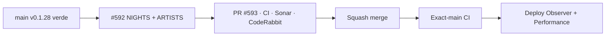

# BRVTAL — Último deploy

  
  
  

> **Development dashboard** · snapshot de **solo el deploy actual** para Issue #592 / PR #593.

## Progress convention

- ✅ ~~Struck through~~ = completed and verified through the required delivery gates.
- 🚧 Normal text = pending or currently in progress.

## Estado del deploy

| Señal | Estado | Evidencia |
| --- | --- | --- |
| Work line | 🚧 **#592 · Concept 05 NIGHTS + ARTISTS authored 1440/390** | parent #583 |
| Base exacta | ✅ ~~main v0.1.28 validado + deploy/performance observados~~ | `409e544375104fc41aa83762187c30d26eefa3cb` |
| PR | 🚧 **#593** | `work/issue-592` |
| Versión | 🚧 **0.1.29** | cambio visible de producto/runtime |
| Producción | 🚧 pendiente de squash + exact-main | sin migración de esquema |

## Huella del cambio

<!-- brvtal:git-delta -->

| Archivos | Inserciones | Eliminaciones | Neto |
| ---: | ---: | ---: | ---: |
| **13** | **+1023** | **−84** | **+939** |

## Calidad y entrega

<!-- brvtal:gate-plan -->

| Control | Estado / contrato |
| --- | --- |
| Gates | **preflight · coordination · fast[PHP+JS] · database · chromium · real-stack · webkit** |
| PR integrity | **PR + snapshot exacto** · Issue #592 · `work/issue-592` · UUID `7d174b8e-c33e-4dd9-a0cf-08e2702dc523` |
| Browser | ✅ ~~Chromium behavior/geometry pasó en el head previo; se revalida en head final~~ |
| Sonar | 🚧 último finding S6481 corregido; nuevo análisis pendiente sobre head final |
| CodeRabbit | 🚧 revisión solicitada sobre head estable final |
| Exact-main | 🚧 **CI del SHA exacto de main** después del squash merge |

## Flujo de entrega

## Qué se hizo

- **02 / NIGHTS** proyecta Events activos + `archive.events` reales desde el mismo payload público y deduplica por identidad.
- Cada Night usa `/events/{slug}` cuando existe slug; no se inventan rutas ni contenido.
- Ticket CTA usa `ticket_url` o Ticket Type público activo; archivo y sold-out no muestran compra.
- **03 / ARTISTS** reutiliza `public-roster.js`; mantiene Collective Status, orden canónico y `/artists/{slug}`.
- Desktop 1440 usa tira editorial densa de Nights y grid documental de Artists; mobile 390 usa swipe ~84vw y grid 2 columnas.
- Media rota/ausente falla cerrada, sin broken-image chrome ni pérdida del contenido textual.
- No se añadió un segundo fetch: el enhancer Concept 05 solo compone el DOM ya alimentado por `BRVTALPublicDataPromise`.
- Cobertura incluye active+archive, dedupe, links canónicos, Ticket Types, missing media, long copy, mobile overflow y reduced-motion/visual-test.

## Archivos modificados en este deploy

- `README.md`
- `config/public_home.php`
- `config/version.php`
- `css/public-concept05-nights-artists.css`
- `index.php`
- `js/app.js`
- `js/public-concept05-nights-artists.js`
- `js/public-home-visual.js`
- `js/public-roster.js`
- `package.json`
- `tests/e2e/public-concept05-nights-artists.spec.mjs`
- `tests/e2e/public-roster-phase-c.spec.mjs`
- `tests/public-concept05-dressing-contract.php`

## Validación

- Base exacta `409e544375104fc41aa83762187c30d26eefa3cb`: BRVTAL CI, Sonar, Deploy Observer y Production Performance verdes antes de iniciar #592.
- Coordination ya reconoce la reserva oculta de #592 en PR #593.
- Database, Chromium, real-stack y WebKit pasaron en la iteración previa del PR; el head final se revalida completo.
- Findings Sonar previos de complejidad/ternaries/líneas largas fueron corregidos; el último S6481 se corrigió con callback explícito.
- No hay migraciones ni cambios de esquema.
- Producción se observa por separado; CI verde no se presenta como prueba de deploy.

## Qué sigue

| Lane | Trabajo |
| --- | --- |
| **NOW** | 🚧 [#592](https://github.com/pl0n3r/brvtal/issues/592) · cerrar PR #593 sobre head final y validar exact-main. |
| **NEXT** | 🚧 [#583](https://github.com/pl0n3r/brvtal/issues/583) · 04 / SOUND + 05 / MEMORIES. |
| **LATER** | 🚧 JOURNAL + CONNECTED, Footer, Theme Studio/Preview; luego #398/#351 según roadmap. |
| **BLOCKED / EXTERNAL** | 🚧 Ningún bloqueo externo activo; reviewers externos son advisory salvo finding accionable. |

## Panorama general pendiente

| Lane | Frente | Issues |
| --- | --- | --- |
| **NOW** | 🚧 Concept 05 NIGHTS + ARTISTS | 🚧 [#592](https://github.com/pl0n3r/brvtal/issues/592) |
| **NEXT** | 🚧 Concept 05 public fidelity | 🚧 [#583](https://github.com/pl0n3r/brvtal/issues/583) |
| **LATER** | 🚧 visión pública / customization | 🚧 [#398](https://github.com/pl0n3r/brvtal/issues/398), [#351](https://github.com/pl0n3r/brvtal/issues/351) |
