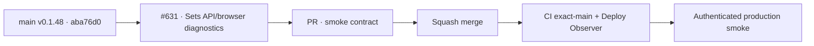

# BRVTAL — Último deploy

  
  
  

> **Production incident #631** · snapshot de **solo el deploy actual**: v0.1.48 exact `main` `aba76d019f3f80978d1b95524098b780d341cc96` tiene CI exact-main y Deploy Observer verdes. Smoke #35951788450 acreditó release/health/Home/Admin/dashboard/Events/date y volvió a fallar en `navigate:sets` aun observando correctamente el binding léxico; ahora se instrumenta API vs navegador antes de tocar runtime. **Engineering roles:** SRE / production incident responder, QA automation engineer.

## Progress convention

- ✅ ~~Struck through~~ = completed and verified through the required delivery gates.
- 🚧 Normal text = pending or currently in progress.

## Estado del deploy

| Señal | Estado | Evidencia |
| --- | --- | --- |
| Work line | 🚧 **#631 · isolate Sets navigation latency** | `work/issue-631`; reserva `cf48a65c-13a2-49af-a53d-ec558c5dfbd9` |
| Base exacta | ✅ ~~main v0.1.48~~ | `aba76d019f3f80978d1b95524098b780d341cc96` |
| Versión | ✅ ~~v0.1.48 sin incremento~~ | solo pruebas/diagnóstico |
| CI exact-main base | ✅ ~~success~~ | [#35951715579](https://github.com/pl0n3r/brvtal/actions/runs/35951715579) |
| Deploy Observer base | ✅ ~~success~~ | [#35951715586](https://github.com/pl0n3r/brvtal/actions/runs/35951715586) |
| Smoke base | ⛔ **failure / Sets transition >20 s** | [#35951788450](https://github.com/pl0n3r/brvtal/actions/runs/35951788450) · `navigate:sets` |
| Entrega candidata | 🚧 diagnóstico API + navegador de Sets | GET read-only, sin runtime/version change |

## Huella del cambio

<!-- brvtal:git-delta -->

| Archivos | Inserciones | Eliminaciones | Neto |
| ---: | ---: | ---: | ---: |
| **3** | **+0** | **−0** | **+0** |

## Calidad y entrega

<!-- brvtal:gate-plan -->

| Control | Estado / contrato |
| --- | --- |
| Gates esperados | **preflight · coordination · fast[PHP+JS] · chromium** |
| PR + snapshot exacto | Issue #631 · reserva `cf48a65c-13a2-49af-a53d-ec558c5dfbd9` |
| CodeRabbit / Sonar | 🚧 HEAD estable; máximo 3 rondas automáticas |
| CI del SHA exacto de main | 🚧 después del merge |
| Producción | 🚧 smoke debe completar Sets/Hero además de lo ya acreditado |

## Flujo de entrega

## Qué se hizo

- Smoke #35951788450 observó v0.1.48 / `aba76d01…` exactos.
- Health **200**, DB **connected**, Home **200**, DISCADMIN **200**, dashboard **882 ms** sin 5xx, versión Admin, Events y Event #6 date pasaron.
- El fallo quedó en `sets-relations / navigate:sets` después de 20 s, con cero 5xx y cero mutaciones bloqueadas.
- El probe léxico ya es correcto; por tanto esta corrida sí demuestra que la transición real a Sets no terminó dentro del límite.
- La candidata mide primero el GET autenticado `/api/index.php/sets?page=1&page_size=50` y luego registra request/response/fallo del mismo GET disparado por el click real.
- No se aplica aún ninguna optimización de DB/API: la siguiente evidencia decidirá si el cuello está en API/DB o en el navegador/UI.

## Archivos modificados en este deploy

- `README.md` — snapshot exacto.
- `tests/e2e/production-authenticated-smoke.mjs` — evidencia separada de Sets API y navegación browser.
- `tests/production-smoke-contract.php` — contrato de diagnóstico read-only de Sets.

## Validación

- ✅ ~~Base v0.1.48: CI #35951715579 y Deploy Observer #35951715586 verdes.~~
- ✅ ~~Smoke #35951788450 acreditó todo hasta Events/date y confirmó timeout real de la transición Sets; cero 5xx y mutaciones bloqueadas.~~
- 🚧 PR CI/revisión, merge y smoke final pendientes; **no declarar PRODUCTION GREEN** antes.

## Qué sigue

| Lane | Trabajo |
| --- | --- |
| **NOW** | 🚧 [#631](https://github.com/pl0n3r/brvtal/issues/631): validar, mergear y repetir smoke real. |
| **NEXT** | 🚧 [#533](https://github.com/pl0n3r/brvtal/issues/533): publicar `🟢 PRODUCTION GREEN` con las cinco evidencias. |
| **LATER** | 🚧 detener BRVTAL después de GREEN mientras Tanda 1 global siga abierta. |
| **BLOCKED / EXTERNAL** | 🚧 Condor/GrindFlow sin GREEN y factory `v1.0.0` ausente; no iniciar Tanda 2. |

## Panorama general pendiente

- 🚧 **NOW**: cerrar #631 con smoke completo.
- 🚧 **NEXT**: verificar incidentes/`[AUTO]` y registrar GREEN en #533.
- 🚧 **LATER**: esperar la barrera global.
- 🚧 **BLOCKED / EXTERNAL**: no adoptar todavía el kit factory.
