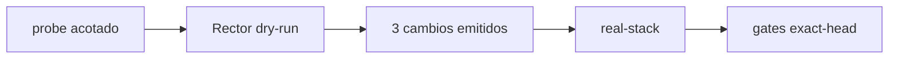

# BRVTAL — Último deploy

> Snapshot de **solo el deploy actual** para #653: primer refactor real emitido por Rector 2.6.7, con comportamiento preservado y sin tocar producción.

## Progress convention
- ✅ ~~Struck through~~ = completed and verified through required gates.
- 🚧 Normal text = pending/in progress.
- ⛔ = active production blocker.

## Estado del deploy
| Señal | Estado | Evidencia |
| --- | --- | --- |
| Work line | 🚧 **#653 · primer refactor real Rector** | `work/issue-653` · reserva `bf7b8aa7-b120-4b3a-a8f9-305f4b4a6252` |
| Base exacta | ✅ **main v0.1.58** | `4295b6f21dd535d03df0843eb527c5829c54d21c` |
| Versión candidata | 🚧 **v0.1.59** | `config/version.php` + `package.json`; no desplegada |
| Producción | ⛔ **NO GREEN · #681** | fuera de alcance de este PR |
| Factory labels | ⛔ **#694** | pendiente Factory v1.0.5 |

## Huella del cambio
<!-- brvtal:git-delta -->
| Archivos | Inserciones | Eliminaciones | Neto |
| ---: | ---: | ---: | ---: |
| **5** | **+54** | **−36** | **+18** |

## Calidad y entrega
<!-- brvtal:gate-plan -->
| Control | Estado / contrato |
| --- | --- |
| Gates esperados | **preflight · coordination · fast[PHP+JS] · database · chromium · real-stack · webkit** |
| PR + snapshot exacto | **#653 · refactor Rector v0.1.59** |
| Roles | **Software Engineering · QA · Security** |
| Rector | ✅ dry-run `9488cde` emitió 3 cambios exactos; aplicados sin ampliar reglas |
| Review | BRVTAL CI / validate + Factory Policy/Privacy + Sonar/CodeQL/CodeRabbit |
| CI del SHA exacto de main | 🚧 validar HEAD final antes de merge |
| Production GREEN | ⛔ no se reclama ni se altera |

## Flujo de entrega

## Qué se hizo
- Rector convirtió `!$tags` y `!$relations` a comparaciones explícitas `=== []`.
- El set PHP 8.5 convirtió `get_class($e)` a `$e::class`.
- Se retiraron marker y regla temporal; `rector.php` vuelve al contrato canónico.
- Real-stack cubre tags y relaciones vacías además de los casos no vacíos.

## Archivos modificados en este deploy
- `README.md`
- `api/blog.php`
- `config/version.php`
- `package.json`
- `tests/e2e/blog-relation-integrity-real-stack.spec.mjs`

## Validación
- ✅ Rector real documentado desde el log del HEAD de probe `9488cde817d181ed0b45f5d67f2878234e064951`.
- 🚧 Gates exact-head del candidato final y revisión terminal antes del merge.

## Qué sigue
| Lane | Trabajo |
| --- | --- |
| **NOW** | 🚧 [#653](https://github.com/pl0n3r/brvtal/issues/653): validar y fusionar el primer refactor Rector. |
| **NEXT** | 🚧 [#698](https://github.com/pl0n3r/brvtal/issues/698): impedir reservas activas concurrentes. |
| **LATER** | 🚧 [#629](https://github.com/pl0n3r/brvtal/issues/629): recuperación admin. |
| **BLOCKED / EXTERNAL** | 🚧 [#681](https://github.com/pl0n3r/brvtal/issues/681) producción · [#694](https://github.com/pl0n3r/brvtal/issues/694) Factory @v1. |

## Panorama general pendiente
- 🚧 **NOW:** #653 Rector.
- 🚧 **NEXT:** #698 coordinación.
- 🚧 **LATER:** #629 seguridad admin.
- 🚧 **BLOCKED / EXTERNAL:** #681 producción; #694 Factory Labels.
