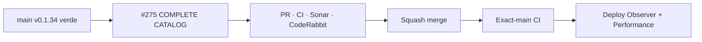

# BRVTAL — Último deploy

  
  
  

> **Development dashboard** · snapshot de **solo el deploy actual** para Issue #275.

## Progress convention

- ✅ ~~Struck through~~ = completed and verified through the required delivery gates.
- 🚧 Normal text = pending or currently in progress.

## Estado del deploy

| Señal | Estado | Evidencia |
| --- | --- | --- |
| Work line | 🚧 **#275 · Bulk Actions sobre catálogo completo** | Events / Artists / Sets / Pages / Releases / Blog |
| Base exacta | ✅ ~~main v0.1.34 CI/validate + Deploy Observer + Performance verdes~~ | `c00957450d51d28b7a4a69f49b5246daa97860ff` |
| Versión | 🚧 **0.1.35** | runtime DISCADMIN, sin migración |
| Producción | 🚧 pendiente de PR → merge → exact-main → observación | no asumir deploy |

## Huella del cambio

<!-- brvtal:git-delta -->

| Archivos | Inserciones | Eliminaciones | Neto |
| ---: | ---: | ---: | ---: |
| **6** | **+253** | **−76** | **+177** |

## Calidad y entrega

<!-- brvtal:gate-plan -->

| Control | Estado / contrato |
| --- | --- |
| Gates | **preflight · coordination · fast[PHP+JS] · database · chromium · real-stack · webkit** |
| PR integrity | **PR + snapshot exacto** · Issue #275 · `work/issue-275` · UUID `a494853a-7cff-4f06-a477-15a44e02dc3f` |
| Catálogo | 🚧 búsqueda sobre la colección autenticada completa; sin truncado silencioso a 500 |
| Selección | 🚧 páginas de 50; selección persiste entre páginas/filtros; máximo 100 por mutación |
| Browser | 🚧 605 registros sintéticos + geometría 390/320 px |
| Sonar | 🚧 Quality Gate sobre HEAD final |
| CodeRabbit | 🚧 full review sobre HEAD final |
| Exact-main | 🚧 **CI del SHA exacto de main** tras squash merge |

## Flujo de entrega

## Qué se hizo

- Se elimina el recorte local `slice(0,500)`: Bulk Actions conserva el catálogo completo recibido por el endpoint autenticado.
- El modal renderiza páginas acotadas de 50 registros con rango, total, PREVIOUS/NEXT y SELECT/CLEAR PAGE.
- La búsqueda recorre el catálogo completo y reinicia a la primera página sin presentar resultados parciales como exhaustivos.
- La selección persiste entre páginas y filtros, pero nunca habilita una mutación con más de 100 IDs; el límite transaccional del servidor se mantiene.
- Respuestas de colección inválidas fallan explícitamente en lugar de simular un catálogo vacío.
- La cobertura Playwright usa 605 registros sintéticos para alcanzar elementos posteriores a la posición 500, validar búsqueda/acción, persistencia de selección, máximo 100 y layout 390/320.
- El contrato durable queda documentado en BRVTAL-SPEC sin introducir un segundo motor de bulk actions.

## Archivos modificados en este deploy

- `README.md` — snapshot exacto del candidato y gates.
- `config/version.php` — versión humana 0.1.35.
- `discadmin/bulk-actions.js` — catálogo completo, paginación y selección acotada.
- `docs/BRVTAL-SPEC.md` — contrato durable de cobertura completa.
- `package.json` — versión 0.1.35 manteniendo el runner actual.
- `tests/e2e/discadmin-bulk-actions.spec.mjs` — regresión de 605 registros y responsive.

## Validación

- Base exacta `c00957450d51d28b7a4a69f49b5246daa97860ff`: BRVTAL CI / `validate` #35819644138 success.
- Production Deploy Observer #35819644152 success y Production Performance #35819782371 success sobre el mismo SHA.
- La implementación aislada fue recuperada mediante el coordinador y reconciliada sobre esa base; no se duplicó la línea de trabajo.
- El candidato v0.1.35 requiere CI/Sonar/CodeRabbit del HEAD final antes de merge.
- No altera credenciales, tablas, migraciones, Hostinger ni contenido editorial productivo.

## Qué sigue

| Lane | Trabajo |
| --- | --- |
| **NOW** | 🚧 [#275](https://github.com/pl0n3r/brvtal/issues/275) · cerrar cobertura completa de Bulk Actions y validar exact-main. |
| **NEXT** | 🚧 [#351](https://github.com/pl0n3r/brvtal/issues/351) · reconciliar Theme Studio Concept 05 sobre el nuevo main. |
| **LATER** | 🚧 [#531](https://github.com/pl0n3r/brvtal/issues/531) · Media Library smarter; [#529](https://github.com/pl0n3r/brvtal/issues/529) · preview público real. |
| **BLOCKED / EXTERNAL** | 🚧 Sin acciones protegidas necesarias para este slice. |

## Panorama general pendiente

| Lane | Frente | Issues |
| --- | --- | --- |
| **NOW** | 🚧 Admin scale | 🚧 [#275](https://github.com/pl0n3r/brvtal/issues/275) |
| **NEXT** | 🚧 Theme customization | 🚧 [#351](https://github.com/pl0n3r/brvtal/issues/351) |
| **LATER** | 🚧 Media / preview / archive | 🚧 [#531](https://github.com/pl0n3r/brvtal/issues/531), [#529](https://github.com/pl0n3r/brvtal/issues/529), [#398](https://github.com/pl0n3r/brvtal/issues/398) |
