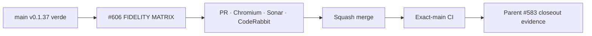

# BRVTAL — Último deploy

  
  
  

> **Development dashboard** · snapshot de **solo el deploy actual** para Issue #606.

## Progress convention

- ✅ ~~Struck through~~ = completed and verified through the required delivery gates.
- 🚧 Normal text = pending or currently in progress.

## Estado del deploy

| Señal | Estado | Evidencia |
| --- | --- | --- |
| Work line | 🚧 **#606 · Concept 05 cross-viewport fidelity QA** | child enfocado de #583 |
| Base exacta | ✅ ~~main v0.1.37 exact-main CI + Sonar + deploy/performance verdes~~ | `463e45a1f2c4d85114f97dabf80a6a770a4dcaab` |
| Versión | ✅ ~~0.1.37 sin bump~~ | cambio de tests/QA, no runtime |
| Producción | ✅ ~~v0.1.37 observada en Hostinger~~ | este PR no modifica delivery público |

## Huella del cambio

<!-- brvtal:git-delta -->

| Archivos | Inserciones | Eliminaciones | Neto |
| ---: | ---: | ---: | ---: |
| **2** | **+400** | **−57** | **+343** |

## Calidad y entrega

<!-- brvtal:gate-plan -->

| Control | Estado / contrato |
| --- | --- |
| Gates | **preflight · coordination · fast[JS] · chromium** |
| PR integrity | **PR + snapshot exacto** · Issue #606 · `work/issue-606` · UUID `1dd29fe7-f1d7-4eec-a7a8-0087ae9413fd` |
| Fidelity matrix | 🚧 390 · 430 · 768 · 1024 · 1280 · 1440 · 1728 · 1920 |
| Accessibility | 🚧 keyboard focus · touch targets · reduced motion |
| Sonar | 🚧 análisis del HEAD final |
| CodeRabbit | 🚧 full review sobre HEAD final |
| CI del SHA exacto de main | 🚧 después del squash merge |

## Flujo de entrega

## Qué se hizo

- Se añadió una suite integrada Concept 05 que monta shell, Hero, Next Experience, Nights, Artists, Sound, Memories, Journal, Connected y footer con los CSS reales.
- La matriz cubre **390 / 430 / 768 / 1024 / 1280 / 1440 / 1728 / 1920** y verifica contención del documento, geometría de bloques, títulos largos y colisiones del header.
- 390 y 1440 tienen aserciones específicas para preservar composiciones authored distintas, no un simple escalado.
- Se validan targets táctiles, foco visible y reduced-motion con GSAP/ScrollTrigger neutralizados.
- El fixture es determinista y usa contenido largo deliberado para revelar regresiones sin inventar relaciones de producción.
- Este slice es test-only; cualquier defecto que Chromium exponga se reparará en el CSS/JS Concept 05 propietario y, solo entonces, el cambio pasará a v0.1.38 deploy-bound.

## Archivos modificados en este deploy

- `README.md` — snapshot exacto de #606 y gates seleccionados.
- `tests/e2e/public-concept05-fidelity-matrix.spec.mjs` — matriz integrada responsive/a11y/reduced-motion.

## Validación

- Base exacta `463e45a1f2c4d85114f97dabf80a6a770a4dcaab`: v0.1.37 con BRVTAL CI/`validate`, Sonar y Deploy Observer verdes.
- #606 está reservado por el coordinador; `work/issue-606` nació idéntica a esa base y no existe PR competidor.
- #583 permanece abierto como contrato padre; este PR no debe cerrarlo.
- Pendiente: ejecutar Chromium sobre la nueva matriz, corregir cualquier defecto real, full review final y squash.

## Qué sigue

| Lane | Trabajo |
| --- | --- |
| **NOW** | 🚧 [#606](https://github.com/pl0n3r/brvtal/issues/606) · cerrar matriz transversal Concept 05. |
| **NEXT** | 🚧 [#583](https://github.com/pl0n3r/brvtal/issues/583) · consolidar evidencia final del contrato visual sin PR monolítico. |
| **LATER** | 🚧 [#398](https://github.com/pl0n3r/brvtal/issues/398) · archivo cultural conectado; [#531](https://github.com/pl0n3r/brvtal/issues/531) · Media Library smarter. |
| **BLOCKED / EXTERNAL** | 🚧 Sin bloqueos externos activos. |

## Panorama general pendiente

| Lane | Frente | Issues |
| --- | --- | --- |
| **NOW** | 🚧 Concept 05 fidelity closeout | 🚧 [#606](https://github.com/pl0n3r/brvtal/issues/606) |
| **NEXT** | 🚧 Parent visual contract | 🚧 [#583](https://github.com/pl0n3r/brvtal/issues/583) |
| **LATER** | 🚧 Public archive / media scale | 🚧 [#398](https://github.com/pl0n3r/brvtal/issues/398), [#531](https://github.com/pl0n3r/brvtal/issues/531) |
