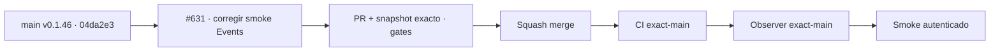

# BRVTAL — Último deploy

  
  
  

> **Production incident #631** · snapshot de **solo el deploy actual**: alinear el smoke autenticado con la ruta Events nativa de DISCADMIN; sin alterar datos productivos ni código del producto.

## Progress convention

- ✅ ~~Struck through~~ = completed and verified through the required delivery gates.
- 🚧 Normal text = pending or currently in progress.

## Estado del deploy

| Señal | Estado | Evidencia |
| --- | --- | --- |
| Work line | 🚧 **#631 · smoke de Events desactualizado** | `work/issue-631`; reserva `5e23b6cc-22d7-4231-a6f9-88fb696e2fba` |
| Base exacta | ✅ ~~main v0.1.46~~ | `04da2e3ce33b3b4afe5e57bb6a2be571736f03f6` |
| Versión | ✅ ~~v0.1.46 sin incremento~~ | cambio exclusivamente en pruebas/documentación |
| CI del SHA exacto de main | ✅ ~~success~~ | [#35928853338](https://github.com/pl0n3r/brvtal/actions/runs/35928853338) sobre la base |
| Deploy Observer base | ✅ ~~success~~ | [#35928853541](https://github.com/pl0n3r/brvtal/actions/runs/35928853541); smoke confirma SHA exacto |
| Production Smoke base | ⛔ **failure** | [#35926109962](https://github.com/pl0n3r/brvtal/actions/runs/35926109962), espera un módulo ajeno a Events |
| Entrega candidata | 🚧 pendiente gates, merge y smoke nuevo | No equivale a producción validada |

## Huella del cambio

<!-- brvtal:git-delta -->
| Archivos | Inserciones | Eliminaciones | Neto |
| ---: | ---: | ---: | ---: |
| **2** | **+140** | **−107** | **+33** |

## Calidad y entrega

<!-- brvtal:gate-plan -->
| Control | Estado / contrato |
| --- | --- |
| Gates | **preflight · coordination · fast[JS] · chromium** |
| PR + snapshot exacto | Issue #631 · reserva `5e23b6cc-22d7-4231-a6f9-88fb696e2fba` |
| Alcance | Smoke de Events `/discadmin/`; **sin** cambios en shell, sesión, DB o credenciales |
| CodeRabbit / Sonar | 🚧 comprobar sobre HEAD final; no adelantar resultados |
| Producción | 🚧 volver a ejecutar `/production-smoke` luego de validar nuevo `main` |

## Flujo de entrega

## Qué se hizo

- El release v0.1.46 y SHA exacto en Hostinger están acreditados por el observer; el smoke anterior en v0.1.45 falló por selector incorrecto.
- El smoke de 23/09/2026 falló porque buscaba `[data-admin-module="content-core"]` al abrir **EVENTS**, pero la ruta de usuario actual es `go('events')` y el formulario nativo es `#modal / #f_event_date`.
- El contrato actualizado exige navegación real a Events, búsqueda visible y edición nativa, y vuelve a verificar una fecha existente sin guardar datos; los checks de Sets y Hero siguen intactos. Además verifica directamente /api/health.php (HTTP 200, versión, SHA exacto y DB), home y DISCADMIN sin 5xx, y mide el tiempo hasta el Dashboard V2 visible.
- La PR #626 / Issue #623 de rendimiento ya está fusionada y desplegada como v0.1.46; este PR preserva el código de rendimiento.

## Archivos modificados en este deploy

- `README.md` — snapshot exacto del incidente, alcance, gates y estado de entrega.
- `tests/e2e/production-authenticated-smoke.mjs` — comprobación de Events/editor nativos acorde con la ruta en producción.

## Validación

- Línea independiente reservada con el coordinador; script JS sometido a `node --check` en `fast`.
- CI, Sonar, CodeRabbit y merge **pendientes**; el smoke productivo debe repetirse sobre el nuevo SHA después del merge.
- Ninguna modificación de credenciales, migración, consulta SQL destructiva o datos reales.

## Qué sigue

- 🚧 [#631](https://github.com/pl0n3r/brvtal/issues/631): reparar y acreditar el smoke sin ocultar fallos reales.
- ✅ ~~[#623](https://github.com/pl0n3r/brvtal/issues/623): rendimiento DISCADMIN integrado por la [PR #626](https://github.com/pl0n3r/brvtal/pull/626).~~
- 🚧 [Roadmap #533](https://github.com/pl0n3r/brvtal/issues/533): declarar PRODUCTION GREEN solo con las cinco señales.

## Panorama general pendiente

- 🚧 **NOW**: smoke autenticado nativo #631 y rendimiento Admin #623.
- 🚧 **NEXT**: exact-main, observación Hostinger, nueva medición Dashboard y smoke aprobado.
- 🚧 **LATER**: backlog de producto tras GREEN, sin adelantar cambios.
- 🚧 **BLOCKED / EXTERNAL**: comprobar comportamiento productivo tras merge; no extrapolar pruebas de CI.
