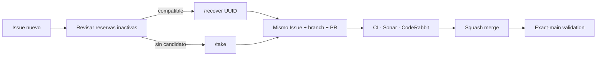

# BRVTAL — Último deploy

  
  
  

> **Development dashboard** · snapshot de **solo el deploy actual** para Issue #581 / PR #582.

## Progress convention

- ✅ ~~Struck through~~ = completed and verified through the required delivery gates.
- 🚧 Normal text = pending or currently in progress.

## Estado del deploy

| Señal | Estado | Evidencia |
| --- | --- | --- |
| Work line | 🚧 **#581 · unified assignment + recovery-first coordination** | PR #582 |
| Base exacta | ✅ ~~main validado~~ | `8793431b65658fa87f50c2f362bebede13a8f140` · exact-main BRVTAL CI / validate passed |
| Versión | ✅ ~~0.1.24 sin cambio~~ | infraestructura de coordinación; no cambia producto/runtime público |
| Producción | — | no requiere migración ni validación funcional en producción |

## Huella del cambio

<!-- brvtal:git-delta -->

| Archivos | Inserciones | Eliminaciones | Neto |
| ---: | ---: | ---: | ---: |
| **5** | **+1006** | **−79** | **+927** |

## Calidad y entrega

<!-- brvtal:gate-plan -->

| Control | Estado / contrato |
| --- | --- |
| Gates | **preflight · coordination · fast[PHP+JS] · database · chromium · real-stack** |
| Reservation | Issue #581 · `work/issue-581` · UUID vigente |
| Ownership | status + assignee + trusted marker + `work/issue-N` son una sola asignación |
| Inactivity | 30 min desde el máximo entre marker activo, commit del branch y comentario humano calificante; el coordinador lo exige |
| Selection | candidato compatible no bloqueado, sin colisión de archivos; el más antiguo usa `created_at` del marker activo |
| Recovery | `/take` recupera primero la reserva inactiva compatible más antigua; `/recover UUID` mantiene Issue + branch + PR |
| PR integrity | **PR + snapshot exacto** · PR heredado debe ser repo propio + `main` + cerrar el Issue + UUID activo |
| Sonar / CodeRabbit | sin findings nuevos accionables antes del merge |
| Exact-main | **CI del SHA exacto de main** después del squash merge |

## Flujo de entrega

## Qué se hizo

- Se convierte la asignación de trabajo en un estado coordinado único: label/status, assignee, reservation marker y branch canónico deben ser coherentes.
- Se define de forma determinista qué reserva cuenta como inactiva, cuál es la más antigua y cuándo un candidato es compatible.
- `/take` ahora busca y recupera primero la reserva inactiva compatible más antigua; `/recover UUID` conserva el control explícito y también permite rotar sesión bajo el mismo actor GitHub.
- Recovery valida el PR heredado, sincroniza assignees estrictamente, actualiza su metadata y publica el nuevo marker solo al final.
- Si la transición no puede completarse de forma segura, intenta restaurar toda la autoridad previa; un rollback incompleto deja el Issue `status: blocked` y expone el fallo.
- Bots, CI, Sonar, CodeRabbit, labels y comandos de coordinación no cuentan como actividad de implementación.
- Se añaden tests de recovery-first en `/take`, sesión same-owner, ventana de inactividad, contrato del PR heredado, assignees, rollback fail-closed, UUID y ruido de coordinación.
- Se elimina del alcance el cambio incidental de `.gitignore`.

## Archivos modificados en este deploy

- `.github/workflows/work-coordination.yml` — reconoce `/recover UUID`.
- `AGENTS.md` — criterios recovery-first/anti-starvation y ownership unificado.
- `README.md` — snapshot exacto de PR #582.
- `scripts/work_coordinator.py` — transición atómica de recovery y sincronización del PR.
- `tests/test_work_coordinator.py` — contratos de recovery y rollback.

## Validación

- Base exacta: `8793431b65658fa87f50c2f362bebede13a8f140`.
- PR #582 debe pasar BRVTAL CI / `validate`, Sonar y revisión final de CodeRabbit.
- Sin cambios de base de datos ni operaciones destructivas de producción.

## Qué sigue

| Lane | Trabajo |
| --- | --- |
| **NOW** | 🚧 [#581](https://github.com/pl0n3r/brvtal/issues/581) / PR #582 · publicar unified assignment + recovery. |
| **NEXT** | 🚧 [#525](https://github.com/pl0n3r/brvtal/issues/525) · rich Blog editor + safe HTML source mode. |
| **LATER** | 🚧 [#524](https://github.com/pl0n3r/brvtal/issues/524), [#528](https://github.com/pl0n3r/brvtal/issues/528), [#529](https://github.com/pl0n3r/brvtal/issues/529). |
| **BLOCKED / EXTERNAL** | 🚧 Ningún bloqueo externo activo para #581. |

## Panorama general pendiente

| Lane | Frente | Issues |
| --- | --- | --- |
| **COORDINATION** | 🚧 unified assignment / recovery-first | 🚧 [#581](https://github.com/pl0n3r/brvtal/issues/581) |
| **EDITORIAL** | 🚧 Blog rich editor | 🚧 [#525](https://github.com/pl0n3r/brvtal/issues/525) |
| **LATER** | 🚧 Membership / drafts / preview | 🚧 [#524](https://github.com/pl0n3r/brvtal/issues/524), [#528](https://github.com/pl0n3r/brvtal/issues/528), [#529](https://github.com/pl0n3r/brvtal/issues/529) |
