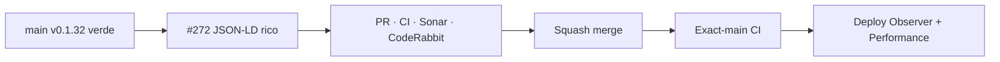

# BRVTAL — Último deploy

  
  
  

> **Development dashboard** · snapshot de **solo el deploy actual** para Issue #272.

## Progress convention

- ✅ ~~Struck through~~ = completed and verified through the required delivery gates.
- 🚧 Normal text = pending or currently in progress.

## Estado del deploy

| Señal | Estado | Evidencia |
| --- | --- | --- |
| Work line | 🚧 **#272 · JSON-LD específico por entidad pública** | SEO / indexación |
| Base exacta | ✅ ~~main v0.1.32 CI/validate + Deploy Observer + Performance verdes~~ | `58537f2196902b2f9bbfa3ed3d2f319c1adf7633` |
| Versión | 🚧 **0.1.33** | runtime SEO, sin migración |
| Producción | 🚧 pendiente de PR → merge → exact-main → observación | no asumir deploy |

## Huella del cambio

<!-- brvtal:git-delta -->

| Archivos | Inserciones | Eliminaciones | Neto |
| ---: | ---: | ---: | ---: |
| **7** | **+474** | **−54** | **+420** |

## Calidad y entrega

<!-- brvtal:gate-plan -->

| Control | Estado / contrato |
| --- | --- |
| Gates | **preflight · coordination · fast[PHP+JS] · database · chromium · real-stack · webkit** |
| PR integrity | **PR + snapshot exacto** · Issue #272 · `work/issue-272` · UUID `a55dcb7d-8943-45f7-bab4-19c984fa1e16` |
| Public SEO | 🚧 MusicEvent, MusicGroup, MusicRecording, MusicAlbum, BlogPosting; fallback WebPage |
| Sonar | 🚧 Quality Gate sobre head final |
| CodeRabbit | 🚧 full review sobre head final |
| Exact-main | 🚧 **CI del SHA exacto de main** tras squash merge |

## Flujo de entrega

## Qué se hizo

- Events públicos con fecha y lugar real producen `MusicEvent` con `startDate`, `Place`/ciudad, `eventStatus` según lifecycle y performers solo de artistas publicados.
- Blog expone `headline`, `datePublished`, `dateModified` reales y publisher BRVTAL, sin autor ficticio.
- Releases aportan fecha, catálogo, artistas publicados y enlaces HTTP(S) seguros; Sets enlazan artista publicado y destino de escucha válido.
- Artists anuncian solo perfiles configurados y seguros. Pages públicas en inglés declaran `inLanguage`.
- Event sin fecha/lugar, Blog sin publicación o Set sin relaciones ni URL segura usan `WebPage` en lugar de inventar hechos.
- No se inventan zonas horarias ni se reintroducen drafts en JSON-LD; rutas y SEO manual permanecen intactos.
- Test PHP unitario auto-descubierto e integración MariaDB con tablas temporales y guardia `brvtal_test*`; contrato durable en `docs/BRVTAL-SPEC.md`.

## Archivos modificados en este deploy

- `README.md` — huella exacta y gates del candidato.
- `config/public_seo.php` — resolver y JSON-LD enriquecidos de forma fail-closed.
- `config/version.php` — versión humana 0.1.33.
- `docs/BRVTAL-SPEC.md` — semántica durable de datos estructurados públicos.
- `package.json` — versión y runner MariaDB de regresiones SEO.
- `tests/integration/public-rich-schema.php` — datos sintéticos publicados/draft sobre MariaDB desechable.
- `tests/public-rich-schema-contract.php` — contratos PHP de fechas, tipos, seguridad y rutas.

## Validación

- Base exacta `58537f2196902b2f9bbfa3ed3d2f319c1adf7633`: BRVTAL CI / `validate` #35813401204 success; Deploy Observer y Production Performance success por separado.
- Este candidato requiere CI/Sonar/CodeRabbit del HEAD final. No implica publicación en Hostinger.
- No altera credenciales, tablas persistentes, Hostinger ni contenido editorial productivo.

## Qué sigue

| Lane | Trabajo |
| --- | --- |
| **NOW** | 🚧 [#272](https://github.com/pl0n3r/brvtal/issues/272) · cerrar JSON-LD tipado y validar exact-main. |
| **NEXT** | 🚧 [#583](https://github.com/pl0n3r/brvtal/issues/583) · revisar fidelidad pública Concept 05. |
| **LATER** | 🚧 [#390](https://github.com/pl0n3r/brvtal/issues/390) · SEO workspace; [#214](https://github.com/pl0n3r/brvtal/issues/214) · fallbacks dinámicos. |
| **BLOCKED / EXTERNAL** | 🚧 Sin acciones protegidas necesarias para este slice. |

## Panorama general pendiente

| Lane | Frente | Issues |
| --- | --- | --- |
| **NOW** | 🚧 Structured data canónico | 🚧 [#272](https://github.com/pl0n3r/brvtal/issues/272) |
| **NEXT** | 🚧 Fidelity + customization | 🚧 [#583](https://github.com/pl0n3r/brvtal/issues/583), [#351](https://github.com/pl0n3r/brvtal/issues/351) |
| **LATER** | 🚧 SEO/Admin enhancements | 🚧 [#390](https://github.com/pl0n3r/brvtal/issues/390), [#214](https://github.com/pl0n3r/brvtal/issues/214) |
