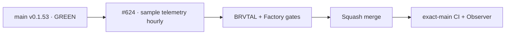

# BRVTAL — Último deploy

  
  
  

> Snapshot de **solo el deploy actual**: #624 reduce amplificación de GitHub sin tocar runtime. Base exacta `main 6c1c2f1cd4cffc1c422d512d79e746463597c246` / v0.1.53, con BRVTAL CI, Factory Release, Deploy Observer y Production Performance verdes.

## Progress convention

- ✅ ~~Struck through~~ = completed and verified through the required delivery gates.
- 🚧 Normal text = pending or currently in progress.

## Estado del deploy

| Señal | Estado | Evidencia |
| --- | --- | --- |
| Work line | 🚧 **#624 · GitHub load reduction** | `work/issue-624`; reserva `923585d4-919f-4bf1-a78c-4f3ae85e78c0` |
| Base exacta | ✅ ~~main v0.1.53 GREEN~~ | `6c1c2f1cd4cffc1c422d512d79e746463597c246` |
| Versión producto | ✅ ~~v0.1.53 sin cambio~~ | repository-only; no deploy-bound |
| Telemetría CI | 🚧 **horaria/manual** | se elimina el trigger `workflow_run` por cada BRVTAL CI |
| Coordinación | ✅ ~~filtro por comando preservado~~ | comentarios normales no ejecutan runner/API |
| Producción | ✅ ~~sin cambio de runtime~~ | 0 incidentes / 0 `[AUTO]` al iniciar el slice |

## Huella del cambio

<!-- brvtal:git-delta -->

| Archivos | Inserciones | Eliminaciones | Neto |
| ---: | ---: | ---: | ---: |
| **6** | **+221** | **−62** | **+159** |

## Calidad y entrega

<!-- brvtal:gate-plan -->

| Control | Estado / contrato |
| --- | --- |
| Gates esperados | **preflight · coordination · fast[PHP+JS]** |
| PR + snapshot exacto | Issue #624 · reserva `923585d4-919f-4bf1-a78c-4f3ae85e78c0` |
| Telemetría | cron `17 * * * *` + dispatch manual; máximo una muestra reciente por ventana horaria |
| Seguridad | reporter desde `main` confiable, checkout SHA-pinned, credenciales no persistidas, permisos `actions: read` + `contents: read` |
| Review | Sonar, CodeQL y CodeRabbit permanecen activos sobre el HEAD estable |
| Agentes | un solo frente de implementación por repo; lecturas independientes sí pueden paralelizarse |
| CI del SHA exacto de main | 🚧 después del merge |

## Flujo de entrega

## Qué se hizo

- Sustituye telemetría `workflow_run` por muestreo horario y `workflow_dispatch` opcional sobre un run de BRVTAL CI.
- El muestreo automático ignora un CI completado hace más de una hora y serializa por repositorio.
- Mantiene la evidencia JSON/summary existente y consulta los jobs solo cuando hay una muestra útil; el reporter se ejecuta desde `main`, nunca desde el SHA observado.
- Conserva coordinación por `issue_comment`, pero el job sigue filtrado a comandos reales y bots quedan excluidos.
- Alinea `AGENTS.md` con Factory: un solo frente de implementación por repo, push agrupado y prohibición explícita de polling en bucle.
- Añade contratos fail-closed para evitar regresar a telemetría por cada CI, ampliar silenciosamente la coordinación o ejecutar el reporter desde el SHA observado.
- Incorpora en este workflow los pins v7 de `checkout` y `upload-artifact`; Dependabot #657/#659 conserva sus demás upgrades sin colisionar con #624.
- `ci_retry.py` ya tenía backoff acotado para fallos transitorios; no se modifica.

## Archivos modificados en este deploy

- `.github/workflows/ci-throughput-telemetry.yml`
- `AGENTS.md`
- `README.md`
- `tests/ci-throughput-report-contract.php`
- `tests/github-load-contract.php`
- `tests/project-operations-contract.php`

## Validación

- ✅ BRVTAL CI alcanzó los contratos nuevos; el único fallo determinista encontrado fue una aserción legacy de 4 work lines y quedó alineada al límite Factory de un solo frente de implementación.
- 🚧 Factory CI/Policy/Privacy, Sonar, CodeQL y revisión final deben cerrar sobre el HEAD estable.
- 🚧 Tras merge: exact-main BRVTAL CI + Deploy Observer deben seguir verdes; este slice no exige nueva versión ni release.

## Qué sigue

| Lane | Trabajo |
| --- | --- |
| **NOW** | 🚧 [#624](https://github.com/pl0n3r/brvtal/issues/624): reducir amplificación GitHub. |
| **NEXT** | 🚧 [#630](https://github.com/pl0n3r/brvtal/issues/630): siguiente slice compatible de Factory. |
| **LATER** | 🚧 [#533](https://github.com/pl0n3r/brvtal/issues/533): continuar roadmap canónico. |
| **BLOCKED / EXTERNAL** | 🚧 [#627](https://github.com/pl0n3r/brvtal/issues/627): Factory v1 aún carece del contrato completo de labels requerido. |

## Panorama general pendiente

- 🚧 **NOW**: validar #624 y medir reducción estructural de una corrida por CI a una muestra por hora.
- 🚧 **NEXT**: continuar #630 sin duplicar #627 bloqueado.
- 🚧 **LATER**: adoptar coordinación/deploy/rollback/observación del kit cuando exista equivalencia demostrada.
- 🚧 **BLOCKED / EXTERNAL**: #627 espera capacidades centrales adicionales de Factory.
