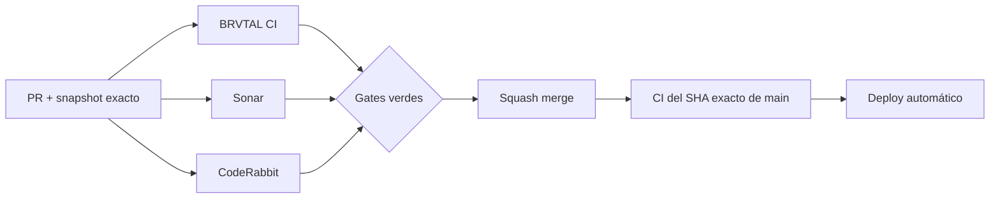

  

# BRVTAL — Último deploy

  <strong>Theme runtime · bounded complexity refactor</strong>

  

> Snapshot transitorio de este deploy. Se reemplaza en el siguiente; no es changelog acumulativo.

## Estado del deploy

| Señal | Estado | Evidencia |
| --- | --- | --- |
| Base exacta | ✅ **VALIDATED IN CODE** | `main` `1167b2560caaad696f56b05438e3b2177e6ada74` · BRVTAL CI #1085 |
| Alcance | 🧪 **#451** | complejidad cognitiva del Theme runtime público |
| Browser | 🌐 **Playwright** | desktop/mobile, wordmark, favicon, preloader y fallbacks |
| Sonar | ✅ **Quality Gate** | 0 issues nuevos / 0 hotspots antes de findings finales |
| Producción | ⚪ **No validada** | CI no equivale a validación de producción |

## Flujo de entrega

## Qué se hizo

- Divide la lógica de branding de `js/public-theme-runtime.js` en helpers acotados sin cambiar API pública ni modelo de datos.
- Mantiene una sola fuente de settings mediante `window.BRVTALPublicDataPromise`, sin segunda petición pública cuando el payload ya existe.
- Conserva header, hero, favicon, preloader y binding responsive.
- Valida `mobileLogo`, `preloaderLogo` y `logo` de forma independiente antes de aplicar fallback.
- Un asset preferido inválido ya no bloquea un `logo` principal válido.
- `wordmark` conserva prioridad en header/preloader, mientras el hero usa el logo visual.
- Un header logo que falla al cargar se elimina y deja visible el branding textual.
- Se añadieron regresiones browser específicas para los findings funcionales de CodeRabbit.

## Archivos modificados en este deploy

- `README.md` — snapshot nuevo y exacto del deploy #451.
- `js/public-theme-runtime.js` — helpers de branding y fallback seguro por asset.
- `tests/e2e/public-theme-runtime.spec.mjs` — cobertura ejecutable de responsive, wordmark y fallbacks inválidos.
- `tests/settings-control-plane-contract.php` — contrato suplementario de prioridad del wordmark.

## Validación

- Base exacta `1167b2560caaad696f56b05438e3b2177e6ada74` pasó BRVTAL CI #1085.
- El primer ciclo de #505 pasó BRVTAL CI #1088, Chromium y Sonar; CodeRabbit detectó tres findings válidos que se corrigen en este head.
- El nuevo head debe volver a pasar BRVTAL CI / Chromium, Sonar y CodeRabbit.
- Este slice no toca DB, sesión admin ni mutaciones privadas; real-stack/database pueden quedar fuera por scope.
- Tras squash merge se verificará BRVTAL CI sobre el SHA exacto resultante de `main`.
- No se declara **VALIDATED IN PRODUCTION** desde CI.

## Qué sigue

1. Cerrar el segundo ciclo de BRVTAL CI / Sonar / CodeRabbit.
2. Squash merge y exact-main CI.
3. Marcar Theme runtime como cubierto en #451 si el nuevo ciclo permanece verde.
4. Continuar con #481 IndexNow, ya diagnosticado, sin mezclarlo con este refactor.

## Panorama general pendiente

| Frente | Estado / siguiente foco |
| --- | --- |
| 🧪 **Sonar / calidad** | #451 · cerrar Theme runtime y continuar deuda vigente |
| 🔎 **SEO / IndexNow** | #481 · próximo slice preparado |
| 🗃️ **Archivo cultural** | #398 · Archive/Memories conectados por relaciones explícitas |
| 🎛️ **Apariencia** | #149 — completar Light en módulos modernos |
| 🖼️ **Hero Slider** | #221 integridad editorial · #480 regresión visual desktop |
| 🔐 **Seguridad editorial** | #257, #216, #174, #193 |
| 📈 **Analytics** | #427 — completar eventos `brvtal_*` en GTM/GA4 |
| ✍️ **Content / edición** | #224, #252 |
| 🧾 **Activity / operaciones** | #232, #195 |
| 📚 **Bulk Actions** | #275 — registros >500 sin falsa exhaustividad |
| 🌐 **Idioma** | #212 — español canónico + inglés automático por fases |
| 💾 **Backups** | #389 — scheduling seguro + Drive opcional |

---

BRVTAL · Rave till Grave · deploy snapshot

