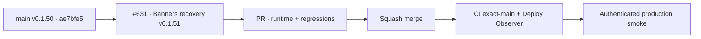

# BRVTAL — Último deploy

  
  
  

> **Production incident #631** · exact `main` v0.1.50 `ae7bfe551e4b754d29fc6170d17b5a7dda76cf0f` tiene CI exact-main y Deploy Observer verdes. Smoke #35956208496 pasó release/health/Home/Admin/Events/date/Sets relations y falló en Hero Slider intento 2: `window.go('hero-slider')` devolvió `false` sin 5xx. **Engineering roles:** SRE / production incident responder, frontend reliability engineer, QA automation engineer.

## Progress convention

- ✅ ~~Struck through~~ = completed and verified through the required delivery gates.
- 🚧 Normal text = pending or currently in progress.

## Estado del deploy

| Señal | Estado | Evidencia |
| --- | --- | --- |
| Work line | 🚧 **#631 · repeated Banners load recovery** | `work/issue-631`; reserva `913afe75-2f43-40e6-8ec6-1c092596c318` |
| Base exacta | ✅ ~~main v0.1.50~~ | `ae7bfe551e4b754d29fc6170d17b5a7dda76cf0f` |
| Versión | 🚧 **v0.1.51 candidate** | runtime Banners reliability |
| CI exact-main base | ✅ ~~success~~ | [#35956107649](https://github.com/pl0n3r/brvtal/actions/runs/35956107649) |
| Deploy Observer base | ✅ ~~success~~ | [#35956107639](https://github.com/pl0n3r/brvtal/actions/runs/35956107639) |
| Smoke base | ⛔ **failure / Hero attempt 2** | [#35956208496](https://github.com/pl0n3r/brvtal/actions/runs/35956208496) · result=false |
| Entrega candidata | 🚧 retry Settings + host recovery + diagnostics | stale navigation sigue abortando |

## Huella del cambio

<!-- brvtal:git-delta -->

| Archivos | Inserciones | Eliminaciones | Neto |
| ---: | ---: | ---: | ---: |
| **7** | **+164** | **−42** | **+122** |

## Calidad y entrega

<!-- brvtal:gate-plan -->

| Control | Estado / contrato |
| --- | --- |
| Gates esperados | **preflight · coordination · fast[PHP+JS] · database · chromium · real-stack · webkit** |
| PR + snapshot exacto | Issue #631 · reserva `913afe75-2f43-40e6-8ec6-1c092596c318` |
| CodeRabbit / Sonar | 🚧 HEAD estable; máximo 3 rondas automáticas |
| CI del SHA exacto de main | 🚧 después del merge |
| Producción | 🚧 smoke debe completar Hero 3/3 y terminar con cero 5xx |

## Flujo de entrega

## Qué se hizo

- Smoke #35956208496 observó v0.1.50 / `ae7bfe55…` exactos.
- Health **200**, DB **connected**, Home **200**, DISCADMIN **200**, dashboard **436 ms**, Admin version, Events workspace y Event #6 date pasaron.
- Sets quedó acreditado: API **200 en 32 ms**, browser **200 en 57 ms**, Artist/Event esperados presentes en state y selects.
- Hero intento 1 pasó; intento 2 devolvió `false` antes de la aserción visual. No hubo 5xx ni mutaciones productivas.
- `hero-slider.js` hoy usa el mismo `false` para carga stale, host perdido y error de Settings, por lo que el smoke no podía distinguir causa.
- La candidata reintenta una vez la lectura de Settings solo para errores reintentables; `AUTH_REQUIRED`, credenciales inválidas y rate limit no se ocultan.
- Si el host desaparece mientras la misma revisión sigue activa, el workspace se recrea únicamente si seguimos autenticados y `state.section === 'hero-slider'`.
- Una revisión realmente stale sigue abortándose; no se resucita una navegación abandonada.
- Se expone diagnóstico acotado de la última carga y el smoke lo persiste si una navegación Hero devuelve `false`.
- Regresiones nuevas cubren retry de Settings y pérdida/recreación del host durante la carga.
- Sin SQL, migraciones ni escrituras productivas.

## Archivos modificados en este deploy

- `README.md` — snapshot exacto del incidente y gates.
- `config/version.php` — candidato v0.1.51.
- `discadmin/hero-slider.js` — retry/recovery y diagnóstico de carga.
- `package.json` — versión v0.1.51.
- `tests/e2e/hero-slider-v2.spec.mjs` — regresiones de retry y host invalidado.
- `tests/e2e/production-authenticated-smoke.mjs` — evidencia de diagnóstico Hero en fallo.
- `tests/hero-slider-contract.php` — contrato estático de retry/recovery/diagnóstico.

## Validación

- ✅ ~~Base v0.1.50: CI #35956107649 y Deploy Observer #35956107639 verdes.~~
- ✅ ~~Smoke #35956208496 acreditó todos los pasos hasta Sets y Hero intento 1.~~
- 🚧 PR CI/revisión, merge y smoke final pendientes; **no declarar PRODUCTION GREEN** antes.
- 🚧 El smoke final debe tener Hero **3/3**, cero 5xx y cero mutaciones bloqueadas.

## Qué sigue

| Lane | Trabajo |
| --- | --- |
| **NOW** | 🚧 [#631](https://github.com/pl0n3r/brvtal/issues/631): validar v0.1.51, mergear y repetir smoke real. |
| **NEXT** | 🚧 [#533](https://github.com/pl0n3r/brvtal/issues/533): publicar `🟢 PRODUCTION GREEN` solo con las cinco evidencias. |
| **LATER** | 🚧 detener BRVTAL después de GREEN mientras Tanda 1 global siga abierta. |
| **BLOCKED / EXTERNAL** | 🚧 Condor/GrindFlow sin GREEN y factory `v1.0.0` ausente; no iniciar Tanda 2. |

## Panorama general pendiente

- 🚧 **NOW**: cerrar #631 con smoke completo y cero 5xx.
- 🚧 **NEXT**: verificar incidentes/`[AUTO]` y registrar GREEN en #533.
- 🚧 **LATER**: esperar la barrera global.
- 🚧 **BLOCKED / EXTERNAL**: no adoptar todavía el kit factory.
