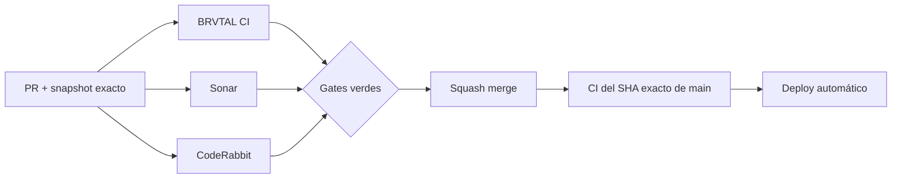

  

# BRVTAL — Último deploy

  <strong>Theme runtime · smaller responsibilities, same public behavior</strong>

  

> Este README representa **solo el deploy actual**. Se reemplaza en el siguiente deploy y no funciona como changelog acumulativo.

## Estado del deploy

| Señal | Estado | Evidencia |
| --- | --- | --- |
| Base exacta | ✅ **VALIDATED IN CODE** | `main` `1167b2560caaad696f56b05438e3b2177e6ada74` · BRVTAL CI #1085 |
| Alcance | 🧪 **#451** | siguiente slice de complejidad en Theme runtime |
| Riesgo | 🧩 **Refactor** | sin cambio de schema, API ni contrato público |
| Browser | 🌐 **Playwright** | branding desktop/mobile + favicon/preloader + fallback |
| Producción | ⚪ **No validada por este PR** | CI verde no equivale a validación de producción |

## Flujo de entrega

## Qué se hizo

- Continúa #451 con un slice único sobre `js/public-theme-runtime.js`, sin mezclar bugs funcionales de Theme Studio.
- La selección de logos, sincronización del header/hero, binding responsive, favicon y preloader quedan en helpers pequeños y explícitos.
- `updateBrandLogo()` conserva su contrato y ahora orquesta helpers en lugar de concentrar toda la ramificación.
- `applyBranding()` conserva la misma autoridad pública pero separa copy, logo responsive, favicon y preloader.
- Se preservan los fallbacks actuales: URLs no seguras no se aplican, un header logo fallido se retira y el branding textual permanece disponible.
- El runtime sigue reutilizando `window.BRVTALPublicDataPromise`; el test verifica que no aparezca una segunda petición a `/api/public.php`.
- Playwright valida cambio desktop→mobile, hero/header, favicon, preloader, tokens de color y fallback de imagen.

## Archivos modificados en este deploy

- `README.md` — snapshot exacto del slice #451.
- `js/public-theme-runtime.js` — separa responsabilidades del branding runtime sin cambiar su API.
- `tests/settings-control-plane-contract.php` — protege consumo y prioridad del wordmark sin acoplarse al helper anterior.
- `tests/e2e/public-theme-runtime.spec.mjs` — regresión browser para branding responsive y fallback.

## Validación

- Base exacta `1167b2560caaad696f56b05438e3b2177e6ada74` pasó BRVTAL CI #1085 completo.
- El PR debe volver a pasar BRVTAL CI / Chromium, Sonar y CodeRabbit sobre su SHA exacto.
- Sonar debe confirmar que el refactor reduce el finding de complejidad objetivo sin introducir issues nuevos.
- Para este runtime público no hay operación autenticada útil; la regla del usuario E2E aplica donde exista un flujo admin/privado que probar.
- Tras squash merge se verificará BRVTAL CI sobre el SHA exacto resultante de `main`.
- Ningún resultado de CI implica por sí solo **VALIDATED IN PRODUCTION**.

## Qué sigue

1. Corregir findings válidos del ciclo BRVTAL CI / Sonar / CodeRabbit.
2. Squash merge y exact-main CI.
3. Revalidar #451 y marcar Theme runtime como resuelto solo si Sonar deja de reportar el grupo objetivo.
4. Continuar con el siguiente riesgo de mayor valor sin ampliar este PR.

## Panorama general pendiente

| Frente | Estado / siguiente foco |
| --- | --- |
| 🧪 **Sonar / calidad** | #451 · Theme runtime en este slice; luego siguiente grupo vigente |
| 🗃️ **Archivo cultural** | #398 · Archive/Memories ya conectados con relaciones explícitas |
| 🎛️ **Apariencia** | #149 — completar Light en módulos modernos |
| 🖼️ **Hero Slider** | #221 integridad editorial · #480 regresión visual desktop |
| 🔐 **Seguridad editorial** | #257, #216, #174, #193 |
| 🔎 **SEO / entrega pública** | #182, #214, #204, #272 → #390 · #479 alt · #481 IndexNow |
| 📈 **Analytics** | #427 — completar eventos `brvtal_*` dentro de GTM/GA4 |
| ✍️ **Content / edición** | #224, #252 |
| 🧾 **Activity / operaciones** | #232, #195 |
| 📚 **Bulk Actions** | #275 — registros >500 sin falsa exhaustividad |
| 🧭 **DISCADMIN / Theme** | #348, #351, #354 |
| 🌐 **Idioma** | #212 — español canónico + inglés automático por fases |
| 💾 **Backups** | #389 — scheduling seguro + Drive opcional |

---

BRVTAL · Rave till Grave · snapshot operativo, no historial acumulativo

