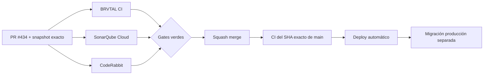

  

# BRVTAL — Último deploy

  <strong>Memories · curated cultural gallery</strong>

  

> Este README representa **solo el deploy actual**. Se reemplaza en el siguiente deploy y no funciona como changelog acumulativo.

## Estado del deploy

| Señal | Estado | Evidencia |
| --- | --- | --- |
| Base exacta | ✅ **VALIDATED IN CODE** | `main` `97bbe328427f356005b6ff17a6c02bd741bddc50` |
| PR | 🧠 **#434 Memories** | reconciliado sobre el `main` actual sin duplicar PR |
| Modelo | 🧩 **Curación explícita** | Media Library almacena; Memories selecciona/publica |
| Migración | ⚪ **No ejecutada en producción** | `database/migration_memories_01.sql` es aditiva/idempotente |
| Producción | ⚪ **No validada por este PR** | CI verde no equivale a validación de producción |

## Flujo de entrega

## Qué se hizo

- #415 convierte **Memories** en una galería curada apoyada en Media Library, sin crear una segunda ruta de upload.
- DISCADMIN incorpora **MEDIA → Memories** dentro del shell canónico y permite seleccionar imagen, video o audio existente.
- Cada Memory tiene título público, contexto opcional, orden y estado `draft/published`; quitar la curación conserva el asset fuente.
- La referencia a Media queda protegida frente a borrado mientras exista una Memory asociada.
- `api/public.php` entrega solo Memories publicadas con media fuente publicable y mantiene la allowlist pública canónica.
- Home Memories deja de tratar toda Media Library como galería y renderiza exclusivamente la colección curada.
- La galería pública soporta imagen/video/audio, layout responsive, viewer con PREV/NEXT, teclado, foco contenido/restaurado y video sin autoplay.
- El picker de Memories reutiliza el controlador modal compartido de DISCADMIN para Escape, Tab trap y restauración de foco.
- La rama antigua de #434 fue reconciliada sobre el `main` moderno conservando los cambios posteriores de Dashboard/CI/README y las correcciones previas de Sonar/CodeRabbit.
- Se mantiene cobertura contractual, MariaDB y Playwright para publicación, privacidad, integridad, navegación, accesibilidad y viewer.

> El merge de código **no ejecuta la migración de producción**. Esa operación permanece separada y protegida.

## Archivos modificados en este deploy

- `AGENTS.md` — registra Memories como modelo durable de curación y actualiza navegación/prioridad.
- `README.md` — snapshot visual exacto del deploy y panorama pendiente.
- `api/memories.php` — API protegida de curation CRUD con auth/CSRF y validación.
- `api/public.php` — entrega pública allowlisted de Memories curadas.
- `config/media_integrity.php` — impide borrar Media fuente mientras esté curada.
- `css/public-memories.css` — composición responsive y viewer público.
- `database/migration_memories_01.sql` — migración aditiva/idempotente.
- `database/schema.sql` — esquema base para instalaciones nuevas.
- `discadmin/admin-modal-accessibility.js` — integra el picker al controlador modal compartido.
- `discadmin/index.php` — carga estilos/scripts de Memories preservando el shell actual.
- `discadmin/memories.css` — UI responsive de curación.
- `discadmin/memories.js` — navegación, picker, edición, orden, publicación y eliminación segura.
- `discadmin/memories.php` — workspace autenticado de Memories.
- `index.php` — carga/versiona la presentación pública de Memories.
- `js/public-media.js` — render curado y viewer seguro de imagen/video/audio.
- `package.json` — integra la validación MariaDB de Memories.
- `tests/e2e/discadmin-memories.spec.mjs` — cobertura del flujo administrativo.
- `tests/e2e/public-media.spec.mjs` — galería curada, filtros, viewer y mobile.
- `tests/e2e/public-runtime-fallback.spec.mjs` — preserva runtime moderno y valida payload curado.
- `tests/integration/memories.php` — idempotencia, orden, privacidad, FK/unique y persistencia MariaDB.
- `tests/media-library-contract.php` — contrato compartido compatible con el refactor.
- `tests/memories-contract.php` — contrato de arquitectura, seguridad y entrega pública.

## Validación

- Base exacta reconciliada: `main` `97bbe328427f356005b6ff17a6c02bd741bddc50`.
- El head histórico `0af0c24769f77a162dc6279874abf427109302ad` se conserva como respaldo del trabajo previo.
- Las correcciones previas válidas de SonarQube y CodeRabbit se reaplicaron junto con sus regresiones.
- El nuevo head debe volver a pasar **BRVTAL CI / validate**, SonarQube Cloud y CodeRabbit antes de cualquier merge.
- Tras squash merge se verificará BRVTAL CI sobre el SHA exacto resultante de `main`.
- Ningún resultado de CI implica por sí solo **VALIDATED IN PRODUCTION**.

## Qué sigue

1. Confirmar que #434 sea mergeable contra `main` y que su diff contenga exactamente estos 22 archivos.
2. Resolver cualquier finding válido nuevo de BRVTAL CI, SonarQube o CodeRabbit sobre el head reconciliado.
3. Squash merge y verificar **BRVTAL CI / validate** sobre el SHA exacto de `main`.
4. Mantener `database/migration_memories_01.sql` sin ejecutar en producción automáticamente.
5. Después, continuar #398 con relaciones culturales explícitas; no inferir Memory ↔ Event/Artist/Set/Release por nombres, fechas o copy.

## Panorama general pendiente

| Frente | Estado / siguiente foco |
| --- | --- |
| 🧪 **Sonar / calidad** | #451 — continuar burn-down en public app / Archive / Theme runtime |
| 🎛️ **Apariencia** | #149 — completar Light en módulos modernos |
| 🖼️ **Hero Slider** | #221 integridad editorial · #480 regresión visual desktop |
| 🔐 **Seguridad editorial** | #257, #216, #174, #193 |
| 🔎 **SEO / entrega pública** | #182, #214, #204, #272 → #390 · #479 alt · #481 IndexNow |
| 📈 **Analytics** | #427 — completar eventos `brvtal_*` dentro de GTM/GA4 |
| ✍️ **Content / edición** | #224, #252 |
| 🧾 **Activity / operaciones** | #232, #195 |
| 📚 **Bulk Actions** | #275 — registros >500 sin falsa exhaustividad |
| 🧭 **DISCADMIN / Theme** | #348, #351 |
| 🗃️ **Archivo cultural** | #398, #403 — relaciones explícitas, sin heurísticas |
| 🧠 **Memories** | #415 / PR #434 — merge + exact-main CI; migración producción separada |
| 🌐 **Idioma** | #212 — español canónico + inglés automático por fases |
| 💾 **Backups** | #389 — scheduling seguro + Drive opcional |

---

BRVTAL · Rave till Grave · snapshot operativo, no historial acumulativo

