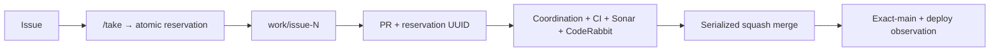

# BRVTAL — Último deploy

  
  
  

> **Development dashboard** · snapshot profesional de **solo el deploy actual**.

## Progress convention

- ✅ ~~Struck through~~ = completed and verified through the required delivery gates.
- 🚧 Normal text = pending or currently in progress.

## Estado del deploy

| Señal | Estado | Evidencia |
| --- | --- | --- |
| Work line | 🚧 **#571 multi-agent coordination (v0.1.22)** | atomic Issue reservation · canonical branches · PR collision prevention |
| Base exacta | ✅ **VALIDATED IN CODE** | `main` `da4527c484899cea912710e1fbeca611c03a2a7d` |
| Version | 🚧 **0.1.21 → 0.1.22** | infrastructure patch deploy |
| Producción base | ✅ **DEPLOYED release observed** | v0.1.21 visible through Production Deploy Observer after 9 s; not behavioral validation |

## Huella del cambio

<!-- brvtal:git-delta -->

| Archivos | Inserciones | Eliminaciones | Neto |
| ---: | ---: | ---: | ---: |
| **11** | **+1911** | **−67** | **+1844** |

## Calidad y entrega

<!-- brvtal:gate-plan -->

| Control | Estado / contrato |
| --- | --- |
| Gates | **preflight · coordination · fast[PHP+JS] · database · chromium · real-stack · webkit** |
| Reservation | atomic `work/issue-N` branch lock · trusted UUID marker |
| PR integrity | Issue + branch + reservation + closing relation fail closed |
| Collision safety | exact changed-file overlap against other open PRs targeting `main` |
| Lifecycle | available · reserved · in review · completed · cancelled · blocked |
| Sonar + CodeRabbit | parallel on stable head |
| Exact-main | CI of resulting main SHA after squash merge |

## Flujo de entrega

## Qué se hizo

- Se porta a BRVTAL la coordinación multiagente probada en Condor sin cambiar nombres canónicos existentes del repositorio.
- La creación de `work/issue-N` funciona como lock atómico por Issue.
- Los comandos `/take`, `/release UUID`, `/transfer UUID` y `/force-release` administran ownership sin depender del chat.
- Los estados de coordinación quedan visibles mediante labels y se sincronizan con eventos de PR/Issue.
- El PR falla si Issue, rama, reserva o metadata no coinciden.
- El gate detecta colisiones de archivos con otros PR abiertos hacia `main` y reporta paths exactos.
- El gate `coordination` entra al `validate` existente; no se crea un CI competidor.
- El propio PR #571 usa bootstrap seguro; después del merge las reservas pasan a ser obligatorias.
- Los PR deploy-bound deben terminar su título con `(vX.Y.Z)`.
- Versión **0.1.22**.

## Archivos modificados en este deploy

- `.github/workflows/update-release-metadata.yml` — agrega coordination al DAG y al validate agregado.
- `.github/workflows/work-coordination.yml` — comandos y sincronización GitHub-native de Issue/PR.
- `AGENTS.md` — reglas operativas durables de reserva, colisiones y paralelización.
- `README.md` — snapshot visual exacto de v0.1.22.
- `config/version.php` — release runtime v0.1.22.
- `docs/BRVTAL-SPEC.md` — contrato técnico durable de coordinación multiagente.
- `package.json` — versión y comando local de pruebas de coordinación.
- `scripts/work_coordinator.py` — árbitro de reservas, lifecycle, validación y colisiones.
- `tests/ci-scope-contract.php` — protege el DAG canónico con el nuevo gate de coordinación.
- `tests/project-operations-contract.php` — protege integración canónica al CI/documentación.
- `tests/test_work_coordinator.py` — cobertura de lock atómico, sesiones, lifecycle y collisions.

## Validación

- Base exacta `da4527c`: BRVTAL CI / `validate` success.
- Production Deploy Observer de la base: v0.1.21 observada tras 9 s.
- El PR debe cerrar unit tests del coordinador, BRVTAL CI, Sonar y CodeRabbit sobre el head estable.
- Exact-main seguirá siendo obligatorio después del squash merge.
- Deploy observado no equivale a comportamiento validado en producción.

## Qué sigue

| Lane | Trabajo |
| --- | --- |
| **NOW** | 🚧 [#571](https://github.com/pl0n3r/brvtal/issues/571) · multi-agent coordination and PR collision prevention. |
| **NEXT** | 🚧 [#518](https://github.com/pl0n3r/brvtal/issues/518) · canonical professional Admin data grid. |
| **LATER** | 🚧 [#257](https://github.com/pl0n3r/brvtal/issues/257), [#525](https://github.com/pl0n3r/brvtal/issues/525) · editor protection + rich Blog editor. |
| **EVIDENCE** | 🚧 [#564](https://github.com/pl0n3r/brvtal/issues/564) · gather more samples before Phase D. |
| **BLOCKED / EXTERNAL** | ✅ No active external blocker; [#534](https://github.com/pl0n3r/brvtal/issues/534) remains under freshness monitoring after v0.1.21 was observed. |

## Panorama general pendiente

| Lane | Frente | Issues |
| --- | --- | --- |
| **NOW** | 🚧 Multi-agent coordination / collision prevention | 🚧 [#571](https://github.com/pl0n3r/brvtal/issues/571) |
| **NEXT** | 🚧 Admin data grid | 🚧 [#518](https://github.com/pl0n3r/brvtal/issues/518) |
| **LATER** | 🚧 Admin editorial productivity | 🚧 [#257](https://github.com/pl0n3r/brvtal/issues/257), [#525](https://github.com/pl0n3r/brvtal/issues/525), [#524](https://github.com/pl0n3r/brvtal/issues/524), [#528](https://github.com/pl0n3r/brvtal/issues/528), [#529](https://github.com/pl0n3r/brvtal/issues/529) |
| **EVIDENCE** | 🚧 CI throughput Phase D decision | 🚧 [#564](https://github.com/pl0n3r/brvtal/issues/564) |
| **BLOCKED / EXTERNAL** | ✅ No active Hostinger blocker; release freshness restored in the latest observed deploy | [#534](https://github.com/pl0n3r/brvtal/issues/534) monitoring |
