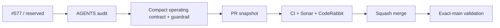

# BRVTAL — Último deploy

  
  
  

> **Development dashboard** · snapshot profesional de **solo el deploy actual**.

## Progress convention

- ✅ ~~Struck through~~ = completed and verified through the required delivery gates.
- 🚧 Normal text = pending or currently in progress.

## Estado del deploy

| Señal | Estado | Evidencia |
| --- | --- | --- |
| Work line | 🚧 **#577 AGENTS operating-contract audit** | autonomy · source ownership · compact bootstrap · anti-bloat guardrail |
| Base exacta | 🚧 **current main** | `7519c2d4749427622ff6de618b037d94b5a870b6` |
| Version | ✅ **0.1.23 unchanged** | non-runtime repository operating-contract maintenance |
| Producción base | ✅ **NO PRODUCT RUNTIME CHANGE** | no production behavior is modified by this PR |

## Huella del cambio

<!-- brvtal:git-delta -->

| Archivos | Inserciones | Eliminaciones | Neto |
| ---: | ---: | ---: | ---: |
| **3** | **+326** | **−541** | **−215** |

## Calidad y entrega

<!-- brvtal:gate-plan -->

| Control | Estado / contrato |
| --- | --- |
| Gates | **preflight · coordination · fast[PHP]** |
| Reservation | Issue #577 · `work/issue-577` · atomic reservation |
| PR integrity | **PR + snapshot exacto** · no overlap with #574 / #576 |
| AGENTS target | < 360 lines · < 30 KB · no product-state ledger |
| Source ownership | AGENTS=execution · SPEC=product · #533=roadmap · README=snapshot |
| Sonar + CodeRabbit | parallel on stable intended head |
| Exact-main | **CI del SHA exacto de main** after squash merge |

## Flujo de entrega

## Qué se hizo

- Se convierte `AGENTS.md` de manual mixto a contrato operativo para agentes.
- Se añade una regla explícita de autonomía: máximo trabajo seguro por turno, sin detenerse por microavances.
- Se mantiene paralelización segura y coordinación GitHub-native como comportamiento por defecto.
- Producto/arquitectura se delega a `docs/BRVTAL-SPEC.md`; ejecución/progreso a #533; snapshot a README.
- Se elimina el bootstrap histórico de #571 y otras reglas ya obsoletas.
- Se conserva el contrato de exact-main, Sonar, CodeRabbit, deploy observation y límites de producción.
- El test operativo impide que AGENTS vuelva a superar 360 líneas / 30 KB o reintroduzca inventarios de producto.

## Archivos modificados en este deploy

- `AGENTS.md` — bootstrap operativo compacto y reglas de autonomía/paralelización.
- `README.md` — snapshot exacto de #577.
- `tests/project-operations-contract.php` — guardrails de tamaño, ownership y contenido de AGENTS.

## Validación

- Cambio no-runtime: no altera versión de producto ni comportamiento público/DISCADMIN.
- El PR debe pasar contract suite, README exacto, coordination, Sonar y CodeRabbit.
- Exact-main sigue siendo obligatorio después del squash merge.
- Sin cambios de producción ni migraciones.

## Qué sigue

| Lane | Trabajo |
| --- | --- |
| **NOW** | 🚧 [#577](https://github.com/pl0n3r/brvtal/issues/577) · compact AGENTS operating contract. |
| **NEXT** | 🚧 [#257](https://github.com/pl0n3r/brvtal/issues/257) / PR #574 · unsaved editor protection; [#575](https://github.com/pl0n3r/brvtal/issues/575) / PR #576 · production-smoke IA alignment. |
| **LATER** | 🚧 [#525](https://github.com/pl0n3r/brvtal/issues/525), [#524](https://github.com/pl0n3r/brvtal/issues/524), [#528](https://github.com/pl0n3r/brvtal/issues/528), [#529](https://github.com/pl0n3r/brvtal/issues/529). |
| **BLOCKED / EXTERNAL** | 🚧 No active Hostinger blocker; external delivery evidence remains independently observed. |

## Panorama general pendiente

| Lane | Frente | Issues |
| --- | --- | --- |
| **NOW** | 🚧 Agent operating model | 🚧 [#577](https://github.com/pl0n3r/brvtal/issues/577) |
| **NEXT** | 🚧 Active editorial / production-smoke lines | 🚧 [#257](https://github.com/pl0n3r/brvtal/issues/257), [#575](https://github.com/pl0n3r/brvtal/issues/575) |
| **LATER** | 🚧 Rich editor / membership / drafts / preview | 🚧 [#525](https://github.com/pl0n3r/brvtal/issues/525), [#524](https://github.com/pl0n3r/brvtal/issues/524), [#528](https://github.com/pl0n3r/brvtal/issues/528), [#529](https://github.com/pl0n3r/brvtal/issues/529) |
| **BLOCKED / EXTERNAL** | 🚧 External deploy/production evidence | monitored separately from code validation |
