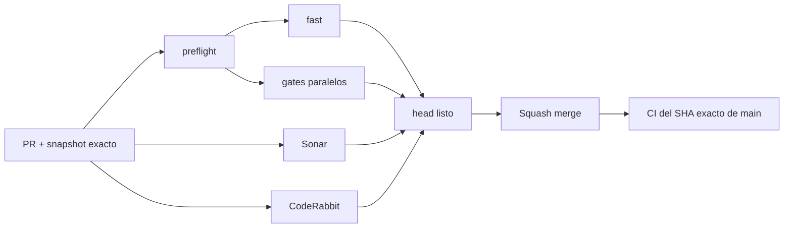

# BRVTAL — Último deploy

  
  
  

> **Development dashboard** · snapshot profesional de **solo el deploy actual**.

## Estado del deploy

| Señal | Estado actual | Evidencia |
| --- | --- | --- |
| Work line | 🎨 **#521 Event Accent** | picker + HEX + swatch + validación |
| Base exacta | ✅ **VALIDATED IN CODE** | `main` `b6fc5e7da6c8b73409f7eea1391d1b44b6778414` · exact-main `validate` verde |
| Fase | ⚡ **Phase 1 / quick wins** | [#533](https://github.com/pl0n3r/brvtal/issues/533) |
| CI | 📉 **123 s → 84 s** | ~31.7% tras [#535](https://github.com/pl0n3r/brvtal/pull/535) |
| Producción | ⛔ **BLOCKED / EXTERNAL** | Hostinger marker en [#534](https://github.com/pl0n3r/brvtal/issues/534) |

## Huella del cambio

<!-- brvtal:git-delta -->

| Archivos | Inserciones | Eliminaciones | Neto |
| ---: | ---: | ---: | ---: |
| **11** | **+327** | **−49** | **+278** |

## Calidad y entrega

<!-- brvtal:gate-plan -->

| Control | Estado / contrato |
| --- | --- |
| Gates seleccionados | **preflight · fast[PHP+JS] · database · chromium · real-stack · webkit** |
| Browser | picker/HEX/preview y estados inválidos |
| Real-stack | usuario E2E persiste Accent canónico |
| Sonar | Clean-as-You-Code en paralelo |
| CodeRabbit | full review del head estable en paralelo |
| Exact-main | CI del SHA exacto de main tras squash merge |
| Producción | deploy marker ≠ validación funcional |

## Flujo de entrega

## Qué se hizo

- Event Accent ahora usa un componente reutilizable con picker visual, HEX editable y swatch inmediato.
- Picker y texto se sincronizan; seis dígitos se normalizan a `#rrggbb`.
- Valores inválidos muestran estado accesible y no se guardan silenciosamente.
- El workflow atómico y el servidor rechazan HEX inválido; el servidor normaliza el valor válido.
- Real-stack usa el admin E2E para verificar UI, persistencia y rechazo 422.

## Archivos modificados en este deploy

- `api/event-workflow-lib.php` — valida y normaliza Accent.
- `discadmin/admin-color-field.css` — estilos del campo reutilizable.
- `discadmin/admin-color-field.js` — sincronización picker/HEX/swatch.
- `discadmin/content-core.js` — sincroniza y valida el editor.
- `discadmin/content-core.php` — control visual accesible.
- `discadmin/event-workflow.js` — normalización antes del save atómico.
- `discadmin/index.php` — carga el componente compartido.
- `README.md` — dashboard exacto de #521.
- `tests/e2e/content-core-real-stack.spec.mjs` — persistencia real-stack.
- `tests/e2e/discadmin-color-field.spec.mjs` — regresiones picker/HEX.
- `tests/event-workflow-contract.php` — contrato de normalización/rechazo.

## Validación

- HEX escrito ↔ picker ↔ preview permanecen sincronizados.
- Entrada `A1B2C3` se normaliza a `#a1b2c3`.
- `#12` falla en UI y servidor con `INVALID_ACCENT`.
- El input mantiene ayuda en `aria-describedby` y expone el error mediante `aria-errormessage`, oculto mientras el valor es válido.
- El Event público conserva su contrato de color/fallback.

## Qué sigue

| Lane | Trabajo |
| --- | --- |
| **NOW** | Cerrar [#521](https://github.com/pl0n3r/brvtal/issues/521). |
| **NEXT** | [#526](https://github.com/pl0n3r/brvtal/issues/526) → [#522](https://github.com/pl0n3r/brvtal/issues/522). |
| **BLOCKED / EXTERNAL** | [#534](https://github.com/pl0n3r/brvtal/issues/534) Hostinger marker/hPanel. |
| **LATER** | [#479](https://github.com/pl0n3r/brvtal/issues/479), [#517](https://github.com/pl0n3r/brvtal/issues/517), [#221](https://github.com/pl0n3r/brvtal/issues/221). |

## Panorama general pendiente

| Lane | Frente | Issues |
| --- | --- | --- |
| **NOW** | Event authoring | [#521](https://github.com/pl0n3r/brvtal/issues/521) |
| **NEXT** | Admin friction | [#526](https://github.com/pl0n3r/brvtal/issues/526), [#522](https://github.com/pl0n3r/brvtal/issues/522) |
| **BLOCKED / EXTERNAL** | Deploy | [#534](https://github.com/pl0n3r/brvtal/issues/534) |
| **LATER** | Quick wins | [#479](https://github.com/pl0n3r/brvtal/issues/479), [#517](https://github.com/pl0n3r/brvtal/issues/517), [#221](https://github.com/pl0n3r/brvtal/issues/221) |
