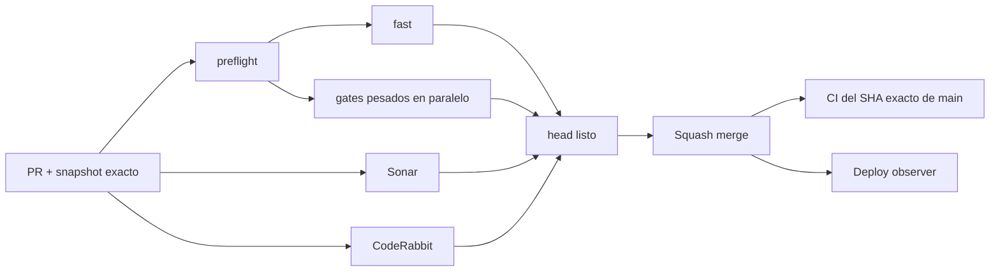

# BRVTAL — Último deploy

  
  
  

> **Development dashboard** · snapshot profesional de **solo el deploy actual**. Estado útil primero; branding decorativo después.

## Estado del deploy

| Señal | Estado actual | Evidencia |
| --- | --- | --- |
| Work line | 🟢 **#520 Events single-list** | elimina el Search Events/listado duplicado sin perder el editor guiado |
| Base exacta | ✅ **VALIDATED IN CODE** | `main` `37de68940ba466b8c6b1790ae2213240e9ec6299` · exact-main `validate` verde |
| Fase | ⚡ **Phase 1 / quick wins** | roadmap maestro [#533](https://github.com/pl0n3r/brvtal/issues/533) |
| Versión producto | 🧪 **pre-1.0** | versión humana/semver pendiente en [#517](https://github.com/pl0n3r/brvtal/issues/517) |
| Lead time CI | 📉 **123 s → 84 s** | último full-scope medido: **−31.7%** tras [#535](https://github.com/pl0n3r/brvtal/pull/535) |
| Producción | ⛔ **BLOCKED / EXTERNAL** | marker exacto no apareció en >10 min; revisar Hostinger hPanel en [#534](https://github.com/pl0n3r/brvtal/issues/534) |

## Huella del cambio

<!-- brvtal:git-delta -->

| Archivos | Inserciones | Eliminaciones | Neto |
| ---: | ---: | ---: | ---: |
| **4** | **+55** | **−48** | **+7** |

La huella se calcula con `git diff --numstat` y CI rechaza el README si estos números o la lista de archivos quedan desactualizados.

## Calidad y entrega

<!-- brvtal:gate-plan -->

| Control | Estado / contrato |
| --- | --- |
| Gates seleccionados | **preflight · fast[JS] · chromium · real-stack** |
| BRVTAL CI | badge vivo arriba · `validate` agrega todas las capas aplicables |
| Sonar | badge vivo arriba · Clean-as-You-Code, sin inventar resultados |
| CodeRabbit | full review sobre el head estable, en paralelo con CI/Sonar |
| Exact-main | se valida otra vez después del squash merge |
| Producción | deploy marker y validación funcional son evidencias distintas |

## Flujo de entrega

## Qué se hizo

- Mantiene **un solo Search Events/listado visible**: el workspace superior del shell.
- Content Core sigue montado internamente, pero su lista duplicada queda oculta y sirve únicamente al modal guiado de Events.
- `+ NEW EVENT` y EDIT continúan entrando al workflow completo de identidad, fecha/lugar, lifecycle, tickets, roster y SEO.
- Añade regresión Playwright del shell y validación **real-stack con el usuario E2E** para impedir que el duplicado vuelva.

## Archivos modificados en este deploy

**DISCADMIN**
- `discadmin/admin-information-architecture.js` — deja Content Core Events como motor interno del modal y oculta su workspace duplicado.

**Tests**
- `tests/e2e/discadmin-information-architecture.spec.mjs` — exige un único buscador/listado visible y conserva el editor guiado.
- `tests/e2e/content-core-real-stack.spec.mjs` — valida el flujo canónico Events con PHP/MariaDB y el admin E2E.

**Handoff**
- `README.md` — snapshot exacto de #520.

## Validación

- Playwright de Information Architecture comprueba **1** buscador de Events visible, no dos.
- El Content Core interno permanece montado con su `.wrap` oculto, de modo que el estado y el modal avanzado siguen disponibles.
- El real-stack entra por `/discadmin/?module=events`, usa el usuario E2E aislado y abre el modal desde el botón superior.
- BRVTAL CI selecciona Chromium + real-stack para este diff; Sonar y CodeRabbit corren en paralelo sobre el head estable.
- Tras merge se vuelve a comprobar el SHA exacto de `main`; el bloqueo de Hostinger sigue separado de la validación de código.

## Qué sigue

| Lane | Trabajo |
| --- | --- |
| **NOW** | Cerrar [#520](https://github.com/pl0n3r/brvtal/issues/520): un solo workspace de Events visible. |
| **NEXT** | [#521](https://github.com/pl0n3r/brvtal/issues/521) Event Accent picker → [#526](https://github.com/pl0n3r/brvtal/issues/526) taxonomía Blog → [#522](https://github.com/pl0n3r/brvtal/issues/522) Media navigation/UI. |
| **BLOCKED / EXTERNAL** | [#534](https://github.com/pl0n3r/brvtal/issues/534): Hostinger no expone el SHA exacto en la ventana de 10 min; revisar auto-deploy/autorización en hPanel. |
| **LATER** | Continuar [#533](https://github.com/pl0n3r/brvtal/issues/533) de quick wins hacia cambios estructurales. |

## Panorama general pendiente

| Lane | Frente | Issues |
| --- | --- | --- |
| **NOW** | Admin Events | [#520](https://github.com/pl0n3r/brvtal/issues/520) |
| **NEXT** | Admin friction | [#521](https://github.com/pl0n3r/brvtal/issues/521), [#526](https://github.com/pl0n3r/brvtal/issues/526), [#522](https://github.com/pl0n3r/brvtal/issues/522), [#479](https://github.com/pl0n3r/brvtal/issues/479), [#517](https://github.com/pl0n3r/brvtal/issues/517), [#221](https://github.com/pl0n3r/brvtal/issues/221) |
| **BLOCKED / EXTERNAL** | Deploy Hostinger | [#534](https://github.com/pl0n3r/brvtal/issues/534) |
| **LATER** | Shell / apariencia | [#348](https://github.com/pl0n3r/brvtal/issues/348), [#149](https://github.com/pl0n3r/brvtal/issues/149), [#514](https://github.com/pl0n3r/brvtal/issues/514) |
| **LATER** | Editorial productivity | [#518](https://github.com/pl0n3r/brvtal/issues/518), [#519](https://github.com/pl0n3r/brvtal/issues/519), [#525](https://github.com/pl0n3r/brvtal/issues/525), [#528](https://github.com/pl0n3r/brvtal/issues/528) |
| **LATER** | Operational dashboards | [#513](https://github.com/pl0n3r/brvtal/issues/513), [#515](https://github.com/pl0n3r/brvtal/issues/515), [#532](https://github.com/pl0n3r/brvtal/issues/532) |
| **LATER** | Archive / resilience | [#398](https://github.com/pl0n3r/brvtal/issues/398), [#389](https://github.com/pl0n3r/brvtal/issues/389), [#530](https://github.com/pl0n3r/brvtal/issues/530) |
