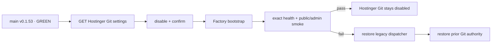

# BRVTAL — Último deploy

  
  
  

> Snapshot de **solo el deploy actual**: #672 añade el control plane para transferir de forma manual y reversible la autoridad de deploy de Hostinger Git al layout Factory. Este PR no ejecuta el cutover ni habilita deploy automático por `push`. Base exacta `main cf9d3b67c700b774f9ffbe959d84430f0307c6d8` / v0.1.53 GREEN.

## Progress convention

- ✅ ~~Struck through~~ = completed and verified through the required delivery gates.
- 🚧 Normal text = pending or currently in progress.

## Estado del deploy

| Señal | Estado | Evidencia |
| --- | --- | --- |
| Work line | 🚧 **#672 · controlled Hostinger API cutover** | `work/issue-672`; reserva `277c92aa-213a-46df-ae19-f8cb7847e8d4` |
| Base exacta | ✅ ~~main v0.1.53 GREEN~~ | `cf9d3b67c700b774f9ffbe959d84430f0307c6d8` |
| Versión producto | ✅ ~~v0.1.53 sin cambio~~ | repository-only; `deploy_bound=false` |
| Hostinger API | 🚧 **GET → disable → verify** | Bearer secret; settings exactos de BRVTAL |
| Workflow | 🚧 **manual-only** | `workflow_dispatch` + `CUTOVER-BRVTAL`; sin `push` |
| Orden de recovery | 🚧 **legacy dispatcher → Git authority** | Git no se reactiva si el layout no puede restaurarse |
| Producción | ✅ ~~sin writes remotos en este PR~~ | el workflow nuevo no se ejecuta durante entrega |

## Huella del cambio

<!-- brvtal:git-delta -->

| Archivos | Inserciones | Eliminaciones | Neto |
| ---: | ---: | ---: | ---: |
| **6** | **+498** | **−47** | **+451** |

## Calidad y entrega

<!-- brvtal:gate-plan -->

| Control | Estado / contrato |
| --- | --- |
| Gates esperados | **preflight · coordination · fast[PHP+JS] · database · chromium · real-stack · webkit · recovery** |
| PR + snapshot exacto | Issue #672 · reserva `277c92aa-213a-46df-ae19-f8cb7847e8d4` |
| Roles | Infrastructure · SRE · Security · QA |
| Secretos runtime | `HOSTINGER_API_TOKEN` · `DEPLOY_TOKEN` · `DEPLOY_SSH_KEY`; nunca se imprimen |
| API confiable | endpoint Hostinger fijo; sin URL controlada por usuario ni shell |
| Cutover | settings BRVTAL exactos → disable confirmado → bootstrap → revalidación API |
| Recovery | bootstrap restaura layout; solo después se restaura la configuración Git previa |
| Review | BRVTAL CI + Factory gates + Privacy + Sonar/CodeQL/CodeRabbit sobre HEAD estable |
| CI del SHA exacto de main | 🚧 después del merge |

## Flujo de entrega

## Qué se hizo

- Añade `ops/factory/hostinger_cutover.py`: cliente estándar `urllib`, endpoint oficial fijo, Bearer auth sanitizado y schema de settings fail-closed.
- Valida que owner/repository/branch sean `pl0n3r/brvtal@main` y que el target sea el document root del sitio; el PUT reutiliza exactamente la configuración observada y solo cambia `is_enabled`.
- Deshabilita auto-deploy, relee Hostinger y exige estado disabled **antes** de llamar el bootstrap reversible de #670.
- En fallo posterior al bootstrap, verifica/restaura primero el dispatcher legacy; solo entonces devuelve la configuración Git original. Si no puede probar el layout, deja Git apagado.
- Añade `.github/workflows/factory-hostinger-cutover.yml` con trigger exclusivamente manual, mínimo privilegio, timeout, concurrency serial y confirmación exacta `CUTOVER-BRVTAL`.
- Integra `tests/test_hostinger_cutover.py` al suite canónico mediante `factory-hostinger-transport-contract.php`: éxito, idempotencia disabled, schema/settings inesperados, API 503 sanitizado, fallo bootstrap, fallo post-bootstrap y restore fail-closed.
- No añade todavía el caller permanente `factory/deploy.yml@v1` y no ejecuta el cutover real en este slice.

## Archivos modificados en este deploy

- `.github/workflows/factory-hostinger-cutover.yml`
- `tests/factory-hostinger-transport-contract.php`
- `README.md`
- `ops/factory/hostinger_cutover.py`
- `ops/factory/transport.py`
- `tests/test_hostinger_cutover.py`

## Validación

- 🚧 `tests/test_hostinger_cutover.py` debe pasar dentro del gate `fast`.
- 🚧 El suite canónico ejecuta el unittest del cutover sin modificar el workflow compartido; database/chromium/real-stack/webkit/recovery permanecen bajo el alcance normal del diff.
- 🚧 Factory CI/Policy/Privacy, Sonar y CodeQL deben pasar sobre el HEAD estable.
- 🚧 CodeRabbit continúa advisory según AGENTS.md; solo hallazgos accionables bloquean.
- ✅ ~~Producción permanece intacta~~: no existe trigger automático hacia el nuevo cutover.

## Qué sigue

| Lane | Trabajo |
| --- | --- |
| **NOW** | 🚧 [#672](https://github.com/pl0n3r/brvtal/issues/672): validar e integrar control API + workflow manual. |
| **NEXT** | 🚧 [#630](https://github.com/pl0n3r/brvtal/issues/630): ejecutar el cutover controlado y, tras evidencia GREEN, añadir el caller Factory por `push`. |
| **LATER** | 🚧 [#533](https://github.com/pl0n3r/brvtal/issues/533): reanudar roadmap tras cerrar TANDA 2. |
| **BLOCKED / EXTERNAL** | 🚧 [#627](https://github.com/pl0n3r/brvtal/issues/627): labels espera paridad central de Factory. |

## Panorama general pendiente

- 🚧 **NOW**: cerrar #672 sin tocar producción.
- 🚧 **NEXT**: ejecutar cutover manual desde exact main y probar rollback/health antes de habilitar push deploy.
- 🚧 **LATER**: cerrar #630 con merge → producción validada o rollback automático.
- 🚧 **BLOCKED / EXTERNAL**: #627 sigue fuera hasta paridad completa del kit.
