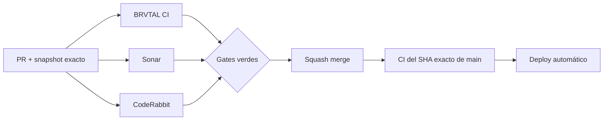

  

# BRVTAL — Último deploy

<strong>Cultural Archive · Home TRANSMISSIONS</strong>

  

> Este README representa **solo el deploy actual**. Se reemplaza en el siguiente deploy y no funciona como changelog acumulativo.

## Estado del deploy

| Señal | Estado | Evidencia |
| --- | --- | --- |
| Base exacta | ✅ **VALIDATED IN CODE** | `main` `824114b4dbe105bc701c75cf2fb998fda5d1aed1` · BRVTAL CI #1096 |
| Alcance | 🧪 **#506 / #398** | Blog publicado → TRANSMISSIONS en Home |
| Datos | 🔗 **Estructurados** | reutiliza Blog + relaciones Event/Artist/Set/Release |
| Browser | 🌐 **Playwright** | render, navegación, vacío/fallo y mobile |
| Producción | ⚪ **No validada** | CI no equivale a validación de producción |

## Flujo de entrega

## Qué se hizo

- Añade **TRANSMISSIONS** a Home como capa editorial BRVTAL sobre el Blog publicado existente.
- Reutiliza `window.BRVTALPublicDataPromise`; no crea endpoint ni segunda petición CMS.
- Conserva el orden canónico del payload y limita Home a cuatro señales editoriales.
- Los títulos navegan a `/blog/{slug}` y solo se muestran relaciones estructuradas explícitas Event/Artist/Set/Release.
- Añade estados honestos para colección vacía y fallo del payload compartido.
- Añade layout mobile-first, targets táctiles y protección contra overflow.
- No incluye migraciones ni cambios de esquema.

## Archivos modificados en este deploy

- `README.md` — snapshot exacto y panorama pendiente.
- `index.html` — mount y fallback estático de TRANSMISSIONS.
- `index.php` — entrega/defer versionado de estilos.
- `js/public-runtime-loader.js` — carga TRANSMISSIONS dentro del core runtime.
- `js/public-transmissions.js` — render editorial desde el payload público compartido.
- `css/public-transmissions.css` — lenguaje visual Archive/System y responsive.
- `tests/public-transmissions-contract.php` — contratos de wiring, datos y rutas.
- `tests/e2e/public-mobile-performance.spec.mjs` — contrato del orden del runtime público con TRANSMISSIONS.
- `tests/e2e/public-transmissions.spec.mjs` — render, relaciones, vacío/fallo y mobile.

## Validación

- La base exacta `824114b4dbe105bc701c75cf2fb998fda5d1aed1` pasó BRVTAL CI #1096.
- El branch debe pasar ahora tests dirigidos, BRVTAL CI / validate, Sonar y CodeRabbit.
- Tras squash merge se verificará BRVTAL CI sobre el SHA exacto resultante de `main`.
- No se declara **VALIDATED IN PRODUCTION** desde CI.

## Qué sigue

1. Cerrar tests y gates de #506.
2. Squash merge + exact-main CI.
3. Continuar #398 profundizando rutas de archivo cultural con relaciones explícitas.
4. Mantener #481 IndexNow como frente SEO independiente preparado.

## Panorama general pendiente

| Frente | Estado / siguiente foco |
| --- | --- |
| 🗃️ **Archivo cultural** | #398 · profundizar navegación relacional tras TRANSMISSIONS |
| 🔎 **SEO / IndexNow** | #481 · integración preparada |
| 🧪 **Sonar / calidad** | #451 · continuar burn-down por riesgo |
| 🎛️ **Apariencia** | #149 · completar Light en módulos modernos |
| 🖼️ **Hero Slider** | #221 integridad editorial · #480 regresión visual desktop |
| 🔐 **Seguridad editorial** | #257, #216, #174, #193 |
| 📈 **Analytics** | #427 · completar eventos `brvtal_*` en GTM/GA4 |
| ✍️ **Content / edición** | #224, #252 |
| 🧾 **Activity / operaciones** | #232, #195 |
| 📚 **Bulk Actions** | #275 · registros >500 sin falsa exhaustividad |
| 🌐 **Idioma** | #212 · español canónico + inglés automático por fases |
| 💾 **Backups** | #389 · scheduling seguro + Drive opcional |

---

BRVTAL · Rave till Grave · deploy snapshot

