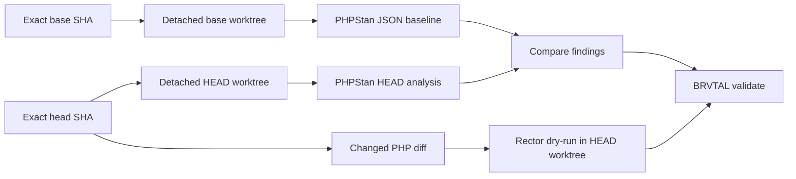

# BRVTAL — Último deploy

  
  
  

> Snapshot de **solo el deploy actual**: trabajo repository-only de calidad para #685. Añade PHPStan incremental con baseline de hallazgos JSON derivada del SHA base exacto y Rector dry-run limitado a PHP cambiado. No modifica runtime, producto, Hostinger ni la versión v0.1.58. El incidente #681 continúa bloqueado por reconciliación externa de producción.

## Progress convention

- ✅ ~~Struck through~~ = completed and verified through the required delivery gates.
- 🚧 Normal text = pending or currently in progress.
- ⛔ = active production blocker.

## Estado del deploy

| Señal | Estado | Evidencia |
| --- | --- | --- |
| Work line | 🚧 **#685 · PHP static-analysis gates** | `work/issue-685`; reservation `c99d7f2e-e19a-4d81-bb91-a17c96217711` |
| Base exacta | ✅ **main v0.1.58** | `d4426f49c8e1b5df63cae8dd2afe5577baa88dc8` |
| Versión de producto | ✅ **v0.1.58 sin cambio** | repository-only / no deploy-bound runtime |
| PHPStan | 🚧 **snapshot exact-base → diff de hallazgos HEAD** | PHPStan 2.2.14 |
| Rector | 🚧 **dry-run PHP cambiado** | Rector 2.6.7 · PHP 8.5 |
| Production | ⛔ **#681 sigue bloqueado** | este PR no afirma GREEN ni toca DB/Hostinger |

## Huella del cambio

<!-- brvtal:git-delta -->

| Archivos | Inserciones | Eliminaciones | Neto |
| ---: | ---: | ---: | ---: |
| **10** | **+524** | **−35** | **+489** |

## Calidad y entrega

<!-- brvtal:gate-plan -->

| Control | Estado / contrato |
| --- | --- |
| Gates esperados | **preflight · coordination · fast[PHP+JS] · database · chromium · real-stack · webkit · recovery** |
| PR + snapshot exacto | **Issue #685 · PHPStan + Rector CI gates** |
| Roles | **Infrastructure · Software Engineering · QA · Security** |
| Trust boundary | baseline desde base SHA exacta; base y HEAD analizados en worktrees exactos; reportes pasan por stdin; sin secretos |
| Permisos | contents: read; sin ampliación |
| Review | BRVTAL CI + Factory Policy + Privacy + Sonar/CodeQL/CodeRabbit |
| CI del SHA exacto de main | 🚧 después del merge |
| Production GREEN | 🚧 independiente; #681 permanece abierto |

## Flujo de entrega

## Qué se hizo

- Fija PHPStan 2.2.14 y Rector 2.6.7 como tooling exclusivo de CI.
- Genera una baseline de hallazgos PHPStan en JSON desde el SHA base exacto y compara el HEAD por archivo, regla y mensaje, preservando multiplicidad.
- Rechaza SHAs no exactas o commits inexistentes antes del análisis y ejecuta PHPStan/Rector sobre worktrees exactos, no sobre el merge ref.
- El comparador recibe los reportes por stdin; no abre rutas entregadas por argumentos CLI.
- Ejecuta Rector solo sobre archivos PHP añadidos/modificados/renombrados presentes en HEAD.
- Mantiene `phpstan.neon` y `rector.php` como configuración repository-only.
- Añade contratos Python, prueba conductual con Git temporal y validación de sintaxis del script.
- No cambia versión, runtime, base de datos, deploy ni Hostinger.

## Archivos modificados en este deploy

- `.github/workflows/update-release-metadata.yml` — instala herramientas fijadas y ejecuta el gate incremental.
- `README.md` — snapshot exacto del trabajo repository-only.
- `phpstan.neon` — alcance y nivel inicial de PHPStan.
- `rector.php` — PHP 8.5 + niveles iniciales de dead code y code quality.
- `scripts/ci-scope.sh` — clasifica configs de análisis como repository-only.
- `scripts/php-static-analysis.sh` — ejecuta PHPStan en worktrees exactos de base/HEAD y Rector dry-run.
- `scripts/phpstan_diff.py` — compara hallazgos recibidos por stdin y falla solo ante deuda nueva.
- `tests/test_php_static_analysis_behavior.py` — prueba conductual con Git temporal y herramientas stub.
- `tests/test_phpstan_diff.py` — regresiones del comparador incremental.
- `tests/test_static_analysis_ci.py` — contratos de seguridad y CI.

## Validación

- 🚧 Criterios de aceptación ejecutables deben pasar sobre el HEAD estable.
- 🚧 BRVTAL CI / validate debe pasar con el gate plan exacto del diff.
- 🚧 Factory Policy, Privacy, Sonar, CodeQL y CodeRabbit deben cerrar sin hallazgos bloqueantes.
- No se considera #681 resuelto ni producción GREEN por este cambio.

## Qué sigue

| Lane | Trabajo |
| --- | --- |
| **NOW** | 🚧 [#685](https://github.com/pl0n3r/brvtal/issues/685): integrar gates PHPStan/Rector. |
| **NEXT** | 🚧 [#686](https://github.com/pl0n3r/brvtal/issues/686): aplicar el primer nivel acotado de Rector. |
| **LATER** | 🚧 [#653](https://github.com/pl0n3r/brvtal/issues/653): cerrar el épico tras ambos hijos y exact-main green. |
| **BLOCKED / EXTERNAL** | 🚧 [#681](https://github.com/pl0n3r/brvtal/issues/681): reconciliación Hostinger/DB requiere transporte autorizado y backup previo. |

## Panorama general pendiente

- 🚧 **NOW:** #685 estática PHP incremental sin deuda nueva.
- 🚧 **NEXT:** #686 primera aplicación Rector acotada y revisable.
- 🚧 **LATER:** #653 cierra cuando ambos hijos estén integrados y validados.
- 🚧 **BLOCKED / EXTERNAL:** #681 requiere reconciliación productiva fuera de este PR.
