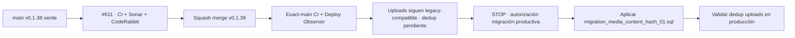

# BRVTAL — Último deploy

  
  
  

> **Development dashboard** · snapshot de **solo el deploy actual** para Issue #610.

## Progress convention

- ✅ ~~Struck through~~ = completed and verified through the required delivery gates.
- 🚧 Normal text = pending or currently in progress.

## Estado del deploy

| Señal | Estado | Evidencia |
| --- | --- | --- |
| Work line | 🚧 **#610 · exact Media duplicate detection + canonical reuse** | child enfocado de #531 |
| Base exacta | ✅ ~~main v0.1.38 exact-main CI + Sonar + Deploy Observer + Production Performance verdes~~ | `7e3c9dd2ff9bb94e909acfe757140339e9755974` |
| Versión | 🚧 **0.1.39** | Media runtime/API/DB schema cambian |
| Producción | 🚧 source aún no mergeado · uploads siguen compatibles antes de la migración | `migration_media_content_hash_01.sql` activa dedup |

## Huella del cambio

<!-- brvtal:git-delta -->

| Archivos | Inserciones | Eliminaciones | Neto |
| ---: | ---: | ---: | ---: |
| **12** | **+623** | **−52** | **+571** |

## Calidad y entrega

<!-- brvtal:gate-plan -->

| Control | Estado / contrato |
| --- | --- |
| Gates | **preflight · coordination · fast[PHP+JS] · database · chromium · real-stack · webkit** |
| PR integrity | **PR + snapshot exacto** · Issue #610 · `work/issue-610` · UUID `b606662f-5b0f-49c1-b33b-ff49653fa097` |
| Exact dedup | 🚧 SHA-256 por bytes · mismo contenido/diferente filename → canonical reuse |
| Legacy compatibility | 🚧 uploads legacy siguen operativos · al migrar: lazy backfill size+MIME y bounded hashing |
| Concurrency | 🚧 unique `content_hash` + race winner lookup + orphan cleanup |
| Migration safety | ✅ ~~aditiva, nullable, idempotente, jamás auto-run~~ |
| Sonar | ✅ ~~Quality Gate · 0 new issues · 0 hotspots~~ |
| CodeRabbit | 🚧 full review sobre HEAD final |
| CI del SHA exacto de main | 🚧 después del squash merge |
| Production migration | 🚧 requiere control humano antes de cambiar schema productivo |

## Flujo de entrega

## Qué se hizo

- Añadido `media.content_hash CHAR(64) NULL` con índice único explícito e idempotente.
- Upload calcula SHA-256 después de las validaciones actuales de tamaño/MIME/imagen.
- Assets ya hasheados se reutilizan por índice sin escribir otro archivo ni modificar título/path/original/variants del canonical.
- Legacy Media con hash NULL se inspecciona solo si coincide tamaño+MIME, con límite de candidatos y bytes hasheados; si el límite no permite demostrar ausencia de duplicado, el upload falla cerrado.
- Missing/non-local legacy candidates se omiten sin bloquear una búsqueda que sí puede completarse.
- Carrera concurrente: el índice único elige ganador; el request perdedor borra el archivo recién movido y devuelve el canonical ganador.
- Con esquema legacy, Media Library y nuevos uploads siguen funcionando sin dedup y reportan explícitamente que la migración está pendiente; no hay ventana de outage entre deploy y schema rollout.
- DISCADMIN selecciona el asset reutilizado, muestra `Duplicate detected — existing asset reused.` y expone SHA-256 como metadata de trazabilidad.
- Pruebas nuevas cubren hash por bytes, migración idempotente, backfill legacy, bytes distintos, missing/non-local, race unique y UX de reuse.

## Archivos modificados en este deploy

- `api/media-library.php`
- `config/media_dedup.php`
- `config/version.php`
- `database/migration_media_content_hash_01.sql`
- `database/schema.sql`
- `discadmin/media-library.js`
- `package.json`
- `tests/e2e/discadmin-media.spec.mjs`
- `tests/integration/media-dedup.php`
- `tests/media-dedup-contract.php`
- `tests/media-library-contract.php`
- `README.md`

## Validación

- Base exacta `7e3c9dd2ff9bb94e909acfe757140339e9755974`: v0.1.38 con exact-main CI, Sonar, Deploy Observer y Production Performance verdes.
- #610 está reservado por el coordinador; `work/issue-610` nació idéntica a esa base y no existe PR competidor.
- El rollout no autoejecuta SQL. Aplicar la migración en producción es una acción separada y explícita.
- Pendiente: revisión final, squash/exact-main/deploy seguro; después, detenerse antes de cualquier cambio de schema productivo.

## Qué sigue

| Lane | Trabajo |
| --- | --- |
| **NOW** | 🚧 [#610](https://github.com/pl0n3r/brvtal/issues/610) · validar exact dedup y dejar v0.1.39 listo para rollout. |
| **NEXT** | 🚧 merge/deploy/exact-main de v0.1.39; después aplicar la migración productiva únicamente con autorización explícita. |
| **LATER** | 🚧 [#531](https://github.com/pl0n3r/brvtal/issues/531) · política/UX de optimización; [#398](https://github.com/pl0n3r/brvtal/issues/398) · archivo cultural conectado. |
| **BLOCKED / EXTERNAL** | 🚧 producción: cambio de schema requiere control humano según AGENTS.md. |

## Panorama general pendiente

| Lane | Frente | Issues |
| --- | --- | --- |
| **NOW** | 🚧 Media exact dedup | 🚧 [#610](https://github.com/pl0n3r/brvtal/issues/610) |
| **NEXT** | 🚧 Media optimization / archive evolution | 🚧 [#531](https://github.com/pl0n3r/brvtal/issues/531), [#398](https://github.com/pl0n3r/brvtal/issues/398) |
| **LATER** | 🚧 Admin resilience / SEO | 🚧 [#530](https://github.com/pl0n3r/brvtal/issues/530), [#528](https://github.com/pl0n3r/brvtal/issues/528), [#390](https://github.com/pl0n3r/brvtal/issues/390) |
