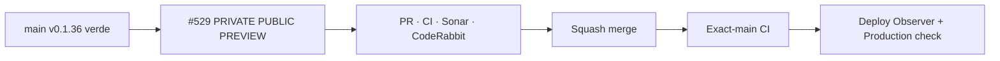

# BRVTAL — Último deploy

  
  
  

> **Development dashboard** · snapshot de **solo el deploy actual** para Issue #529.

## Progress convention

- ✅ ~~Struck through~~ = completed and verified through the required delivery gates.
- 🚧 Normal text = pending or currently in progress.

## Estado del deploy

| Señal | Estado | Evidencia |
| --- | --- | --- |
| Work line | 🚧 **#529 · preview público real antes de Publish** | renderer canónico · draft privado |
| Base exacta | ✅ ~~main v0.1.36 exact-main CI + Sonar + deploy/performance verdes~~ | `b1c9679625c4b2ad35a330e66f29811b3aef8a98` |
| Versión | 🚧 **0.1.37** | Preview Events / Artists / Releases / Sets / Pages / Blog |
| Producción | 🚧 pendiente de PR → merge → exact-main → observación | sin migración ni escritura de datos |

## Huella del cambio

<!-- brvtal:git-delta -->

| Archivos | Inserciones | Eliminaciones | Neto |
| ---: | ---: | ---: | ---: |
| **21** | **+1354** | **−68** | **+1286** |

## Calidad y entrega

<!-- brvtal:gate-plan -->

| Control | Estado / contrato |
| --- | --- |
| Gates | **preflight · coordination · fast[PHP+JS] · database · chromium · real-stack · webkit** |
| PR integrity | **PR + snapshot exacto** · Issue #529 · `work/issue-529` · UUID `7450f035-72bc-4bcf-a301-b51a69620d07` |
| Preview privacy | 🚧 auth + CSRF al crear · token aleatorio 48 hex · sesión Admin · TTL 10 min · no-store/noindex |
| Renderer | 🚧 producción y preview llaman `brvtal_public_entity_document()`; no segundo template |
| Fidelity | 🚧 shell de inspección **1440 desktop / 390 mobile** sobre el documento público real |
| Sonar | 🚧 Quality Gate sobre HEAD final |
| CodeRabbit | 🚧 full review sobre HEAD final |
| Exact-main | 🚧 **CI del SHA exacto de main** después del squash merge |

## Flujo de entrega

## Qué se hizo

- Events, Artists, Releases, Sets, Pages y Blog reciben una acción **PUBLIC PREVIEW** que consume valores actuales del editor, incluso sin guardarlos.
- Los snapshots viven solo en la sesión Admin, expiran en 10 minutos y usan tokens criptográficos; crear preview exige autenticación + CSRF.
- La ruta browser-visible usa `no-store`, `noindex,nofollow` y requiere también la sesión que originó el token.
- Se extrajo `brvtal_public_entity_document()`: producción y preview comparten exactamente la misma entrega pública, incluidos assets, Artist framing y controles.
- El shell permite revisar composición Concept 05 en **1440** y **390** sin copiar componentes al Admin.
- Event preview incluye estado actual de ticket types, precios/CTA, accent y lineup; Releases/Blog incluyen relaciones/artwork/body actuales.
- URLs, media, accent, fecha y JSON de Page se validan antes de renderizar datos crudos del editor.
- La prueba real-stack demuestra que un draft nunca guardado se puede previsualizar, no aparece en los registros editoriales y no abre desde otra sesión.

## Archivos modificados en este deploy

- `.htaccess` — ruta privada tokenizada de preview.
- `README.md` — snapshot exacto del candidato y gates.
- `api/public-preview.php` — creación autenticada/CSRF del snapshot.
- `config/public_entity_delivery.php` — pipeline único de entrega de entidad.
- `config/public_preview.php` — snapshot, TTL, validación y composición de datos preview.
- `config/version.php` — versión humana 0.1.37.
- `discadmin/blog.js` — full public preview desde Blog.
- `discadmin/content-core.js` — payload Event con tickets y lineup.
- `discadmin/content-core.php` — acción de preview en Event editor.
- `discadmin/index-core.php` — acción compartida en editores legacy.
- `discadmin/public-preview.js` — cliente privado de snapshots.
- `discadmin/releases.js` — full public preview desde Releases.
- `docs/BRVTAL-SPEC.md` — contrato durable de preview.
- `index.php` — producción usa pipeline de entidad compartido.
- `package.json` — versión 0.1.37.
- `preview.php` — shell 1440/390 + render canónico privado.
- `tests/e2e/discadmin-public-preview.spec.mjs` — payload no guardado/browser.
- `tests/e2e/public-preview-real-stack.spec.mjs` — privacidad y canonical rendering real-stack.
- `tests/e2e/run-content-core-real-stack.sh` — incluye smoke real de preview.
- `tests/public-entity-pages-contract.php` — contrato existente actualizado al pipeline compartido.
- `tests/public-preview-contract.php` — invariantes de privacidad/renderer.

## Validación

- Base exacta `b1c9679625c4b2ad35a330e66f29811b3aef8a98`: v0.1.36 con BRVTAL CI/`validate`, Sonar, Deploy Observer y Production Performance verdes.
- #529 fue reservado por el coordinador; no existe otro PR abierto y la rama nació idéntica a esa base.
- El candidato no agrega migraciones ni persiste snapshots/drafts en tablas públicas.
- Pendiente: CI/Sonar/CodeRabbit sobre el HEAD final, squash merge y validación exact-main.

## Qué sigue

| Lane | Trabajo |
| --- | --- |
| **NOW** | 🚧 [#529](https://github.com/pl0n3r/brvtal/issues/529) · validar y entregar preview público privado/canónico. |
| **NEXT** | 🚧 [#583](https://github.com/pl0n3r/brvtal/issues/583) · QA/polish transversal de fidelidad Concept 05. |
| **LATER** | 🚧 [#398](https://github.com/pl0n3r/brvtal/issues/398) · archivo cultural conectado; [#531](https://github.com/pl0n3r/brvtal/issues/531) · Media Library smarter. |
| **BLOCKED / EXTERNAL** | 🚧 Sin bloqueos externos activos. |

## Panorama general pendiente

| Lane | Frente | Issues |
| --- | --- | --- |
| **NOW** | 🚧 Draft/public preview | 🚧 [#529](https://github.com/pl0n3r/brvtal/issues/529) |
| **NEXT** | 🚧 Concept 05 fidelity closeout | 🚧 [#583](https://github.com/pl0n3r/brvtal/issues/583) |
| **LATER** | 🚧 Public archive / media scale | 🚧 [#398](https://github.com/pl0n3r/brvtal/issues/398), [#531](https://github.com/pl0n3r/brvtal/issues/531) |
