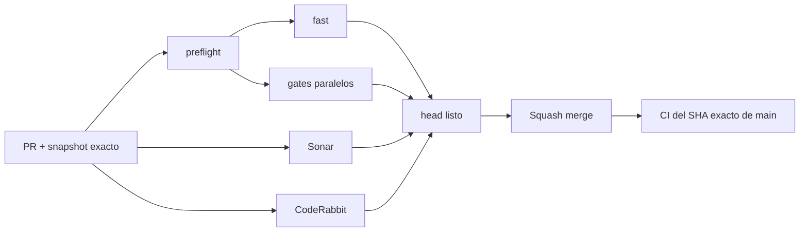

# BRVTAL — Último deploy

  
  
  

> **Development dashboard** · snapshot profesional de **solo el deploy actual**.

## Estado del deploy

| Señal | Estado actual | Evidencia |
| --- | --- | --- |
| Work line | ✍️ **#526 Blog taxonomy** | authoring sin taxonomía manual; tags existentes protegidos |
| Base exacta | ✅ **VALIDATED IN CODE** | `main` `33e6145c420031141cfd68c3f9506fc0842a5da3` · exact-main `validate` verde |
| Fase | ⚡ **Phase 1 / quick wins** | [#533](https://github.com/pl0n3r/brvtal/issues/533) |
| Producción | ⛔ **BLOCKED / EXTERNAL** | Hostinger marker en [#534](https://github.com/pl0n3r/brvtal/issues/534) |

## Huella del cambio

<!-- brvtal:git-delta -->

| Archivos | Inserciones | Eliminaciones | Neto |
| ---: | ---: | ---: | ---: |
| **7** | **+85** | **−43** | **+42** |

## Calidad y entrega

<!-- brvtal:gate-plan -->

| Control | Estado / contrato |
| --- | --- |
| Gates seleccionados | **preflight · fast[PHP+JS] · database · chromium · real-stack** |
| Browser | editor sin TAXONOMY; payload normal omite `tags` |
| Real-stack | PUT sin `tags` preserva; `tags: []` explícito limpia |
| Sonar | Clean-as-You-Code en paralelo |
| CodeRabbit | full review del head estable en paralelo |
| Exact-main | obligatorio después del squash merge |
| Producción | deploy marker ≠ validación funcional |

## Flujo de entrega

## Qué se hizo

- El editor normal de Blog deja de mostrar TAXONOMY / Tags.
- Crear o publicar un Blog sin tags es un flujo válido.
- En PUT, omitir `tags` conserva la taxonomía histórica; un array explícito sigue permitiendo reemplazarla o limpiarla.
- No se inventan categorías/tags automáticamente y la taxonomía pública existente sigue compatible.
- E2E y real-stack cubren que una edición editorial normal no borra tags existentes.

## Archivos modificados en este deploy

- `api/blog.php` — distingue tags omitidos de reemplazo explícito.
- `discadmin/blog.js` — elimina taxonomía manual del editor y deja de enviar tags en saves normales.
- `tests/blog-contract.php` — actualiza el contrato del editor sin taxonomía manual.
- `tests/e2e/discadmin-blog.spec.mjs` — verifica UI/payload sin tags manuales.
- `tests/e2e/blog-relation-integrity-real-stack.spec.mjs` — verifica preservación y limpieza explícita de tags.
- `AGENTS.md` — persiste la regla de taxonomía Blog opcional.
- `README.md` — dashboard exacto de #526.

## Validación

- New/Edit Blog no muestra control TAXONOMY/Tags.
- Un post nuevo se guarda sin propiedad `tags`.
- Un update sin `tags` preserva tags existentes en MariaDB.
- Un update con `tags: []` sigue siendo una limpieza explícita válida.
- Relaciones editoriales, SEO y publicación conservan su comportamiento previo.

## Qué sigue

| Lane | Trabajo |
| --- | --- |
| **NOW** | Cerrar [#526](https://github.com/pl0n3r/brvtal/issues/526). |
| **NEXT** | [#522](https://github.com/pl0n3r/brvtal/issues/522) Media navigation/UI. |
| **BLOCKED / EXTERNAL** | [#534](https://github.com/pl0n3r/brvtal/issues/534) Hostinger marker/hPanel. |
| **LATER** | [#479](https://github.com/pl0n3r/brvtal/issues/479), [#517](https://github.com/pl0n3r/brvtal/issues/517), [#221](https://github.com/pl0n3r/brvtal/issues/221). |

## Panorama general pendiente

| Lane | Frente | Issues |
| --- | --- | --- |
| **NOW** | Blog authoring | [#526](https://github.com/pl0n3r/brvtal/issues/526) |
| **NEXT** | Media friction | [#522](https://github.com/pl0n3r/brvtal/issues/522) |
| **BLOCKED / EXTERNAL** | Deploy | [#534](https://github.com/pl0n3r/brvtal/issues/534) |
| **LATER** | Quick wins | [#479](https://github.com/pl0n3r/brvtal/issues/479), [#517](https://github.com/pl0n3r/brvtal/issues/517), [#221](https://github.com/pl0n3r/brvtal/issues/221) |
