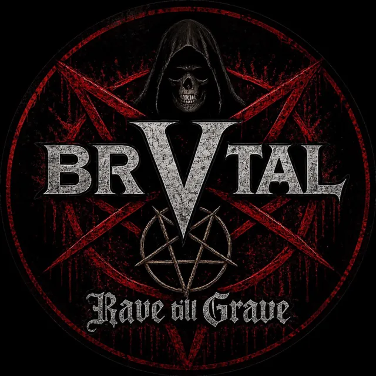
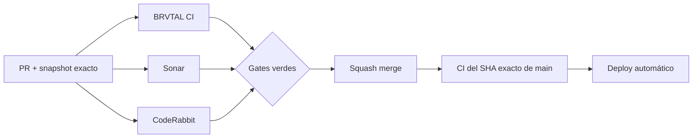

  

# BRVTAL — Último deploy

  <strong>Quality burn-down · pseudorandom hotspots</strong>

  

> Este README representa **solo el deploy actual**. Se reemplaza en el siguiente deploy y no funciona como changelog acumulativo.

## Estado del deploy

| Señal | Estado | Evidencia |
| --- | --- | --- |
| Base exacta | ✅ **VALIDATED IN CODE** | `main` `523292aeab86cd2c9c44e51c752767ffd4692fe7` · BRVTAL CI #1017 |
| Sonar / pseudorandom | 🧪 **En corrección** | Se cubre el conjunto completo actual de `Math.random()` |
| Hero Slider IDs | 🔐 **Web Crypto** | `crypto.getRandomValues()` + fallback contador |
| Efectos visuales | 🎛️ **No security-sensitive** | Loader determinista + PRNG decorativo explícito |
| Producción | ⚪ **No validada por este PR** | CI verde no equivale a validación de producción |

## Flujo de entrega

## Qué se hizo

- Se escanearon los **62 archivos JavaScript** del repo en lotes paralelos para confirmar el conjunto actual completo de `Math.random()`.
- `discadmin/hero-slider.js` deja de usar pseudorandom no criptográfico para IDs editoriales y pasa a `crypto.getRandomValues()`; si Web Crypto no existe, usa timestamp + contador local.
- El loader público deja de simular progreso con `Math.random()` y usa una secuencia determinista de pasos.
- El canvas de grano/glitch usa un PRNG decorativo local explícitamente aislado de IDs, tokens y decisiones de seguridad.
- La cobertura de Hero Slider y Public Quick Wins ahora ejecuta los flujos reales: crea/duplica slides y layers para verificar IDs únicos, completa el loader y compara el primer frame del canvas en dos páginas frescas.
- No cambia API, persistencia, rutas, permisos ni estructura de datos.

## Archivos modificados en este deploy

- `README.md` — snapshot visual exacto del deploy.
- `discadmin/hero-slider.js` — generación de IDs con Web Crypto y fallback contador.
- `js/app.js` — loader determinista y PRNG decorativo sin `Math.random()`.
- `tests/e2e/hero-slider-v2.spec.mjs` — regresión ejecutable de creación/duplicación con IDs no vacíos y únicos.
- `tests/e2e/public-quick-wins.spec.mjs` — regresión ejecutable del loader y secuencia determinista del canvas.

## Validación

- Base exacta: `main` `523292aeab86cd2c9c44e51c752767ffd4692fe7`.
- La base pasó **BRVTAL CI #1017** y queda **VALIDATED IN CODE**.
- El PR debe pasar BRVTAL CI, SonarQube Cloud y CodeRabbit sobre su SHA exacto.
- El job `fast` debe confirmar además que este README conserva el contrato visual y la lista exacta de archivos.
- Tras el squash merge se verificará BRVTAL CI sobre el SHA exacto resultante de `main`.
- Ningún gate de CI implica por sí solo **VALIDATED IN PRODUCTION**.

## Qué sigue

1. Tachar el bloque pseudorandom de #451 solo después de merge + exact-main CI verde.
2. Resolver por separado el warning `sonar.python.version` con una versión Python explícita y realmente soportada.
3. Continuar #451 con los P2 que todavía reproduzcan en el código actual.
4. Mantener #479, #480 y #481 como frentes separados.
5. Reconciliar PR #434 / Memories sin ejecutar migraciones de producción automáticamente.

## Panorama general pendiente

| Frente | Estado / siguiente foco |
| --- | --- |
| 🧪 **Sonar / calidad** | #451 — pseudorandom en este PR; después Python config + P2 vigentes |
| 🎛️ **Apariencia** | #149 — completar Light en módulos modernos |
| 🖼️ **Hero Slider** | #221 integridad editorial de media · #480 regresión visual desktop |
| 🔐 **Seguridad editorial** | #257, #216, #174, #193 |
| 🔎 **SEO / entrega pública** | #182, #214, #204, #272 → #390 · #479 alt · #481 IndexNow |
| ✍️ **Content / edición** | #224, #252 |
| 🧾 **Activity / operaciones** | #232, #195 |
| 📚 **Bulk Actions** | #275 — catálogos >500 sin truncado silencioso |
| 🧭 **Dashboard / Theme** | #348, #351 |
| 🗃️ **Archivo cultural** | #398, #403 |
| 🧠 **Memories** | #415 / PR #434 pendiente; sin migración automática |
| 🌐 **Idioma** | #212 — español canónico + inglés automático por fases |
| 💾 **Backups** | #389 — scheduling seguro + Drive opcional |

---

BRVTAL · Rave till Grave · snapshot operativo, no historial acumulativo

