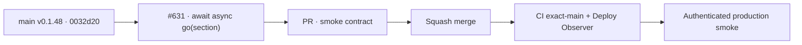

# BRVTAL — Último deploy

  
  
  

> **Production incident #631** · snapshot de **solo el deploy actual**: v0.1.48 exact `main` `0032d200a4c3b64c6bb8a4843b869a460c4acced` tiene CI y Deploy Observer verdes. Smoke #35948083433 acreditó release/health/Home/Admin/dashboard/Events/date y falló esperando Sets porque el helper no esperaba el `go(section)` asíncrono. **Engineering roles:** SRE / production incident responder, QA automation engineer.

## Progress convention

- ✅ ~~Struck through~~ = completed and verified through the required delivery gates.
- 🚧 Normal text = pending or currently in progress.

## Estado del deploy

| Señal | Estado | Evidencia |
| --- | --- | --- |
| Work line | 🚧 **#631 · await async Admin navigation** | `work/issue-631`; reserva `0aa0b77e-45de-4ada-bf0a-24ff8d4d5fb8` |
| Base exacta | ✅ ~~main v0.1.48~~ | `0032d200a4c3b64c6bb8a4843b869a460c4acced` |
| Versión | ✅ ~~v0.1.48 sin incremento~~ | solo pruebas/diagnóstico |
| CI exact-main base | ✅ ~~success~~ | #35948009934 |
| Deploy Observer base | ✅ ~~success~~ | #35948009896 |
| Smoke base | ⛔ **failure / Sets navigation wait** | #35948083433 · `sets-workspace-ready` |
| Entrega candidata | 🚧 click real + espera causal de `state.section` | timeout canónico 20 s |

## Huella del cambio

<!-- brvtal:git-delta -->

| Archivos | Inserciones | Eliminaciones | Neto |
| ---: | ---: | ---: | ---: |
| **3** | **+52** | **−42** | **+10** |

## Calidad y entrega

<!-- brvtal:gate-plan -->

| Control | Estado / contrato |
| --- | --- |
| Gates esperados | **preflight · coordination · fast[PHP+JS] · chromium** |
| PR + snapshot exacto | Issue #631 · reserva `0aa0b77e-45de-4ada-bf0a-24ff8d4d5fb8` |
| CodeRabbit / Sonar | 🚧 HEAD estable; máximo 3 rondas automáticas |
| CI del SHA exacto de main | 🚧 después del merge |
| Producción | 🚧 smoke debe completar Sets/Hero además de lo ya acreditado |

## Flujo de entrega

## Qué se hizo

- Smoke #35948083433 observó v0.1.48 / `0032d200…` exactos.
- Health **200**, DB **connected**, Home **200**, DISCADMIN **200**, dashboard **652 ms** sin 5xx, versión Admin, Events y Event #6 date pasaron.
- El fallo quedó en `sets-relations / sets-workspace-ready`, sin mutaciones bloqueadas.
- `navigate()` esperaba solo el click; ahora el click sigue siendo real y la operación espera `window.state.section === section`.
- Si la navegación real supera 20 s, el fallo queda etiquetado como `navigate:sets`.
- Sin cambios de runtime, SQL ni datos productivos.

## Archivos modificados en este deploy

- `README.md` — snapshot exacto.
- `tests/e2e/production-authenticated-smoke.mjs` — espera causal de navegación.
- `tests/production-smoke-contract.php` — contrato de la espera asíncrona.

## Validación

- ✅ ~~Base v0.1.48: CI #35948009934 y Deploy Observer #35948009896 verdes.~~
- ✅ ~~Smoke #35948083433 acreditó todo hasta Events/date; cero 5xx y mutaciones bloqueadas.~~
- 🚧 PR CI/revisión, merge y smoke final pendientes; **no declarar PRODUCTION GREEN** antes.

## Qué sigue

| Lane | Trabajo |
| --- | --- |
| **NOW** | 🚧 #631: validar, mergear y repetir smoke real. |
| **NEXT** | 🚧 #533: publicar `🟢 PRODUCTION GREEN` con las cinco evidencias. |
| **LATER** | 🚧 detener BRVTAL después de GREEN mientras Tanda 1 global siga abierta. |
| **BLOCKED / EXTERNAL** | 🚧 Condor/GrindFlow sin GREEN y factory `v1.0.0` ausente; no iniciar Tanda 2. |

## Panorama general pendiente

- 🚧 **NOW**: cerrar #631 con smoke completo.
- 🚧 **NEXT**: verificar incidentes/`[AUTO]` y registrar GREEN en #533.
- 🚧 **LATER**: esperar la barrera global.
- 🚧 **BLOCKED / EXTERNAL**: no adoptar todavía el kit factory.
