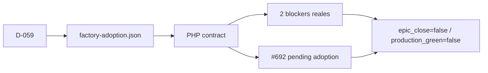

# BRVTAL — Último deploy

  
  
  

> Snapshot de **solo el deploy actual** más el cambio repository-only de #691. Este slice hace ejecutable el estado de adopción Factory v1 y adopta D-059; no cambia producto, versión, Hostinger, base de datos ni producción.

## Progress convention

- ✅ ~~Struck through~~ = completed and verified through the required delivery gates.
- 🚧 Normal text = pending or currently in progress.
- ⛔ = active production blocker.

## Estado del deploy

| Señal | Estado | Evidencia |
| --- | --- | --- |
| Work line | 🚧 **#691 · Factory adoption closure state** | `work/issue-691`; reservation `9460b640-2a39-4467-b4a2-96129fd354b6` |
| Base exacta | ✅ **main v0.1.58** | `3227ac7176486f66fb199719f068dfe08a489591` |
| Versión de producto | ✅ **v0.1.58 sin cambio** | cambio repository-only |
| Producción | ⛔ **NO GREEN · #681** | faltan `DEPLOY_TOKEN` + `DEPLOY_SSH_KEY`; recovery falla cerrado antes de escribir |
| Factory adoption | 🚧 **cierre bloqueado** | #681 + #689 externos; #692 coordinación pendiente |

## Huella del cambio

<!-- brvtal:git-delta -->

| Archivos | Inserciones | Eliminaciones | Neto |
| ---: | ---: | ---: | ---: |
| **5** | **+227** | **−40** | **+187** |

## Calidad y entrega

<!-- brvtal:gate-plan -->

| Control | Estado / contrato |
| --- | --- |
| Gates esperados | **preflight · coordination · fast[PHP]** |
| PR + snapshot exacto | **Issue #691 · repository-only Factory governance** |
| Roles | **Architecture · Software Engineering · Infrastructure · SRE · Security · QA** |
| Trust boundary | estado machine-readable sin secretos; claims GREEN/closure fallan cerrado |
| Permisos | sin nuevos permisos; no Hostinger/DB/Actions secrets |
| Review | BRVTAL CI + Factory Policy + Privacy + Sonar/CodeQL/CodeRabbit |
| CI del SHA exacto de main | 🚧 después del merge |
| Production GREEN | ⛔ bloqueado por #681; este PR no intenta recuperarlo |

## Flujo de entrega

## Qué se hizo

- Adopta D-059 y protege backup previo, autorización de borrados y prohibición de planes/pagos.
- Añade `docs/factory-adoption.json` como estado canónico legible por máquina para #630.
- Registra exactamente dos blockers externos: #681 credenciales de recovery y #689 paridad `push` del observer.
- Corrige una deriva histórica: Factory `coordinacion.yml@v1` ya es reusable; por eso coordinación no se declara blocker externo.
- Abre #692 como leaf ejecutable para adoptar coordinación reusable con paridad.
- Añade contrato PHP auto-descubierto que exige CI/policy/release/labels `@v1` y prohíbe falso GREEN/cierre mientras existan blockers o adopciones obligatorias.
- No reemplaza observer/coordinación, no crea secretos y no muta producción.

## Archivos modificados en este deploy

- `README.md` — snapshot exacto del slice #691.
- `decisiones.yml` — decisión D-059 activa.
- `docs/factory-adoption.json` — estado machine-readable de TANDA 2.
- `tests/factory-adoption-contract.php` — cierre/adopción fail-closed y consumidores Factory v1.
- `tests/factory-policy-contract.php` — regresión de D-059.

## Validación

- 🚧 `factory-policy-contract.php` y `factory-adoption-contract.php` auto-descubiertos por PHP 8.5 compatibility suite.
- 🚧 BRVTAL CI / validate sobre HEAD estable.
- 🚧 Factory Policy, Privacy, Sonar/CodeQL y CodeRabbit.
- No se declara #630 cerrado ni producción GREEN.
- No se repite recovery #681 hasta que existan los dos secrets requeridos.

## Qué sigue

| Lane | Trabajo |
| --- | --- |
| **NOW** | 🚧 [#691](https://github.com/pl0n3r/brvtal/issues/691): integrar estado ejecutable de adopción sin false GREEN. |
| **NEXT** | 🚧 [#692](https://github.com/pl0n3r/brvtal/issues/692): adoptar coordinación reusable Factory v1 con paridad. |
| **LATER** | 🚧 [#630](https://github.com/pl0n3r/brvtal/issues/630): cerrar TANDA 2 solo cuando todos los requisitos sean reales. |
| **BLOCKED / EXTERNAL** | 🚧 [#681](https://github.com/pl0n3r/brvtal/issues/681) secrets Hostinger · [#689](https://github.com/pl0n3r/brvtal/issues/689) observer push parity. |

## Panorama general pendiente

- 🚧 **NOW:** #691 estado ejecutable de adopción.
- 🚧 **NEXT:** #692 coordinación reusable.
- 🚧 **LATER:** #630 cierre de TANDA 2.
- 🚧 **BLOCKED / EXTERNAL:** #681 credenciales de recovery y #689 paridad del observer.
