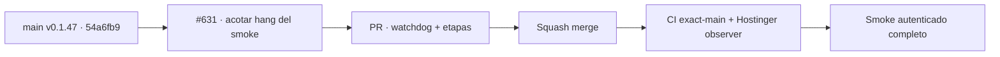

# BRVTAL — Último deploy

  
  
  

> **Production incident #631** · snapshot de **solo el deploy actual**: v0.1.47 exact `main` `54a6fb9ecbb35e9e35420c943531c078558c9891` tiene CI exact-main y Deploy Observer verdes; smoke autenticado #35934172561 llegó a Events/EDIT pero agotó el límite de 25 minutos sin evidencia de etapa terminal. **Engineering roles:** SRE / production incident responder, QA automation engineer, DISCADMIN frontend auditor.

## Progress convention

- ✅ ~~Struck through~~ = completed and verified through the required delivery gates.
- 🚧 Normal text = pending or currently in progress.

## Estado del deploy

| Señal | Estado | Evidencia |
| --- | --- | --- |
| Work line | 🚧 **#631 · bounded authenticated production smoke** | `work/issue-631`; reserva `59d07aba-c4b8-4264-a4c9-86f5cd040a58` |
| Base exacta | ✅ ~~main v0.1.47~~ | `54a6fb9ecbb35e9e35420c943531c078558c9891` |
| Versión | ✅ ~~v0.1.47 sin incremento~~ | mantenimiento de prueba/CI/documentación; runtime intacto |
| CI del SHA exacto de main | ✅ ~~success~~ | [#35934117199](https://github.com/pl0n3r/brvtal/actions/runs/35934117199) |
| Deploy Observer base | ✅ ~~success~~ | [#35934117274](https://github.com/pl0n3r/brvtal/actions/runs/35934117274) |
| Smoke autenticado base | ⛔ **timeout** | [#35934172561](https://github.com/pl0n3r/brvtal/actions/runs/35934172561) · dashboard 1039 ms, no 5xx, Events visible; ejecución posterior no acotada |
| Entrega candidata | 🚧 watchdog + operaciones acotadas | merge/smoke nuevo pendientes; no equivale a producción validada |

## Huella del cambio

<!-- brvtal:git-delta -->

| Archivos | Inserciones | Eliminaciones | Neto |
| ---: | ---: | ---: | ---: |
| **3** | **+150** | **−47** | **+103** |

## Calidad y entrega

<!-- brvtal:gate-plan -->

| Control | Estado / contrato |
| --- | --- |
| Gates | **preflight · coordination · fast[JS] · chromium** |
| PR + snapshot exacto | Issue #631 · reserva `59d07aba-c4b8-4264-a4c9-86f5cd040a58` |
| CodeRabbit / Sonar | 🚧 validar HEAD estable; máximo 3 rondas automáticas |
| CI del SHA exacto de main | 🚧 después del merge |
| Producción | 🚧 smoke ejecutado debe terminar passed y acreditar health/SHA/DB, Home/Admin/Dashboard, Events/date, Sets y Hero |

## Flujo de entrega

## Qué se hizo

- Añadir watchdog de 12 minutos al proceso del smoke y timeout por operación de 20 segundos, ambos configurables y siempre por debajo del timeout de 15 minutos del job.
- Persistir en el artefacto la etapa y operación activas, además de `failureStage` / `failureOperation`, para que un nuevo fallo sea diagnóstico y no otro hang opaco.
- Evitar que `page.evaluate` espere Promises implícitas de `window.go`, `openModal`, `closeModal` o `closeEvent`; mantener aserciones DOM explícitas después de cada transición.
- Escribir la evidencia de fecha del Event antes de cerrar el editor, preservando la última comprobación realmente completada.
- Mantener el smoke estrictamente read-only: sin SQL, migraciones ni mutaciones de contenido productivo.

## Archivos modificados en este deploy

- `.github/workflows/production-authenticated-smoke.yml` — job 15m, watchdog 12m y operación 20s documentados.
- `README.md` — snapshot exacto de #631 y gates.
- `tests/e2e/production-authenticated-smoke.mjs` — watchdog, etapas, timeout por operación y transiciones UI no bloqueantes.

## Validación

- ✅ ~~Base v0.1.47 validada: CI exact-main #35934117199 y observer #35934117274 aprobaron.~~
- ⛔ Smoke #35934172561 agotó 25 minutos después de Events; el artefacto quedó `status: running`, por lo que Sets/Hero no pueden considerarse validados.
- ✅ ~~La rama candidata vuelve a parsear como JavaScript después de reconstruir el archivo desde `main` limpio.~~
- 🚧 PR CI/Chromium, revisión y smoke autenticado ejecutado siguen pendientes; **no declarar PRODUCTION GREEN** sin las cinco evidencias.

## Qué sigue

| Lane | Trabajo |
| --- | --- |
| **NOW** | 🚧 [#631](https://github.com/pl0n3r/brvtal/issues/631): validar la corrección acotada y ejecutar smoke real completo. |
| **NEXT** | 🚧 [#533](https://github.com/pl0n3r/brvtal/issues/533): publicar `🟢 PRODUCTION GREEN` solo con evidencia completa. |
| **LATER** | 🚧 retomar backlog de producto después de GREEN y de la barrera global de Tanda 1. |
| **BLOCKED / EXTERNAL** | 🚧 la Tanda 2 no inicia mientras factory no publique `v1.0.0` y los tres repos no acrediten GREEN. |

## Panorama general pendiente

- 🚧 **NOW**: cerrar #631 con smoke real terminado y diagnóstico acotado si vuelve a fallar.
- 🚧 **NEXT**: registrar evidencia de los 5 puntos GREEN en #533.
- 🚧 **LATER**: esperar la Tanda 1 global antes de adoptar el kit factory.
- 🚧 **BLOCKED / EXTERNAL**: producción BRVTAL sigue sin GREEN mientras #631 permanezca abierto.
