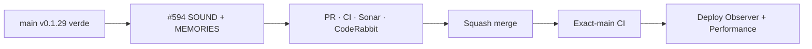

# BRVTAL — Último deploy

  
  
  

> **Development dashboard** · snapshot de **solo el deploy actual** para Issue #594.

## Progress convention

- ✅ ~~Struck through~~ = completed and verified through the required delivery gates.
- 🚧 Normal text = pending or currently in progress.

## Estado del deploy

| Señal | Estado | Evidencia |
| --- | --- | --- |
| Work line | 🚧 **#594 · Concept 05 SOUND + MEMORIES authored 1440/390** | parent #583 |
| Base exacta | ✅ ~~main v0.1.29 validado + deploy/performance observados~~ | `7a70dce6e3bf4503f43516d0b4dd67f1dab5a8dc` |
| Versión | 🚧 **0.1.30** | cambio visible de producto/runtime público |
| Producción | 🚧 pendiente de PR → merge → exact-main | sin migración de esquema |

## Huella del cambio

<!-- brvtal:git-delta -->

| Archivos | Inserciones | Eliminaciones | Neto |
| ---: | ---: | ---: | ---: |
| **14** | **+1038** | **−56** | **+982** |

## Calidad y entrega

<!-- brvtal:gate-plan -->

| Control | Estado / contrato |
| --- | --- |
| Gates | **preflight · coordination · fast[PHP+JS] · database · chromium · real-stack · webkit** |
| PR integrity | **PR + snapshot exacto** · Issue #594 · `work/issue-594` · UUID `4ca01b23-6cd2-4032-a2b5-a087540a6ceb` |
| Browser | 🚧 geometría/behavior 1440 + 390 + media failure + reduced motion |
| Sonar | 🚧 Quality Gate sobre head estable |
| CodeRabbit | 🚧 review final sobre head estable |
| Exact-main | 🚧 **CI del SHA exacto de main** después del squash merge |

## Flujo de entrega

## Qué se hizo

- **04 / SOUND** reutiliza `public-sets-library.js` como renderer único y conserva filtros LATEST / ARTIST / EVENT.
- Set Record sigue siendo `/sets/{slug}`; LISTEN solo aparece con URL HTTP(S) externa válida y las relaciones Artist/Event siguen estructuradas.
- `cover_image` canónico entra al módulo como artwork documental; la primera pieza recibe foco editorial y el “signal” añadido es puramente decorativo, no un waveform falso.
- **05 / MEMORIES** usa exclusivamente `memories` curadas; el Home deja de intentar proyectar `media` crudo como fallback dinámico.
- `public-media.js` continúa siendo el viewer único y conserva relaciones Memory → Event/Artist/Set/Release, filtros, teclado y scroll lock.
- Desktop 1440 usa archivo sonoro denso + contact sheet asimétrico; mobile 390 usa Sound compacto y Memories 2-columnas con full-span deliberado.
- Artwork/media rota falla cerrada sin broken-image chrome; el texto y relaciones permanecen visibles.
- El enhancer Concept 05 no hace requests y no toma ownership de playback, viewer ni GSAP.

## Archivos modificados en este deploy

- `README.md`
- `config/public_home.php`
- `config/version.php`
- `css/public-concept05-sound-memories.css`
- `css/public-sets-library.css`
- `index.php`
- `js/app.js`
- `js/public-concept05-sound-memories.js`
- `js/public-media.js`
- `js/public-sets-library.js`
- `package.json`
- `tests/e2e/public-concept05-sound-memories.spec.mjs`
- `tests/e2e/public-sets-library-phase-c.spec.mjs`
- `tests/public-concept05-dressing-contract.php`

## Validación

- Base exacta `7a70dce6e3bf4503f43516d0b4dd67f1dab5a8dc`: BRVTAL CI, Sonar, Deploy Observer y Production Performance verdes antes de iniciar #594.
- #594 fue reservado atómicamente antes de modificar `work/issue-594`.
- Cobertura nueva verifica payload compartido, curated-only Memories, canonical Set links, relaciones, 1440/390, media rota, touch targets y reduced motion.
- No hay nuevo fetch público, player falso, migraciones ni cambios de esquema.
- Producción se observa por separado; CI verde no se presenta como prueba de deploy.

## Qué sigue

| Lane | Trabajo |
| --- | --- |
| **NOW** | 🚧 [#594](https://github.com/pl0n3r/brvtal/issues/594) · cerrar SOUND + MEMORIES y validar exact-main. |
| **NEXT** | 🚧 [#583](https://github.com/pl0n3r/brvtal/issues/583) · 06 / JOURNAL + 07 / CONNECTED. |
| **LATER** | 🚧 Footer + mobile nav polish, Theme Studio/Admin controls y Preview; luego #398/#351 según roadmap. |
| **BLOCKED / EXTERNAL** | 🚧 Ningún bloqueo externo activo; reviewers externos son advisory salvo finding accionable. |

## Panorama general pendiente

| Lane | Frente | Issues |
| --- | --- | --- |
| **NOW** | 🚧 Concept 05 SOUND + MEMORIES | 🚧 [#594](https://github.com/pl0n3r/brvtal/issues/594) |
| **NEXT** | 🚧 Concept 05 public fidelity | 🚧 [#583](https://github.com/pl0n3r/brvtal/issues/583) |
| **LATER** | 🚧 visión pública / customization | 🚧 [#398](https://github.com/pl0n3r/brvtal/issues/398), [#351](https://github.com/pl0n3r/brvtal/issues/351) |
