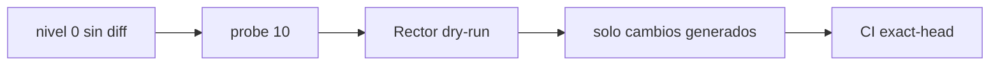

# BRVTAL — Último deploy

> Snapshot de **solo el deploy actual**. **BORRADOR DIAGNÓSTICO #653: NO FUSIONAR.** Probe temporal de Rector 2.6.7 con `withCodeQualityLevel(10)` sobre un PHP real, para comprobar si el nivel conservador 0 carecía de transformaciones aplicables. No se ha ejecutado ninguna mutación de producción.

## Progress convention
- ✅ ~~Struck through~~ = completed and verified through required gates.
- 🚧 Normal text = pending/in progress.
- ⛔ = active production blocker.

## Estado del deploy
| Señal | Estado | Evidencia |
| --- | --- | --- |
| Work line | 🚧 **#653 · primer refactor real Rector** | `work/issue-653` · reserva `4989a45d-67cd-4fd4-92c8-c9fbc72c96f0` |
| Base exacta | ✅ **main v0.1.58** | `4295b6f21dd535d03df0843eb527c5829c54d21c` |
| Versión candidata | 🚧 **v0.1.59 (solo diagnóstico; no desplegada)** | config/version.php y package.json |
| Producción | ⛔ **NO GREEN · #681** | /api/health.php HTTP 503 |
| Factory Labels | ⛔ **#694** | Factory @v1 antiguo |

## Huella del cambio
<!-- brvtal:git-delta -->
| Archivos | Inserciones | Eliminaciones | Neto |
| ---: | ---: | ---: | ---: |
| **5** | **+35** | **−33** | **+2** |

## Calidad y entrega
<!-- brvtal:gate-plan -->
| Control | Estado / contrato |
| --- | --- |
| Gates esperados | **preflight · coordination · fast[PHP+JS] · database · chromium · real-stack · webkit** |
| PR + snapshot exacto | **#653 · borrador sin autorización de merge** |
| Roles | **Software Engineering · QA · Security** |
| Review | BRVTAL CI + Factory Policy + Privacy + Sonar/CodeQL + CodeRabbit |
| Rector | 🚧 ejecutar 2.6.7 con config de prueba; capturar diff real |
| CI del SHA exacto de main | ✅ base validada; PR provisional pendiente |\n| Production GREEN | ⛔ no se reclama ni se altera |

## Flujo de entrega

## Qué se hizo
- Amplía temporalmente CodeQualityLevel de 0 a 10 para probar una nueva hipótesis después de #686, donde nivel 0 no emitió refactors.
- Marca un solo PHP real como changed para que el gate dry-run ejecute Rector.
- Prohíbe integrar la marca o la ampliación de nivel hasta revisar la salida real de Rector y acotar el cambio.

## Archivos modificados en este deploy
- `README.md`
- `rector.php`
- `config/public_visibility.php` — marca temporal
- `config/version.php` — versión temporal
- `package.json` — versión temporal

## Validación
- 🚧 Esperando evidencia de Rector; un run que no genera refactors no satisface #653.
- ⛔ No fusionar ningún probe temporal.

## Qué sigue
| Lane | Trabajo |
| --- | --- |
| **NOW** | 🚧 [#653](https://github.com/pl0n3r/brvtal/issues/653): obtener diff real y limpiar marcadores. |
| **NEXT** | 🚧 [#629](https://github.com/pl0n3r/brvtal/issues/629): recuperación admin. |
| **LATER** | 🚧 [#630](https://github.com/pl0n3r/brvtal/issues/630): adopción Factory. |
| **BLOCKED / EXTERNAL** | 🚧 [#681](https://github.com/pl0n3r/brvtal/issues/681) recovery · [#694](https://github.com/pl0n3r/brvtal/issues/694) Factory @v1. |

## Panorama general pendiente
- 🚧 **NOW:** #653 calidad PHP.
- 🚧 **NEXT:** #629 seguridad del admin.
- 🚧 **LATER:** #630 Factory.
- 🚧 **BLOCKED / EXTERNAL:** #681 health 503; #694 etiquetas Factory.
