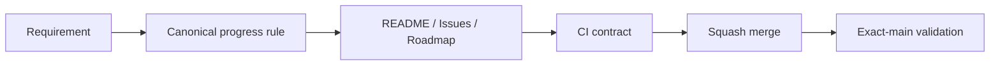

# BRVTAL — Último deploy

  
  
  

> **Development dashboard** · snapshot profesional de **solo el deploy actual**.

## Progress convention

- ✅ ~~Struck through~~ = completed and verified through the required delivery gates.
- 🚧 Normal text = pending or currently in progress.
- Keep completed items visible and crossed out instead of deleting them, so the roadmap preserves delivery history.

## Estado del deploy

| Señal | Estado | Evidencia |
| --- | --- | --- |
| Work line | 📐 **PROJECT PROGRESS CONVENTION** | AGENTS + README validator + GitHub roadmap |
| Base exacta | ✅ **VALIDATED IN CODE** | `main` `d547411b0ae885de1fd078e274315c397f524d66` · exact-main `validate` verde |
| Version | 🚀 **0.1.2 → 0.1.3** | patch deploy bump · pre-1.0 |
| Producción | ⛔ **BLOCKED / EXTERNAL** | Hostinger marker en [#534](https://github.com/pl0n3r/brvtal/issues/534) |

## Huella del cambio

<!-- brvtal:git-delta -->

| Archivos | Inserciones | Eliminaciones | Neto |
| ---: | ---: | ---: | ---: |
| **5** | **+83** | **−54** | **+29** |

## Calidad y entrega

<!-- brvtal:gate-plan -->

| Control | Estado / contrato |
| --- | --- |
| Gates seleccionados | **preflight · fast[PHP+JS]** |
| Progress rule | **CI-enforced** · tracker rows require ✅/🚧 |
| Sonar | Clean-as-You-Code en paralelo |
| CodeRabbit | full review del head estable en paralelo |
| Exact-main | **CI del SHA exacto de main** obligatorio tras squash merge |

## Flujo de entrega

## Qué se hizo

- Se formaliza una única convención visual de progreso para todo BRVTAL.
- Un ítem solo puede pasar a ✅ tachado cuando superó los delivery gates requeridos.
- Lo pendiente o en curso permanece 🚧 y sin tachado.
- Los completados permanecen visibles en el tracker en vez de desaparecer.
- AGENTS conserva la regla para cualquier chat/agente futuro.
- El validador del README rechaza trackers sin la convención.
- El roadmap maestro #533 ya usa la misma semántica.
- BRVTAL avanza a **v0.1.3**.

## Archivos modificados en este deploy

- `AGENTS.md`
- `README.md`
- `config/version.php`
- `scripts/readme-dashboard.py`
- `tests/project-operations-contract.php`

## Validación

- contrato de operaciones exige la convención en AGENTS y README;
- el validador del dashboard exige ✅/🚧 en filas de progreso;
- un ✅ sin tachado falla;
- un 🚧 tachado falla;
- no se cambia arquitectura, datos ni producción;
- sin migración de producción ni operación destructiva.

## Qué sigue

| Lane | Trabajo |
| --- | --- |
| **DONE** | ✅ ~~[#221](https://github.com/pl0n3r/brvtal/issues/221) · Hero/Banner media integrity~~ |
| **NOW** | 🚧 Phase 2 Admin: [#348](https://github.com/pl0n3r/brvtal/issues/348), [#149](https://github.com/pl0n3r/brvtal/issues/149), [#514](https://github.com/pl0n3r/brvtal/issues/514). |
| **NEXT** | 🚧 Settings/navigation follow-through: [#516](https://github.com/pl0n3r/brvtal/issues/516), [#523](https://github.com/pl0n3r/brvtal/issues/523), [#480](https://github.com/pl0n3r/brvtal/issues/480). |
| **BLOCKED / EXTERNAL** | 🚧 [#534](https://github.com/pl0n3r/brvtal/issues/534) · Hostinger Git auto-deploy marker. |
| **LATER** | 🚧 Editorial/productivity: [#519](https://github.com/pl0n3r/brvtal/issues/519), [#518](https://github.com/pl0n3r/brvtal/issues/518), [#525](https://github.com/pl0n3r/brvtal/issues/525), [#513](https://github.com/pl0n3r/brvtal/issues/513). |

## Panorama general pendiente

| Lane | Frente | Issues |
| --- | --- | --- |
| **DONE** | ✅ ~~Phase 1 quick wins~~ | ✅ ~~[#527](https://github.com/pl0n3r/brvtal/issues/527), [#520](https://github.com/pl0n3r/brvtal/issues/520), [#521](https://github.com/pl0n3r/brvtal/issues/521), [#526](https://github.com/pl0n3r/brvtal/issues/526), [#522](https://github.com/pl0n3r/brvtal/issues/522), [#479](https://github.com/pl0n3r/brvtal/issues/479), [#517](https://github.com/pl0n3r/brvtal/issues/517), [#221](https://github.com/pl0n3r/brvtal/issues/221)~~ |
| **NOW** | 🚧 Admin IA / appearance | 🚧 [#348](https://github.com/pl0n3r/brvtal/issues/348), [#149](https://github.com/pl0n3r/brvtal/issues/149), [#514](https://github.com/pl0n3r/brvtal/issues/514) |
| **NEXT** | 🚧 Admin shell/settings | 🚧 [#516](https://github.com/pl0n3r/brvtal/issues/516), [#523](https://github.com/pl0n3r/brvtal/issues/523), [#193](https://github.com/pl0n3r/brvtal/issues/193), [#216](https://github.com/pl0n3r/brvtal/issues/216) |
| **LATER** | 🚧 Editorial productivity | 🚧 [#519](https://github.com/pl0n3r/brvtal/issues/519), [#518](https://github.com/pl0n3r/brvtal/issues/518), [#525](https://github.com/pl0n3r/brvtal/issues/525), [#528](https://github.com/pl0n3r/brvtal/issues/528) |
| **BLOCKED / EXTERNAL** | 🚧 Deploy observation | 🚧 [#534](https://github.com/pl0n3r/brvtal/issues/534) |
