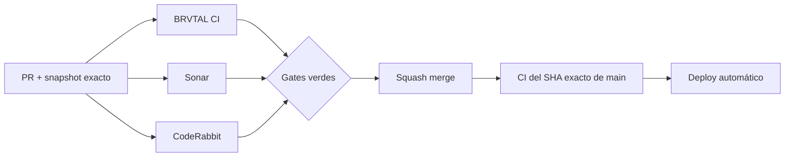

  

# BRVTAL — Último deploy

  <strong>Snapshot de gobernanza · paralelización + handoff visual</strong>

  

> Este README representa **solo el deploy actual**. No es un changelog acumulativo: cada deploy lo reemplaza con un snapshot exacto y un panorama vigente.

## Estado del deploy

| Señal | Estado | Evidencia |
| --- | --- | --- |
| Base exacta | ✅ **VALIDATED IN CODE** | `main` `1a0de40f85d2e4c033fc6a4a838abd0431521a9e` · BRVTAL CI #1010 |
| Runtime público / DISCADMIN | 🟢 **Sin cambios funcionales** | Este deploy modifica gobernanza, README y su validador CI |
| Paralelización | ⚡ **Contrato reforzado** | Lecturas/gates independientes deben agruparse; hasta 4 líneas seguras |
| README visual | 🛡️ **Protegido por CI** | Logo + tabla de estado + Mermaid pasan a ser obligatorios |
| Producción | ⚪ **No validada por este PR** | CI verde no equivale a validación de producción |

## Flujo de entrega

> **Principio operativo:** CI, Sonar, CodeRabbit, inspección y preflight se ejecutan en paralelo siempre que no compartan estado mutable. Merge y writes dependientes permanecen serializados.

## Qué se hizo

- Se reforzó en `AGENTS.md` que la **paralelización es el modo por defecto**, no una optimización opcional.
- Dos o más lecturas independientes deben agruparse; en orquestación del conector GitHub se prioriza `Promise.all(...)`.
- El chequeo de gates debe consultar en paralelo PR state, CI/check-runs, statuses, Sonar y CodeRabbit cuando son independientes.
- Mientras corre un gate externo, se debe adelantar análisis **read-only** del siguiente bloque en vez de quedar inactivo.
- El README de cada deploy pasa a tener un contrato visual permanente: identidad BRVTAL, badge CI, tabla de estado y diagrama Mermaid.
- BRVTAL CI ahora falla si un README futuro pierde esos marcadores visuales o alguno de sus headings canónicos.
- Se mantiene el límite de 8 KB y la lista exacta de archivos modificados por deploy.

## Archivos modificados en este deploy

- `.github/workflows/update-release-metadata.yml` — valida headings, logo, badge CI, tabla de estado y Mermaid del README.
- `AGENTS.md` — endurece el contrato de paralelización y define el formato visual obligatorio del handoff.
- `README.md` — adopta el nuevo diseño visual del snapshot de deploy.

## Validación

- Base exacta: `main` `1a0de40f85d2e4c033fc6a4a838abd0431521a9e`.
- La base pasó **BRVTAL CI #1010** y queda **VALIDATED IN CODE**.
- El PR debe pasar BRVTAL CI, SonarQube Cloud y CodeRabbit sobre su SHA exacto.
- El propio job `fast` debe validar este README con el nuevo contrato visual y con la lista exacta de 3 archivos.
- Tras el squash merge se verificará BRVTAL CI sobre el SHA exacto resultante de `main`.
- Ninguna de estas señales implica por sí sola **VALIDATED IN PRODUCTION**.

## Qué sigue

1. Cerrar este PR de gobernanza y validar el `main` exacto.
2. Continuar #451 con el bloque Sonar de `Math.random()`, clasificando cada uso antes de modificarlo.
3. Resolver por separado el warning `sonar.python.version` con una versión/rango Python realmente soportado por el proyecto.
4. Mantener #479, #480 y #481 separados del burn-down de calidad.
5. Reconciliar PR #434 / Memories sin ejecutar migraciones de producción automáticamente.

## Panorama general pendiente

| Frente | Estado / siguiente foco |
| --- | --- |
| 🧪 **Sonar / calidad** | #451 sigue abierto; accesibilidad y `replaceAll()` ya están cubiertos; quedan pseudorandom, Python config y P2 vigentes |
| 🎛️ **Apariencia** | #149 — completar Light en módulos modernos |
| 🖼️ **Hero Slider** | #221 integridad editorial de media · #480 regresión visual desktop |
| 🔐 **Seguridad editorial** | #257, #216, #174, #193 |
| 🔎 **SEO / entrega pública** | #182, #214, #204, #272 → #390 · #479 alt · #481 IndexNow |
| ✍️ **Content / edición** | #224, #252 |
| 🧾 **Activity / operaciones** | #232, #195 |
| 📚 **Bulk Actions** | #275 — catálogos >500 sin truncado silencioso |
| 🧭 **Dashboard / Theme** | #348, #351 |
| 🗃️ **Archivo cultural** | #398, #403 |
| 🧠 **Memories** | #415 / PR #434 pendiente de reconciliación; sin migración automática |
| 🌐 **Idioma** | #212 — español canónico + inglés automático por fases |
| 💾 **Backups** | #389 — scheduling seguro + Drive opcional |

---

BRVTAL · Rave till Grave · snapshot operativo, no historial acumulativo

