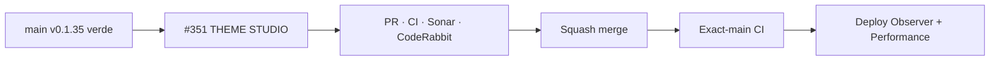

# BRVTAL — Último deploy

  
  
  

> **Development dashboard** · snapshot de **solo el deploy actual** para Issue #351.

## Progress convention

- ✅ ~~Struck through~~ = completed and verified through the required delivery gates.
- 🚧 Normal text = pending or currently in progress.

## Estado del deploy

| Señal | Estado | Evidencia |
| --- | --- | --- |
| Work line | 🚧 **#351 · Theme Studio alineado a Concept 05** | parent visual #583 · ONE SHELL |
| Base exacta | ✅ ~~main v0.1.35 CI/validate + Sonar + deploy/performance verdes~~ | `1f03c3cd4de4a70c913aafffaa230fd0e8c03e94` |
| Versión | 🚧 **0.1.36** | customizer + runtime tipográfico público |
| Producción | 🚧 pendiente de PR → merge → exact-main → observación | sin migración |

## Huella del cambio

<!-- brvtal:git-delta -->

| Archivos | Inserciones | Eliminaciones | Neto |
| ---: | ---: | ---: | ---: |
| **19** | **+551** | **−106** | **+445** |

## Calidad y entrega

<!-- brvtal:gate-plan -->

| Control | Estado / contrato |
| --- | --- |
| Gates | **preflight · coordination · fast[PHP+JS] · database · chromium · real-stack · webkit** |
| PR integrity | **PR + snapshot exacto** · Issue #351 · `work/issue-351` · UUID `30816b2a-76e0-4c78-b7ce-0c415c04c9cc` |
| Theme contract | 🚧 Concept 05 reset · semantic palette · curated fonts · contrast · 1440/390 preview |
| Public runtime | 🚧 solo familias remotas allowlisted/seleccionadas · `display=swap` · fallback local |
| Sonar | 🚧 Quality Gate sobre HEAD final |
| CodeRabbit | 🚧 full review sobre HEAD final |
| Exact-main | 🚧 **CI del SHA exacto de main** después del squash merge |

## Flujo de entrega

## Qué se hizo

- **Concept 05** pasa a ser el sistema visual seguro/default de Theme Studio sin crear un renderer público paralelo.
- La paleta administrable usa roles **BLACK / PAPER / RED / SIGNAL / LINE**; SIGNAL sigue siendo acento secundario y los resets son acotados.
- La tipografía pública se elige desde catálogo curado con Space Grotesk como punto de partida recomendado, mono compatible y fallback local; no se escriben nombres CSS manuales.
- El runtime solo solicita familias Google Fonts permitidas realmente seleccionadas, con `display=swap`; una carga remota fallida conserva el stack local.
- Las declaraciones tipográficas Concept 05 pasan por `--theme-body-font` / `--theme-mono-font` donde corresponde, sin romper la jerarquía authored del diseño.
- El preview local representa Concept 05 en objetivos **1440 / 390**, branding, tipografía y contraste; #529 sigue siendo el flujo separado de preview público real de drafts.
- Los controles SEO sin autoridad pública real, el scene legacy y geometría/tamaños authored por el design system dejan de fingir administrabilidad; los valores legacy compatibles siguen haciendo round-trip.
- **RESET VISUALS TO CONCEPT 05** restaura únicamente el sistema visual seguro y preserva identidad/assets/slug/legacy fuera del alcance.
- La variación de eventos permanece como acento/contaminación controlada, no como fork de la identidad madre.
- El contrato durable de BRVTAL-SPEC se actualiza para reemplazar la antigua regla de “diseño público fijo” por customización semántica y acotada.

## Archivos modificados en este deploy

- `README.md` — snapshot exacto del candidato y gates.
- `config/version.php` — versión humana 0.1.36.
- `css/public-concept05-experience.css` — tokens tipográficos administrables.
- `css/public-concept05-home.css` — tokens tipográficos del Home.
- `css/public-concept05-journal-connected.css` — token mono.
- `css/public-concept05-nights-artists.css` — token mono.
- `css/public-concept05-shell.css` — tokens de shell/header/footer.
- `css/public-concept05-sound-memories.css` — tokens tipográficos.
- `css/public-concept05-tokens.css` — primitive mono ligada al theme.
- `discadmin/index-core.php` — defaults Concept 05 compatibles.
- `discadmin/theme-studio-v2.css` — preview 1440/390, contraste y specimens.
- `discadmin/theme-studio-v2.js` — roles semánticos, catálogo y reset Concept 05.
- `docs/BRVTAL-SPEC.md` — contrato durable de customización acotada.
- `js/public-theme-runtime.js` — carga permitida de fuentes seleccionadas.
- `package.json` — versión 0.1.36.
- `tests/e2e/discadmin-theme-studio-concept05.spec.mjs` — controles, reset, fonts, contraste y geometría.
- `tests/e2e/public-theme-runtime.spec.mjs` — allowlist/fallback de fuentes remotas.
- `tests/public-concept05-foundation-contract.php` — protege tokens tipográficos públicos.
- `tests/theme-studio-v2-contract.php` — contrato Theme Studio / Concept 05.

## Validación

- Base exacta `1f03c3cd4de4a70c913aafffaa230fd0e8c03e94`: BRVTAL CI/validate #35830678272, Sonar main, Deploy Observer #35830678252 y Production Performance #35830704640 verdes.
- #351 fue recuperado por recovery-first y reencadenado sobre ese `main`; no existe otro PR abierto ni se duplicó trabajo.
- La reconciliación desde v0.1.32 solo tenía conflicto real en README/versión/package; las superficies funcionales se conservaron y la metadata se regeneró desde v0.1.35.
- No hay migraciones, escrituras de producción, nuevas rutas públicas ni page builder libre.
- El candidato v0.1.36 requiere CI/Sonar/CodeRabbit sobre el HEAD final antes de merge.

## Qué sigue

| Lane | Trabajo |
| --- | --- |
| **NOW** | 🚧 [#351](https://github.com/pl0n3r/brvtal/issues/351) · validar y entregar Theme Studio Concept 05. |
| **NEXT** | 🚧 [#529](https://github.com/pl0n3r/brvtal/issues/529) · preview público real de draft usando renderer canónico. |
| **LATER** | 🚧 [#398](https://github.com/pl0n3r/brvtal/issues/398) · archivo cultural conectado; [#531](https://github.com/pl0n3r/brvtal/issues/531) · Media Library smarter. |
| **BLOCKED / EXTERNAL** | 🚧 Sin bloqueos externos activos. |

## Panorama general pendiente

| Lane | Frente | Issues |
| --- | --- | --- |
| **NOW** | 🚧 Concept 05 customization | 🚧 [#351](https://github.com/pl0n3r/brvtal/issues/351) |
| **NEXT** | 🚧 Draft/public preview | 🚧 [#529](https://github.com/pl0n3r/brvtal/issues/529) |
| **LATER** | 🚧 Public archive / media scale | 🚧 [#398](https://github.com/pl0n3r/brvtal/issues/398), [#531](https://github.com/pl0n3r/brvtal/issues/531), [#583](https://github.com/pl0n3r/brvtal/issues/583) |
