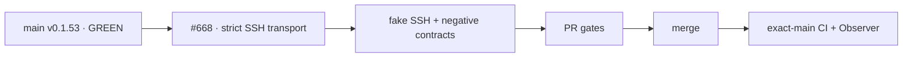

# BRVTAL — Último deploy

  
  
  

> Snapshot de **solo el deploy actual**: #668 implementa el contrato de transporte SSH/dispatcher para Factory v1 sin añadir caller productivo ni ejecutar writes remotos reales. Base exacta `main 57109d727850b5ef431c1c3698ded2a1d11bbaf4` / v0.1.53 GREEN.

## Progress convention

- ✅ ~~Struck through~~ = completed and verified through the required delivery gates.
- 🚧 Normal text = pending or currently in progress.

## Estado del deploy

| Señal | Estado | Evidencia |
| --- | --- | --- |
| Work line | 🚧 **#668 · Hostinger SSH transport + dispatcher** | `work/issue-668`; reserva `b36e02c1-e4f8-490c-8ac2-437266e608c6` |
| Base exacta | ✅ ~~main v0.1.53 GREEN~~ | `57109d727850b5ef431c1c3698ded2a1d11bbaf4` |
| Versión producto | ✅ ~~v0.1.53 sin cambio~~ | repository-only; no caller de producción |
| Release layout | 🚧 **SHA-scoped + shared state** | `factory-releases/<sha>` + `factory-shared` |
| Dispatcher | 🚧 **public_html estable** | switch atómico de `.factory-current` |
| Seguridad SSH | 🚧 **strict host key + key efímera 0600** | descriptor JSON cerrado + `known_hosts` pin |
| Producción | ✅ ~~sin writes en este slice~~ | no workflow invoca todavía el transporte |

## Huella del cambio

<!-- brvtal:git-delta -->

| Archivos | Inserciones | Eliminaciones | Neto |
| ---: | ---: | ---: | ---: |
| **11** | **+0** | **−0** | **+0** |

## Calidad y entrega

<!-- brvtal:gate-plan -->

| Control | Estado / contrato |
| --- | --- |
| Gates esperados | **preflight · coordination · fast[PHP] · database · recovery** |
| PR + snapshot exacto | Issue #668 · reserva `b36e02c1-e4f8-490c-8ac2-437266e608c6` |
| Roles | Infrastructure · SRE · Security · QA |
| Transporte | `DEPLOY_TOKEN` JSON exacto + `DEPLOY_SSH_KEY`; sin secretos en logs |
| Hostinger | `public_html` permanece document root fijo; release pointer interno |
| Estado persistente | `config/config.php`, `uploads`, `storage`, `.private` viven en `factory-shared` |
| Review | BRVTAL CI + Factory gates + Sonar/CodeQL/CodeRabbit sobre HEAD estable |
| CI del SHA exacto de main | 🚧 después del merge |

## Flujo de entrega

## Qué se hizo

- Añade `ops/factory/transport.py` con descriptor cerrado `host/user/port/site_root/known_hosts`, key efímera 0600, `StrictHostKeyChecking=yes` y `UserKnownHostsFile` aislado.
- Empaqueta únicamente contenido Git del SHA exacto y lo prepara en `factory-releases/<sha>`; un `.git/HEAD` mínimo preserva identidad exacta para `/api/health.php`.
- Mantiene estado mutable fuera del artefacto: configuración productiva, uploads, storage y `.private` se enlazan desde `factory-shared`.
- Añade un dispatcher estable para Hostinger: `public_html` no cambia de raíz y conmuta solo `.factory-current`.
- Backup y migración productivos se ejecutan por SSH dentro del release remoto; rollback cambia solo el artefacto y nunca restaura la BD.
- El modo producción se habilita únicamente cuando Factory entrega ambos secretos; sin ellos los adapters fallan cerrado.
- Los contratos cubren descriptor inválido, traversal, host-key incorrecta, campos extra, key ausente, staging SHA-scoped, shared state y switch/rollback mediante fake SSH local.
- Este slice no instala el dispatcher en Hostinger, no prepara `factory-shared` real y no añade `factory/deploy.yml@v1`; esas acciones pertenecen al slice de activación/e2e.

## Archivos modificados en este deploy

- `README.md`
- `ops/factory/backup`
- `ops/factory/build`
- `ops/factory/common.sh`
- `ops/factory/deploy`
- `ops/factory/migrate`
- `ops/factory/public_html-dispatcher.htaccess`
- `ops/factory/rollback`
- `ops/factory/transport.py`
- `tests/factory-deploy-adapters-contract.php`
- `tests/factory-hostinger-transport-contract.php`

## Validación

- 🚧 El contrato PHP debe probar fixture legacy + descriptor estricto + fake SSH staging/activate/rollback.
- 🚧 Database/recovery deben permanecer verdes porque el slice toca la superficie de deploy.
- 🚧 Factory CI/Policy/Privacy, Sonar, CodeQL y CodeRabbit deben cerrar sobre el HEAD estable.
- 🚧 Tras merge: exact-main BRVTAL CI + Deploy Observer + Production Performance deben mantener GREEN.

## Qué sigue

| Lane | Trabajo |
| --- | --- |
| **NOW** | 🚧 [#668](https://github.com/pl0n3r/brvtal/issues/668): validar transporte Hostinger sin writes remotos. |
| **NEXT** | 🚧 [#630](https://github.com/pl0n3r/brvtal/issues/630): preparar shared state/dispatcher real y activar caller Factory con rollback e2e. |
| **LATER** | 🚧 [#533](https://github.com/pl0n3r/brvtal/issues/533): reanudar roadmap tras cerrar TANDA 2. |
| **BLOCKED / EXTERNAL** | 🚧 [#627](https://github.com/pl0n3r/brvtal/issues/627): labels espera paridad central de Factory. |

## Panorama general pendiente

- 🚧 **NOW**: cerrar #668 con evidencia reproducible y producción intacta.
- 🚧 **NEXT**: activar Factory deploy solo después de preparar `factory-shared` y el dispatcher en Hostinger con rollback probado.
- 🚧 **LATER**: cerrar #630 con un merge→producción validada o rollback automático.
- 🚧 **BLOCKED / EXTERNAL**: #627 permanece fuera hasta que Factory cubra su contrato completo.
