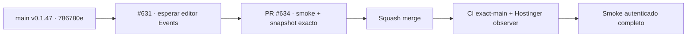

# BRVTAL — Último deploy

  
  
  

> **Production incident #631** · snapshot de **solo el deploy actual**: v0.1.47 exact `main` `786780eddd60a14c7fae4286db20459a2af8667e` has green CI/deploy observer; authenticated production smoke #35932847504 fails on transient duplicate Events search while the editor mounts. **Engineering roles:** SRE, QA automation, DISCADMIN frontend auditor.

## Progress convention

- ✅ ~~Struck through~~ = completed and verified through the required delivery gates.
- 🚧 Normal text = pending or currently in progress.

## Estado del deploy

| Señal | Estado | Evidencia |
| --- | --- | --- |
| Work line | 🚧 **#631 · Events workspace smoke readiness** | `work/issue-631`; reserva `d3db0a43-99f8-474f-87ce-7ed9aa96dd2f` |
| Base exacta | ✅ ~~main v0.1.47~~ | `786780eddd60a14c7fae4286db20459a2af8667e` |
| Versión | ✅ ~~v0.1.47 sin incremento~~ | cambios solo en prueba/documentación |
| CI del SHA exacto de main | ✅ ~~success~~ | [#35932632845](https://github.com/pl0n3r/brvtal/actions/runs/35932632845) |
| Deploy Observer base | ✅ ~~success~~ | [#35932632897](https://github.com/pl0n3r/brvtal/actions/runs/35932632897) |
| Smoke autenticado base | ⛔ **failure** | [#35932847504](https://github.com/pl0n3r/brvtal/actions/runs/35932847504) · doble búsqueda transitoria |
| Entrega candidata | 🚧 PR gates, merge y smoke nuevo | no equivale a producción validada |

## Huella del cambio

<!-- brvtal:git-delta -->

| Archivos | Inserciones | Eliminaciones | Neto |
| ---: | ---: | ---: | ---: |
| **2** | **+48** | **−41** | **+7** |

## Calidad y entrega

<!-- brvtal:gate-plan -->

| Control | Estado / contrato |
| --- | --- |
| Gates | **preflight · coordination · fast[JS] · chromium** |
| PR + snapshot exacto | Issue #631 · reserva `d3db0a43-99f8-474f-87ce-7ed9aa96dd2f` |
| CodeRabbit / Sonar | ✅ ~~revisión sin hallazgos / Quality Gate~~; revalidar HEAD final |
| CI del SHA exacto de main | 🚧 después del merge |
| Producción | 🚧 health/version/SHA/DB, Home/Admin/Dashboard, Events EDIT/date, Sets y Hero |

## Flujo de entrega

## Qué se hizo

- Esperar a que se monte el Content Core interno de Events y su `.wrap` quede oculta antes de verificar exactamente una búsqueda visible en la grilla nativa, sin omitir el fallo si sigue duplicada.
- Comprobar `[data-admin-grid-search]` visible y preservar EDIT real, fecha API/grilla/formulario guiado, relaciones Sets, tres cargas de Hero y guardia de red de solo lectura.
- Mantener runtime v0.1.47 intacto, sin credenciales, migraciones, SQL destructivo ni cambios en contenido de producción.

## Archivos modificados en este deploy

- `README.md` — snapshot exacto de PR #634, incidencia y validaciones.
- `tests/e2e/production-authenticated-smoke.mjs` — esperar montaje de Events y exigir una búsqueda visible.

## Validación

- ✅ ~~Base v0.1.47 validada: CI exact-main #35932632845 y observer #35932632897 aprobaron.~~
- ⛔ Smoke #35932847504 falló en búsqueda transitoriamente duplicada antes de probar EDIT/date, Sets y Hero; las comprobaciones posteriores NO están validadas.
- 🚧 CI del HEAD final, merge, deploy y smoke autenticado ejecutado pendiente; **no declarar PRODUCTION GREEN** sin las cinco evidencias.

## Qué sigue

| Lane | Trabajo |
| --- | --- |
| **NOW** | 🚧 [#631](https://github.com/pl0n3r/brvtal/issues/631): estabilizar smoke real y corregir solo fallos observados. |
| **NEXT** | 🚧 [#533](https://github.com/pl0n3r/brvtal/issues/533): registrar GREEN tras cinco señales probadas. |
| **LATER** | 🚧 retomar backlog de producto después de GREEN. |
| **BLOCKED / EXTERNAL** | 🚧 acreditación productiva hasta ejecutar smoke completo. |

## Panorama general pendiente

- 🚧 **NOW**: recuperación de producción #631 con prueba real.
- 🚧 **NEXT**: cierre de incidente solo tras evidencias exactas.
- 🚧 **LATER**: roadmap producto luego de GREEN.
- 🚧 **BLOCKED / EXTERNAL**: todavía no hay smoke autenticado completo aprobado.

