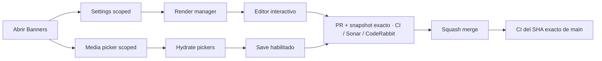

# BRVTAL — Último deploy

  
  
  

> **Development dashboard** · snapshot profesional de **solo el deploy actual**.

## Progress convention

- ✅ ~~Struck through~~ = completed and verified through the required delivery gates.
- 🚧 Normal text = pending or currently in progress.

## Estado del deploy

| Señal | Estado | Evidencia |
| --- | --- | --- |
| Work line | 🚧 **#523 BANNERS FIRST LOAD** | payloads acotados + render progresivo |
| Base exacta | ✅ **VALIDATED IN CODE** | `main` `1480380280a10cd9252a978b78b78cf44c1f2873` · #555 exact-main BRVTAL CI + Sonar verdes |
| Version | 🚧 **0.1.9 → 0.1.10** | patch deploy · pre-1.0 |
| Producción | ⛔ **BLOCKED / EXTERNAL** | Hostinger marker tracked separately in [#534](https://github.com/pl0n3r/brvtal/issues/534) |

## Huella del cambio

<!-- brvtal:git-delta -->

| Archivos | Inserciones | Eliminaciones | Neto |
| ---: | ---: | ---: | ---: |
| **10** | **+463** | **−60** | **+403** |

## Calidad y entrega

<!-- brvtal:gate-plan -->

| Control | Estado / contrato |
| --- | --- |
| Gates seleccionados | **preflight · fast[PHP+JS] · database · chromium · real-stack · webkit** |
| API | Settings allowlist + Media `hero-picker` acotados |
| Browser / real stack | render progresivo + usuario E2E autenticado |
| Sonar + CodeRabbit | paralelo sobre head estable |
| Exact-main | CI + Sonar tras squash merge |

## Flujo de entrega

## Qué se hizo

- Banners usa lecturas scoped paralelas: `home.hero.slider` + Media `hero-picker`; renderiza Settings antes de Media y mantiene picker/Save bloqueados hasta hidratación.
- Las respuestas tardías se descartan y Media remoto sigue hidratándose con DOM seguro.
- Se añadieron contratos, browser y real-stack con usuario E2E; el harness v2 usa los endpoints scoped reales.
- `AGENTS.md` fija el rol **principal engineer + technical executor** y ownership de arquitectura, UX/UI, dirección visual, QA, AppSec, performance y release.
- Versión **0.1.10**.

## Archivos modificados en este deploy

- `AGENTS.md` — Banners + rol operativo cross-functional.
- `README.md` — snapshot #523.
- `api/admin-read-plan.php` — planes scoped + allowlist.
- `api/index.php` — aplica planes scoped.
- `config/version.php` — versión 0.1.10.
- `discadmin/hero-slider.js` — bootstrap/render progresivo.
- `tests/admin-read-plan-contract.php` — contrato scoped/allowlist.
- `tests/e2e/discadmin-hero-slider-security.spec.mjs` — progresivo + picker seguro.
- `tests/e2e/hero-slider-v2.spec.mjs` — harness scoped.
- `tests/e2e/hero-slider-integrity-real-stack.spec.mjs` — E2E real-stack.

## Validación

- Browser: Banners aparece antes de Media; Save se habilita solo tras hidratación.
- Settings scoped acepta solo `home.hero.slider`; variantes/otras keys fallan antes de SQL.
- `hero-picker` excluye audio/documentos; legacy reads siguen compatibles.
- Real-stack/harness usan endpoints scoped reales. Sin migración ni SQL destructivo.

## Qué sigue

| Lane | Trabajo |
| --- | --- |
| **NOW** | 🚧 [#523](https://github.com/pl0n3r/brvtal/issues/523) · pasar gates, mergear y validar exact-main. |
| **NEXT** | 🚧 [#480](https://github.com/pl0n3r/brvtal/issues/480) · corregir clipping/overlap del hero desktop. |
| **LATER** | 🚧 [#193](https://github.com/pl0n3r/brvtal/issues/193), [#216](https://github.com/pl0n3r/brvtal/issues/216) · cerrar Phase 2. |
| **BLOCKED / EXTERNAL** | 🚧 [#534](https://github.com/pl0n3r/brvtal/issues/534) · Hostinger Git auto-deploy marker. |

## Panorama general pendiente

| Lane | Frente | Issues |
| --- | --- | --- |
| **DONE** | ✅ ~~Phase 1 + Admin IA/Appearance/Settings/Security~~ | ✅ ~~[#348](https://github.com/pl0n3r/brvtal/issues/348), [#149](https://github.com/pl0n3r/brvtal/issues/149), [#514](https://github.com/pl0n3r/brvtal/issues/514), [#516](https://github.com/pl0n3r/brvtal/issues/516), [#553](https://github.com/pl0n3r/brvtal/issues/553)~~ |
| **NOW** | 🚧 Phase 2 closeout | 🚧 [#523](https://github.com/pl0n3r/brvtal/issues/523), [#480](https://github.com/pl0n3r/brvtal/issues/480), [#193](https://github.com/pl0n3r/brvtal/issues/193), [#216](https://github.com/pl0n3r/brvtal/issues/216) |
| **LATER** | 🚧 Editorial productivity | 🚧 [#519](https://github.com/pl0n3r/brvtal/issues/519), [#518](https://github.com/pl0n3r/brvtal/issues/518), [#257](https://github.com/pl0n3r/brvtal/issues/257), [#525](https://github.com/pl0n3r/brvtal/issues/525), [#524](https://github.com/pl0n3r/brvtal/issues/524), [#528](https://github.com/pl0n3r/brvtal/issues/528), [#529](https://github.com/pl0n3r/brvtal/issues/529) |
| **LATER** | 🚧 Operational dashboards | 🚧 [#513](https://github.com/pl0n3r/brvtal/issues/513), [#515](https://github.com/pl0n3r/brvtal/issues/515), [#532](https://github.com/pl0n3r/brvtal/issues/532) |
| **BLOCKED / EXTERNAL** | 🚧 Deploy observation | 🚧 [#534](https://github.com/pl0n3r/brvtal/issues/534) |
