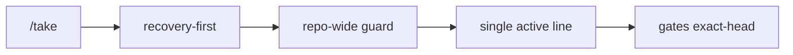

# BRVTAL — Último deploy

> Snapshot de **solo el deploy actual** para #698 / PR #699: coordinación repository-only, fail-closed y con una sola línea activa por repositorio. No modifica producto ni producción.

## Progress convention
- ✅ ~~Struck through~~ = completed and verified through required gates.
- 🚧 Normal text = pending/in progress.
- ⛔ = active production blocker.

## Estado del deploy
| Señal | Estado | Evidencia |
| --- | --- | --- |
| Work line | 🚧 **#698 · coordinación exclusiva** | `work/issue-698` · reserva `37420d44-b8ed-40ed-87c2-3832c759a794` |
| Base exacta | ✅ **main v0.1.59** | `f5a5f1b687d9972a9d898e9da6a618f85cf5cf08` |
| Versión de producto | ✅ **v0.1.59 sin cambio** | repository-only |
| Producción | ⛔ **NO GREEN · #681** | registry de migraciones pendiente |
| Factory labels | ⛔ **#694** | pendiente Factory v1.0.5 |

## Huella del cambio
<!-- brvtal:git-delta -->
| Archivos | Inserciones | Eliminaciones | Neto |
| ---: | ---: | ---: | ---: |
| **5** | **+289** | **−59** | **+230** |

## Calidad y entrega
<!-- brvtal:gate-plan -->
| Control | Estado / contrato |
| --- | --- |
| Gates esperados | **preflight · coordination · fast[PHP+JS] · database · chromium · real-stack** |
| PR + snapshot exacto | **#699 · coordinación repository-wide** |
| Roles | **Infrastructure · Software Engineering · QA · Security** |
| Review | BRVTAL CI + Factory Policy/Privacy + Sonar/CodeQL/CodeRabbit |
| CI del SHA exacto de main | 🚧 validar HEAD final antes de merge |
| Production GREEN | ⛔ fuera de alcance de este PR |

## Flujo de entrega

## Qué se hizo
- `Work Coordination` usa una concurrency group fija del repositorio y `cancel-in-progress: false`.
- `/take` distingue `none / recovered / blocked` y nunca cae a una segunda reserva ante autoridad activa o incompatible.
- `reserve_work()` aplica el mismo guard como defensa para callers internos.
- El contrato operativo deja de proteger la antigua concurrency key por Issue y exige exclusión mutua repository-wide.
- Regresiones cubren reserva reciente, stale recuperable, stale incompatible, release→take y caller interno.
- No hay cambios de runtime, DB, Hostinger, migraciones, secretos o deploy.

## Archivos modificados en este deploy
- `.github/workflows/work-coordination.yml`
- `README.md`
- `scripts/work_coordinator.py`
- `tests/project-operations-contract.php`
- `tests/test_work_coordinator.py`

## Validación
- ✅ Factory CI, Policy, Privacy, Sonar y CodeQL ya validaron el diseño previo del HEAD.
- ✅ Gate `coordination` confirmó la reserva y contrato de PR.
- 🚧 `fast` debe revalidar README + project-operations con la nueva exclusión mutua.
- 🚧 BRVTAL CI exact-head y CodeRabbit terminal antes del merge.

## Qué sigue
| Lane | Trabajo |
| --- | --- |
| **NOW** | 🚧 [#698](https://github.com/pl0n3r/brvtal/issues/698): validar y fusionar exclusión mutua de coordinación. |
| **NEXT** | 🚧 [#629](https://github.com/pl0n3r/brvtal/issues/629): recuperación segura DISCADMIN. |
| **LATER** | 🚧 [#683](https://github.com/pl0n3r/brvtal/issues/683): staff API D-060. |
| **BLOCKED / EXTERNAL** | 🚧 [#681](https://github.com/pl0n3r/brvtal/issues/681) producción · [#694](https://github.com/pl0n3r/brvtal/issues/694) Factory @v1. |

## Panorama general pendiente
- 🚧 **NOW:** #698 coordinación repository-wide.
- 🚧 **NEXT:** #629 recuperación segura DISCADMIN.
- 🚧 **LATER:** #683 staff API D-060.
- 🚧 **BLOCKED / EXTERNAL:** #681 producción; #694 Factory Labels.
