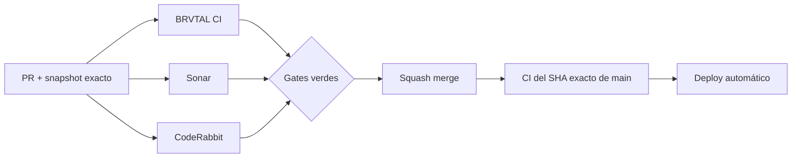

  

# BRVTAL — Último deploy

<strong>TRANSMISSIONS · editorial culture on Home</strong>

  

> Este README representa **solo el deploy actual**. Se reemplaza en el siguiente deploy y no funciona como changelog acumulativo.

## Estado del deploy

| Señal | Estado | Evidencia |
| --- | --- | --- |
| Base exacta | ✅ **VALIDATED IN CODE** | `main` `824114b4dbe105bc701c75cf2fb998fda5d1aed1` · BRVTAL CI #1096 |
| Alcance | 📡 **#506 / #398** | Blog público → TRANSMISSIONS |
| Datos | 🔗 **Relaciones explícitas** | Event / Artist / Set / Release desde `blog[].relations` |
| Runtime | ⚡ **Shared payload** | sin segunda petición a `api/public.php` |
| Producción | ⚪ **No validada** | CI no equivale a validación de producción |

## Flujo de entrega

## Qué se hizo

- Añade **TRANSMISSIONS** al recorrido y navegación pública como framing editorial del Blog existente.
- Reutiliza el orden canónico del payload `blog` y muestra hasta 6 señales con fecha, excerpt, tags y ruta `/blog/{slug}`.
- Resuelve contexto Event/Artist/Set/Release únicamente desde relaciones explícitas y pools públicos.
- No introduce endpoint, tabla, inferencia ni dependencia frontend nueva.
- Blog vacío muestra estado real; fallo del payload conserva el fallback estático.
- Integra el módulo en el runtime versionado después de Media y cubre XSS, mobile/touch y fallback.

## Archivos modificados en este deploy

- `AGENTS.md` — registra TRANSMISSIONS como estado durable.
- `README.md` — snapshot exacto del deploy #506.
- `css/public-transmissions.css` — visual Archive/System responsive.
- `index.html` — sección y navegación TRANSMISSIONS.
- `index.php` — entrega/defer del stylesheet.
- `js/public-runtime-loader.js` — incorpora el módulo al core.
- `js/public-transmissions.js` — render desde payload compartido y relaciones explícitas.
- `tests/e2e/public-mobile-performance.spec.mjs` — protege el orden adaptativo.
- `tests/e2e/public-transmissions.spec.mjs` — comportamiento, seguridad, touch y fallback.
- `tests/public-transmissions-contract.php` — contrato de wiring, rutas y single-request.

## Validación

- Base exacta `824114b4dbe105bc701c75cf2fb998fda5d1aed1` pasó BRVTAL CI #1096.
- El PR debe pasar BRVTAL CI / Chromium, Sonar y CodeRabbit sobre su SHA exacto.
- No modifica DB, autenticación ni administración; database/real-stack pueden quedar fuera por scope.
- Tras squash merge se verificará BRVTAL CI sobre el SHA exacto resultante de `main`.
- No se declara **VALIDATED IN PRODUCTION** desde CI.

## Qué sigue

1. Resolver findings válidos, squash merge y exact-main CI.
2. Actualizar #398 con TRANSMISSIONS integrado.
3. Continuar #481 **IndexNow**, ya solicitado y documentado.

## Panorama general pendiente

| Frente | Estado / siguiente foco |
| --- | --- |
| 🗃️ **Archivo cultural** | #398 · cerrar TRANSMISSIONS y continuar solo relaciones reales |
| 🔎 **SEO / IndexNow** | #481 · siguiente slice preparado |
| 🧪 **Sonar / calidad** | #451 · continuar deuda vigente por riesgo |
| 🎛️ **Apariencia** | #149 — completar Light en módulos modernos |
| 🖼️ **Hero Slider** | #221 integridad editorial · #480 regresión visual desktop |
| 🔐 **Seguridad editorial** | #257, #216, #174, #193 |
| 📈 **Analytics** | #427 — completar eventos `brvtal_*` en GTM/GA4 |
| ✍️ **Content / edición** | #224, #252 |
| 🧾 **Activity / operaciones** | #232, #195 |
| 📚 **Bulk Actions** | #275 — registros >500 sin falsa exhaustividad |
| 🌐 **Idioma** | #212 — español canónico + inglés automático por fases |
| 💾 **Backups** | #389 — scheduling seguro + Drive opcional |

---

BRVTAL · Rave till Grave · deploy snapshot

