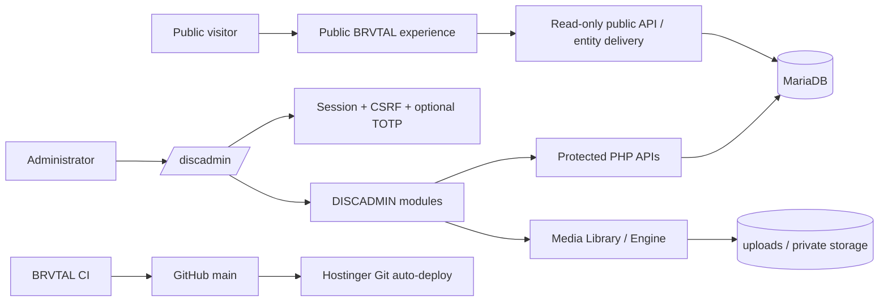

# BRVTAL

> **RAVE TILL GRAVE**  
> Proprietary digital platform for underground electronic music, events, artists, releases, media, editorial content and the BRVTAL label ecosystem.

[](https://github.com/pl0n3r/brvtal/actions/workflows/update-release-metadata.yml)


**Production:** https://brvtal.com.co  
**Administration:** `/discadmin`  
**Repository:** `pl0n3r/brvtal`  
**Canonical branch:** `main`  
**Architecture source of truth:** [`docs/BRVTAL-SPEC.md`](docs/BRVTAL-SPEC.md)

---

## What BRVTAL is

BRVTAL is being built as more than an event website. It combines:

- underground electronic-music collective;
- event production;
- artist infrastructure;
- Sets and Releases;
- media/archive management;
- editorial content;
- label foundations;
- future booking/community capabilities.

The public product is intentionally art-directed: **dark, aggressive, hypnotic and recognizably BRVTAL**. The administration side is equally opinionated: **DISCADMIN is one proprietary application**, not a collection of disconnected mini-admins.

The public frontend is currently **English only**.

---

## Platform status — September 2026

| Area | Current state |
|---|---|
| Public website | Active English-first frontend |
| Public entity pages | Events, Artists, Sets, Releases, Blog and CMS Pages |
| Public SEO | Canonical metadata, OG/Twitter, JSON-LD, sitemap/robots, `404/noindex` safeguards |
| Public Archive | Historical event discovery separated from active lifecycle content |
| Related Content | Public Event/Artist/Set/Release relationship graph with privacy filtering |
| DISCADMIN shell | One canonical shell/sidebar/session/workspace |
| Events | CRUD, lifecycle, tickets, roster/participation, SEO, archive behavior |
| Artists | CRUD, profile data and collective lifecycle foundation |
| Sets | CRUD, multi-platform links, artist/event relations |
| Releases | Label/catalog module, artwork, artists, platforms and lifecycle |
| Blog | Draft/publish/archive, tags, relations, media and SEO |
| Pages | CMS-managed content and public canonical routes |
| Content Core | Guided event/ticket/roster workflow; known stabilization debt remains |
| Media Library | Visual picker, upload, reusable media, metadata and reference protection |
| Media Engine v2 | Originals, focal points, context crop previews, quality guidance and WebP variants |
| Content Health | Read-only editorial completeness/SEO/media guidance |
| SEO editor defaults | Title/description fallbacks with manual override priority |
| Global Search | Cross-module `⌘K / Ctrl+K` search |
| Bulk Actions v1 | Safe status changes; no Bulk Delete |
| Admin Activity | Append-only audit/history foundation and read-only UI |
| Security / 2FA | TOTP, encrypted secrets, recovery codes, Safari/WebKit validated login |
| System Status v2 | Visual control room: health, deploy, DB/content, storage, GitHub metrics, activity |
| CI | PHP, JS, contracts, MariaDB, migration checks and Playwright |
| Deployment | GitHub `main` → Hostinger Git auto-deployment |

### Completion language

BRVTAL deliberately distinguishes:

1. **IMPLEMENTED** — code exists;
2. **VALIDATED IN CODE** — CI/tests passed;
3. **DEPLOYED** — Hostinger has received the merged source;
4. **VALIDATED IN PRODUCTION** — real production behavior was checked.

A green PR is not automatically “validated in production.”

---

## Architecture



### Canonical DISCADMIN navigation

```text
DASHBOARD
EVENTS
ARTISTS
RELEASES
SETS
MEDIA
PAGES
BLOG
CONTENT CORE

TECHNICAL
THEME STUDIO
SETTINGS
SECURITY / 2FA
SYSTEM STATUS
```

Cross-cutting capabilities such as Search, Bulk Actions, Content Health, SEO assistance, Activity and System Status enhance this same shell. Do not create second sidebars or standalone admin applications for them.

---

## Major implemented capabilities

### Events + Content Core

Events are first-class entities with drafts, public lifecycle states, tickets, media, SEO and artist participation through `event_artists`.

Canonical lineup concept:

```text
GET  /events/{id}/lineup
POST /events/{id}/lineup
```

Content Core provides the guided event workflow inside the canonical DISCADMIN shell. Drafts may be incomplete; publication-oriented states require stronger validation.

Production smoke testing has exposed and fixed multiple Content Core issues. Remaining defects are tracked as stabilization debt rather than a reason to redesign the admin architecture.

### Releases / Label

Releases support label/catalog data, artwork, release type/date, credited Artists, external listening/store destinations and `draft / published / archived` lifecycle.

### Blog

Blog supports `draft / published / archived`, tags, cover media, SEO and relations to Events, Artists, Sets and Releases.

### Media Library + Media Engine v2

Media is reusable platform content rather than disposable form attachments.

Implemented foundation includes:

- visual library and picker;
- validated uploads;
- path normalization;
- metadata and sidecars;
- original preservation;
- image dimensions and warnings;
- WebP variants when supported;
- square and larger width variants for suitable images;
- reference-aware deletion protection.

Media Engine v2 adds focal-point controls, live square/card/hero previews, context-aware WebP variants and per-context resolution guidance while preserving the source original.

### SEO + public entity delivery

Published content has canonical entity routes:

```text
/events/{slug}
/artists/{slug}
/sets/{slug}
/releases/{slug}
/blog/{slug}
/pages/{slug}
```

Public delivery includes canonical URLs, Open Graph/Twitter metadata, structured data and sitemap/robots behavior. Draft/private/unknown entity routes must not leak as public content.

When editorial SEO fields are empty, BRVTAL falls back to the entity title/name and its description/bio/excerpt. Manually authored SEO metadata always takes priority.

### Archive + Related Content

Historical Events remain discoverable rather than disappearing when their active lifecycle ends. Related Content connects public Events, Artists, Sets and Releases while filtering private/draft relationships at the server layer.

Archive Discovery v2 adds combined year, text and relationship filters plus canonical links from historical records to their public Event pages.

### Search + Bulk Actions

Global Search covers editorial modules through `⌘K / Ctrl+K`.

Bulk Actions v1 supports safe lifecycle/status changes with CSRF, explicit allowlists, row locking, transactions, rollback and a maximum batch size.

**Bulk Delete is intentionally not implemented.**

### Admin Activity

Important administrative mutations are recorded in append-only `admin_activity_log` history with actor/action/resource/change metadata and sanitized before/after snapshots.

From the Dashboard, each editorial activity row can open the complete history for that content item. The timeline shows who changed it and when, with readable before/after values for each changed field.

The UI and endpoint remain read-only. Automatic restore/revert is intentionally deferred.

### Security / 2FA

Implemented security includes:

- centralized PHP sessions;
- CSRF validation;
- login rate limiting;
- TOTP / Google Authenticator-compatible enrollment and challenge;
- AES-256-GCM encrypted TOTP secrets;
- hashed recovery codes;
- persistent private encryption-key fallback in existing Settings when a dedicated server key is unavailable;
- protection against exposing/editing/deleting that private setting through normal Settings APIs/UI;
- browser regression coverage for the full password → TOTP → authenticated session flow, including WebKit/Safari behavior.

Never commit real security secrets or expose them through diagnostics.

### System Status v2

System Status is a visual operations/control-room screen rather than a wall of logs. It surfaces:

- platform health score;
- API/DB/runtime/security/activity/deployment indicators;
- deployment SHA/environment;
- database content counts;
- BRVTAL-managed storage usage;
- GitHub commit/merged-PR/source metrics;
- Content Health;
- recent admin activity;
- actionable issues;
- Advanced Diagnostics on demand.

Hostinger shared-node filesystem totals are diagnostic-only. The visible storage chart uses BRVTAL-managed application data against the configured operational hosting quota.

---

## Technology stack

| Layer | Technology |
|---|---|
| Backend | PHP 8.3+ |
| Database | MariaDB / MySQL-compatible SQL |
| Public frontend | HTML, CSS, vanilla JavaScript |
| Administration | Proprietary DISCADMIN shell + mounted enhancements/modules |
| Authentication | PHP sessions, CSRF, rate limiting, TOTP |
| Media | PHP filesystem/media engine + browser picker |
| Testing | PHP contracts/integration + Playwright |
| CI | GitHub Actions with MariaDB service |
| Production | Hostinger shared/managed LiteSpeed |
| Deployment | GitHub `main` → Hostinger Git integration |

BRVTAL intentionally remains compatible with shared hosting: production does not require a long-running Node server, containers or SSH deployment.

---

## Repository structure

```text
brvtal/
├── .github/              GitHub Actions / CI
├── api/                  Public and protected PHP APIs
├── assets/               Public static assets
├── config/               Bootstrap, auth, media, deployment and release config
├── css/                  Public frontend styles
├── database/             Base schema + explicit migrations
├── discadmin/            Canonical DISCADMIN shell/modules/enhancements
├── docs/                 Product/technical specification
├── js/                   Public frontend JavaScript
├── scripts/              Maintenance/support scripts
├── storage/              Private/runtime application storage
├── tests/                Contracts, MariaDB integration and browser tests
├── uploads/              Managed uploaded media in production
├── index.php             Public server-rendered delivery/router
├── package.json          Browser-test tooling
└── playwright.config.mjs Playwright configuration
```

---

## Local setup

### Requirements

- PHP 8.3+
- PDO MySQL extension
- MariaDB/MySQL-compatible server
- Node.js for the test toolchain

### Clone

```bash
git clone https://github.com/pl0n3r/brvtal.git
cd brvtal
```

### Configuration

```bash
cp config/config.example.php config/config.php
```

Configure database/security values locally. `config/config.php` with real credentials is never committed.

The example configuration also documents an optional operational storage quota used by System Status. Production currently has a safe known-plan fallback, but explicit configuration is preferred when hosting limits change.

### Install test dependencies

```bash
npm install
```

---

## Database and migrations

`database/schema.sql` is historical/base schema. New schema changes use explicit migrations in `database/`.

Important production foundations already applied include:

```text
migration_content_core_01.sql
migration_releases_01.sql
migration_blog_01.sql
migration_seo_01.sql
migration_admin_activity_01.sql
```

TOTP encryption-key persistence was intentionally implemented using existing schema/Settings and did not require a new production migration.

**Merging source code never means a database migration was automatically applied.**

Rules:

- migrations must be explicit and data-safe;
- idempotent where practical;
- never blindly rerun already-applied production migrations;
- no destructive resets/seeds on production;
- if new source depends on a migration, production SQL is applied and confirmed separately.

---

## Public/admin API model

`api/public.php` is the canonical read-only public-data allowlist. Do not create a second divergent public implementation.

`api/index.php` and specialized protected APIs handle authenticated administration.

Conceptual endpoints include:

```text
/api/index.php/auth
/api/index.php/dashboard
/api/index.php/events
/api/index.php/artists
/api/index.php/sets
/api/index.php/media
/api/index.php/pages
/api/index.php/settings
/api/public.php
/api/releases.php
/api/blog.php
/api/content-health.php
/api/admin-search.php
/api/bulk-actions.php
/api/admin-activity.php
```

Protected mutations require authentication and CSRF as appropriate.

---

## CI and testing

The workflow file is historically named `.github/workflows/update-release-metadata.yml`, but the workflow itself is **BRVTAL CI**.

CI currently validates combinations of:

```text
PHP syntax
JavaScript syntax
Core API contracts
Media Library contracts
Releases contracts
Blog contracts
Content Health contracts
SEO contracts
Global Search contracts
Bulk Actions contracts
Public Archive contracts
Related Content contracts
Admin Activity contracts
System Status contracts
Migration idempotency
MariaDB persistence/integration
Playwright browser behavior
Chromium + targeted WebKit/Safari regressions
```

CI does **not** rewrite `config/version.php` on every commit.

Deployment identity is resolved at runtime through `config/deployment.php`, allowing production to identify the actual Git checkout without metadata-only commits.

---

## Development and deployment workflow

```text
main
  ↓
feature / fix / docs branch
  ↓
implementation + tests
  ↓
Pull Request
  ↓
BRVTAL CI
  ↓
squash merge to main
  ↓
main CI
  ↓
Hostinger Git auto-deploy
  ↓
production verification
```

Operational rules:

- no routine feature work directly on `main`;
- one concern per PR where practical;
- no FTP/manual deployment unless explicitly requested;
- schema migrations are independent of source deployment;
- do not create parallel DISCADMIN shells/sidebars;
- preserve working production data;
- distinguish CI success from production verification.

---

## Current roadmap

The initial stabilization roadmap has been superseded. Major platform foundations already exist; current development should focus on operational maturity and deeper product value.

### 1. Backups Foundation v1 — implemented

Shared-hosting-safe backup foundation:

- authenticated manual DB backup;
- private backup storage;
- media/file inventory and safe archive strategy;
- manifest with timestamp, deploy SHA, size/checksum and components;
- history/status/download inside the existing Technical/System Status experience;
- activity logging;
- **no one-click restore**.

### 2. Media Engine v2 UX — implemented

Build on the existing variant engine:

- focal point;
- crop previews;
- context-aware variants;
- stronger resolution/quality guidance;
- better responsive delivery.

### 3. Editorial Version History v1 — implemented

Admin Activity now includes per-content timelines and readable field-level before/after diffs. History remains read-only; restore/revert requires a later explicit safeguards phase.

### 4. Public discovery and polish — active next priority

- richer Archive/Media discovery;
- relationship-driven browsing;
- public entity refinement;
- performance and responsive polish;
- reduced-motion quality.

### 5. Analytics/privacy foundation

Prefer Google Analytics where appropriate and minimal privacy/cookie handling that matches the features actually deployed. Do not build a large custom analytics product prematurely.

### Known stabilization debt

Content Core still has known production-smoke issues. Blocking defects should be fixed in focused PRs, but they no longer freeze all roadmap progress.

### Explicitly deferred

- complex RBAC;
- Bulk Delete;
- one-click restore;
- generic Wix/Elementor-style builders;
- arbitrary event-site/skin builders;
- large custom analytics infrastructure;
- unnecessary language selector/i18n complexity.

---

## Product principles

1. **One platform, not disconnected tools.**
2. **Relationships are structured data, not duplicated text.**
3. **Drafts are first-class.**
4. **CMS intelligence advises; it does not autonomously publish.**
5. **Media is reusable and source originals are preserved.**
6. **Public exposure is explicit and allowlisted.**
7. **Production SQL is deliberate and separate from source deployment.**
8. **Visual identity matters on public and admin surfaces.**
9. **Accessibility, mobile and reduced motion are first-class.**
10. **A feature is complete only after production verification.**

---

## Primary references

- [`docs/BRVTAL-SPEC.md`](docs/BRVTAL-SPEC.md) — master product/technical specification
- [`database/CONTENT_CORE_README.md`](database/CONTENT_CORE_README.md) — Content Core database notes
- [`config/config.example.php`](config/config.example.php) — local/private configuration shape
- [`.github/workflows/update-release-metadata.yml`](.github/workflows/update-release-metadata.yml) — canonical CI environment

When README, older conversation notes and current implementation disagree on architecture, inspect the master specification **and the current repository** before changing behavior. Newer explicit product decisions supersede older roadmap notes.

---

## Ownership and use

BRVTAL is a proprietary project. Repository availability does not imply permission to reuse its brand, visual identity, private operational configuration or proprietary product work outside the terms chosen by its owner.
