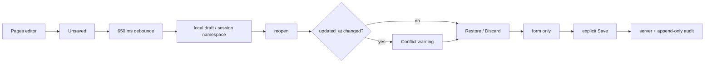

# BRVTAL — Último deploy

> Snapshot de **solo el deploy actual** para #708: drafts recuperables de Pages sobre el motor reusable de #528. No declara producción GREEN.

## Progress convention
- ✅ ~~Struck through~~ = completed and verified through required gates.
- 🚧 Normal text = pending/in progress.
- 🚧 = active production blocker.

## Estado del deploy
| Señal | Estado | Evidencia |
| --- | --- | --- |
| Work line | 🚧 **#708 · Pages recoverable drafts** | `work/issue-708` · reserva `2424a705-12b9-4063-94da-1227c8be848a` |
| Base | ✅ **main** | `5c8ba6ffec18bae1846fdbbf6dbd9b60d2397542` |
| Versión | 🚧 **v0.1.67** | `config/version.php` + `package.json` |
| PR | 🚧 **#710** | exact-head gates obligatorios |
| Producción | 🚧 **NO GREEN · #681** | deployment exacto; `/api/health.php` sigue 503 |
| Continuidad | ✅ **#709** | Events / Artists / Sets / Releases + evaluación Hero/Theme |

## Huella del cambio
<!-- brvtal:git-delta -->
| Archivos | Inserciones | Eliminaciones | Neto |
| ---: | ---: | ---: | ---: |
| **12** | **+663** | **−43** | **+620** |

## Calidad y entrega
<!-- brvtal:gate-plan -->
| Control | Estado / contrato |
| --- | --- |
| Gates | **preflight · coordination · fast[PHP+JS] · database · chromium · real-stack · webkit** |
| Factory | Policy · Privacy · Labels |
| Snapshot | PR + snapshot exacto |
| Main | CI del SHA exacto de main |
| Review | Sonar + CodeRabbit |
| Seguridad | localStorage same-origin por sesión; sin endpoint, proveedor, permiso ni migración nuevos |
| Producción | #681 permanece fuera de alcance; no se declara GREEN |

## Flujo de entrega

## Qué se hizo
- Nuevo `legacy-editor-drafts.js`: adaptador reusable para editores legacy sobre `editor-drafts.js`.
- Primer consumidor: **Pages**; Events/Artists/Sets/Releases quedan explícitamente en #709.
- Autosave local con debounce; el adaptador no hace fetch/POST/PUT ni publica.
- Estados accesibles: Unsaved, Saving, Draft saved, Save failed y Saved to server.
- Reopen ofrece Restore/Discard y usa `updated_at` para advertir conflicto.
- Save exitoso limpia el draft solo si el formulario sigue igual al payload enviado.
- Ediciones hechas durante un Save en vuelo permanecen en el editor y se conservan como draft.
- Fallo HTTP conserva recovery cuando storage funciona; storage degradado no promete una copia inexistente.
- Expiración de sesión y logout explícito purgan drafts locales.
- Version History y auditoría server-side permanecen como autoridad; sin segunda historia.
- #709 preserva el rollout restante sin inflar esta PR.

## Archivos modificados en este deploy
- `discadmin/legacy-editor-drafts.js`
- `discadmin/legacy-editor-drafts.css`
- `discadmin/admin-modules.js`
- `discadmin/admin-reliability.js`
- `discadmin/editor-drafts.js`
- `discadmin/index-core.php`
- `discadmin/index.php`
- `tests/e2e/discadmin-page-drafts.spec.mjs`
- `tests/legacy-editor-drafts-contract.php`
- `config/version.php`
- `package.json`
- `README.md`

## Validación
- E2E: Pages debounce + reload/Restore.
- E2E: conflicto por revisión `updated_at`.
- E2E: Save en vuelo conserva ediciones posteriores.
- E2E: storage degradado conserva input y mensaje honesto.
- E2E: expiración de sesión invalida writes en vuelo; el logout real del shell purga recovery local.
- Contract/E2E: shell/cableado, no-network autosave, logout real, invalidación de writes en vuelo y hidden UI.
- No cambia `datos.yml`: no añade dato personal, proveedor ni transferencia a tercero.
- Sin SQL, migración, Hostinger write ni cambios de readiness.
- 🚧 Gates exact-head deben cerrar antes de merge.

## Qué sigue
| Lane | Trabajo |
| --- | --- |
| **NOW** | 🚧 [#708](https://github.com/pl0n3r/brvtal/issues/708): integrar adaptador legacy + Pages. |
| **NEXT** | 🚧 [#709](https://github.com/pl0n3r/brvtal/issues/709): Events / Artists / Sets / Releases + evaluación Hero/Theme. |
| **LATER** | 🚧 [#533](https://github.com/pl0n3r/brvtal/issues/533): roadmap canónico. |
| **BLOCKED / EXTERNAL** | 🚧 [#681](https://github.com/pl0n3r/brvtal/issues/681): migration registry parity / producción NO GREEN. |
| **BLOCKED BY #681** | 🚧 #530: Recycle Bin requiere metadata durable/migración segura. |

## Panorama general pendiente
- 🚧 **NOW**: #708 / v0.1.67.
- 🚧 **NEXT**: #709 tras exact-main del fundamento legacy.
- 🚧 **LATER**: continuar #533 según prioridad real.
- 🚧 **BLOCKED / EXTERNAL**: #681 conserva recovery productivo fail-closed; #530 no añade migraciones hasta recuperar registry.
