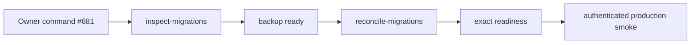

# BRVTAL — Último deploy

  
  
  

> Snapshot de **solo el deploy actual**: recuperación operacional de #681. Expone en GitHub Actions la reconciliación Hostinger/DB ya implementada en `ops/factory/transport.py`; no añade SQL ni otro transporte y no cambia la versión de producto v0.1.58.

## Progress convention

- ✅ ~~Struck through~~ = completed and verified through the required delivery gates.
- 🚧 Normal text = pending or currently in progress.
- ⛔ = active production blocker.

## Estado del deploy

| Señal | Estado | Evidencia |
| --- | --- | --- |
| Work line | 🚧 **#681 · migration registry parity** | `work/issue-681`; reservation `1acc1796-9048-4b25-abce-fba905c90964` |
| Base exacta | ✅ **main v0.1.58** | `d183b748918f47b25bc7146b33cc952b49194c05` |
| Versión de producto | ✅ **v0.1.58 sin cambio** | workflow operacional repository-only |
| Producción | ⛔ **health 503** | smoke autenticado falla antes del login |
| Recuperación | 🚧 **owner-only / fail-closed** | inspect → backup → reconcile → readiness → smoke |

## Huella del cambio

<!-- brvtal:git-delta -->

| Archivos | Inserciones | Eliminaciones | Neto |
| ---: | ---: | ---: | ---: |
| **3** | **+0** | **−0** | **+0** |

## Calidad y entrega

<!-- brvtal:gate-plan -->

| Control | Estado / contrato |
| --- | --- |
| Gates esperados | **preflight · coordination · fast[docs-only]** |
| PR + snapshot exacto | **Issue #681 · recovery workflow** |
| Roles | **Infrastructure · SRE · Security · QA** |
| Trust boundary | comando exacto del dueño; secretos solo server-side; transporte SSH existente |
| Permisos | contents: read; actions: write solo para disparar el smoke posterior |
| Review | BRVTAL CI + Factory Policy + Privacy + Sonar/CodeQL/CodeRabbit |
| CI del SHA exacto de main | 🚧 después del merge |
| Production GREEN | 🚧 solo después de health 200 + smoke autenticado |

## Flujo de entrega

## Qué se hizo

- Añade un workflow operacional con comando exacto `/reconcile-production-migrations` restringido al dueño y al Issue #681.
- Hace checkout explícito de `main` y resuelve SHA/versión exactos antes de tocar producción.
- Reutiliza `transport.py inspect-migrations` para inspección acotada y `reconcile-migrations` para backup + escritura del registry + `verify-plan __NONE__` + readiness.
- No expone secretos ni filas de aplicación; el resumen solo contiene conteos y booleanos estructurales saneados.
- Tras éxito dispara el smoke autenticado existente; no duplica pruebas ni credenciales.
- No cambia producto, versión, DNS, cutover Factory ni lógica SQL.

## Archivos modificados en este deploy

- `.github/workflows/production-migration-reconcile.yml` — ejecución owner-only de la recuperación ya implementada.
- `README.md` — snapshot exacto del incidente.
- `tests/test_production_migration_reconcile_workflow.py` — contrato de trigger, permisos y transporte.

## Validación

- 🚧 Contrato Python del workflow.
- 🚧 BRVTAL CI / validate sobre HEAD estable.
- 🚧 Factory Policy, Privacy, Sonar/CodeQL y CodeRabbit.
- 🚧 Tras merge: comando de reconciliación, health exacto y smoke autenticado.
- No se declara #681 resuelto ni producción GREEN antes de esa evidencia.

## Qué sigue

| Lane | Trabajo |
| --- | --- |
| **NOW** | 🚧 [#681](https://github.com/pl0n3r/brvtal/issues/681): ejecutar reconciliación productiva con backup y recuperar GREEN. |
| **NEXT** | 🚧 [#630](https://github.com/pl0n3r/brvtal/issues/630): continuar adopción Factory v1 tras recuperar producción. |
| **LATER** | 🚧 [#533](https://github.com/pl0n3r/brvtal/issues/533): roadmap normal después de TANDA 2. |
| **BLOCKED / EXTERNAL** | 🚧 Ninguno nuevo; el transporte usa secretos ya contratados por BRVTAL. |

## Panorama general pendiente

- 🚧 **NOW:** #681 health 503 / migration registry parity.
- 🚧 **NEXT:** #630 adopción Factory v1.
- 🚧 **LATER:** #533 desarrollo normal.
- 🚧 **BLOCKED / EXTERNAL:** ninguno adicional para esta recuperación.
