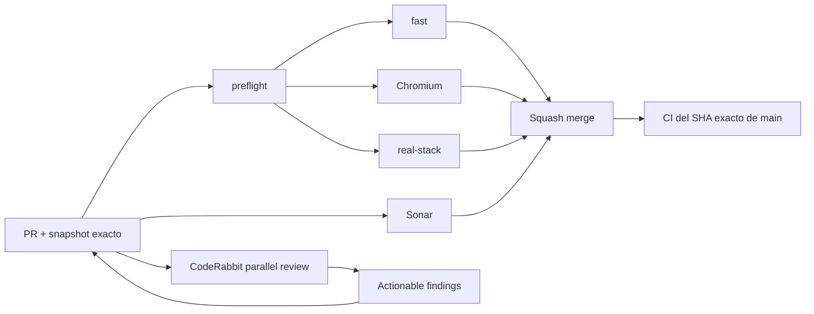

# BRVTAL — Último deploy

  
  
  

> **Development dashboard** · snapshot profesional de **solo el deploy actual**.

## Progress convention

- ✅ ~~Struck through~~ = completed and verified through the required delivery gates.
- 🚧 Normal text = pending or currently in progress.
- Completed roadmap items remain visible and crossed out.

## Estado del deploy

| Señal | Estado | Evidencia |
| --- | --- | --- |
| Work line | 🚧 **#348 ADMIN INFORMATION ARCHITECTURE** | task-based sidebar + Settings entry points |
| Base exacta | ✅ **VALIDATED IN CODE** | `main` `d7433b77786f06b67a2f6cf5edb5d6c0d268ad49` · exact-main `validate` verde |
| Version | 🚧 **0.1.3 → 0.1.4** | patch deploy bump · pre-1.0 |
| Producción | ⛔ **BLOCKED / EXTERNAL** | Hostinger marker tracked in [#534](https://github.com/pl0n3r/brvtal/issues/534) |

## Huella del cambio

<!-- brvtal:git-delta -->

| Archivos | Inserciones | Eliminaciones | Neto |
| ---: | ---: | ---: | ---: |
| **20** | **+546** | **−162** | **+384** |

## Calidad y entrega

<!-- brvtal:gate-plan -->

| Control | Estado / contrato |
| --- | --- |
| Gates seleccionados | **preflight · fast[PHP+JS] · chromium · real-stack** |
| Browser | IA, Settings y Global Search con Playwright |
| Real-stack | seleccionado por cambio en shell PHP |
| Sonar | Clean-as-You-Code en paralelo |
| CodeRabbit | full review del head estable en paralelo · findings accionables se corrigen; un reviewer externo estancado no bloquea indefinidamente según AGENTS |
| Exact-main | **CI del SHA exacto de main** obligatorio tras squash merge |

## Flujo de entrega

## Qué se hizo

- Reorganiza DISCADMIN en **SITE / EDITORIAL** y **CONFIGURATION / TECHNICAL**.
- Renombra Hero Slider a **Banners** y lo coloca inmediatamente después de Dashboard.
- Ordena Dashboard, Banners, Events, Artists, Releases, Sets, Media, Pages y Blog.
- Mantiene Memories como subflujo visual de Media, sin crear un tercer grupo.
- Theme Studio y Security / 2FA salen del top-level y se abren desde Settings junto a System Status.
- Añade **Global Search** persistente en el sidebar inmediatamente arriba de Logout reutilizando el mismo buscador.
- Elimina el badge ambiguo **ONLINE** del header y el bloque **CONTROL PLANE** de Settings.
- Conserva rutas profundas/Back/Forward y marca Settings activo en Theme Studio o Security.
- Actualiza contexto canónico, elimina la taxonomía antigua del sidebar y mantiene CodeRabbit como revisión paralela no bloqueante cuando queda estancado sin findings accionables.
- Actualiza versión a **0.1.4**.

## Archivos modificados en este deploy

- `AGENTS.md`
- `README.md`
- `config/version.php`
- `discadmin/admin-information-architecture.css`
- `discadmin/admin-information-architecture.js`
- `discadmin/global-search.js`
- `discadmin/hero-slider.js`
- `discadmin/index-core.php`
- `discadmin/memories.js`
- `discadmin/settings-v2.css`
- `discadmin/settings-v2.js`
- `tests/discadmin-quick-wins-contract.php`
- `tests/e2e/discadmin-global-search.spec.mjs`
- `tests/e2e/discadmin-hero-slider-security.spec.mjs`
- `tests/e2e/discadmin-information-architecture.spec.mjs`
- `tests/e2e/discadmin-settings-v2.spec.mjs`
- `tests/e2e/discadmin-trigger-order.spec.mjs`
- `tests/global-search-contract.php`
- `tests/settings-control-plane-contract.php`
- `tests/sonar-dom-before-quick-wins-contract.php`

## Validación

- IA browser contract valida los dos grupos, destinos ocultos y orden visible exacto.
- Global Search valida entrada superior + lateral antes de Logout.
- Settings valida accesos Theme Studio / Security / System Status, fallback de System Status y ausencia de Control Plane.
- Memories queda inmediatamente después de Media y conserva un único estado activo entre Media/Memories.
- Banners renderiza preview y errores con DOM seguro; contenido editorial con apariencia HTML permanece texto y no ejecuta nodos.
- Contratos PHP validan shell, buscador y Settings.
- Los gates finales del PR deben quedar verdes antes de merge.
- No hay migración ni operación destructiva de producción.

## Qué sigue

| Lane | Trabajo |
| --- | --- |
| **NOW** | 🚧 [#348](https://github.com/pl0n3r/brvtal/issues/348) · cerrar gates y exact-main. |
| **NEXT** | 🚧 [#149](https://github.com/pl0n3r/brvtal/issues/149) + [#514](https://github.com/pl0n3r/brvtal/issues/514) · apariencia coherente y Admin premium/legible. |
| **NEXT** | 🚧 [#516](https://github.com/pl0n3r/brvtal/issues/516) · consolidación profunda de Settings / 2FA / Advanced. |
| **BLOCKED / EXTERNAL** | 🚧 [#534](https://github.com/pl0n3r/brvtal/issues/534) · Hostinger Git auto-deploy marker. |
| **LATER** | 🚧 [#519](https://github.com/pl0n3r/brvtal/issues/519), [#518](https://github.com/pl0n3r/brvtal/issues/518), [#525](https://github.com/pl0n3r/brvtal/issues/525), [#513](https://github.com/pl0n3r/brvtal/issues/513). |

## Panorama general pendiente

| Lane | Frente | Issues |
| --- | --- | --- |
| **DONE** | ✅ ~~Phase 1 quick wins~~ | ✅ ~~[#527](https://github.com/pl0n3r/brvtal/issues/527), [#520](https://github.com/pl0n3r/brvtal/issues/520), [#521](https://github.com/pl0n3r/brvtal/issues/521), [#526](https://github.com/pl0n3r/brvtal/issues/526), [#522](https://github.com/pl0n3r/brvtal/issues/522), [#479](https://github.com/pl0n3r/brvtal/issues/479), [#517](https://github.com/pl0n3r/brvtal/issues/517), [#221](https://github.com/pl0n3r/brvtal/issues/221)~~ |
| **NOW** | 🚧 Admin IA | 🚧 [#348](https://github.com/pl0n3r/brvtal/issues/348) |
| **NEXT** | 🚧 Appearance / premium UX | 🚧 [#149](https://github.com/pl0n3r/brvtal/issues/149), [#514](https://github.com/pl0n3r/brvtal/issues/514) |
| **NEXT** | 🚧 Admin shell/settings | 🚧 [#516](https://github.com/pl0n3r/brvtal/issues/516), [#523](https://github.com/pl0n3r/brvtal/issues/523), [#193](https://github.com/pl0n3r/brvtal/issues/193), [#216](https://github.com/pl0n3r/brvtal/issues/216) |
| **LATER** | 🚧 Editorial productivity | 🚧 [#519](https://github.com/pl0n3r/brvtal/issues/519), [#518](https://github.com/pl0n3r/brvtal/issues/518), [#525](https://github.com/pl0n3r/brvtal/issues/525), [#528](https://github.com/pl0n3r/brvtal/issues/528) |
| **BLOCKED / EXTERNAL** | 🚧 Deploy observation | 🚧 [#534](https://github.com/pl0n3r/brvtal/issues/534) |
