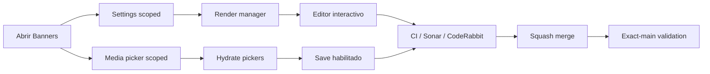

# BRVTAL — Último deploy

  
  
  

> **Development dashboard** · snapshot profesional de **solo el deploy actual**.

## Progress convention

- ✅ ~~Struck through~~ = completed and verified through the required delivery gates.
- 🚧 Normal text = pending or currently in progress.
- Completed roadmap items remain visible and crossed out.

## Estado del deploy

| Señal | Estado | Evidencia |
| --- | --- | --- |
| Work line | 🚧 **#523 BANNERS FIRST LOAD** | payloads acotados + render progresivo |
| Base exacta | ✅ **VALIDATED IN CODE** | `main` `1480380280a10cd9252a978b78b78cf44c1f2873` · #555 exact-main BRVTAL CI + Sonar verdes |
| Version | 🚧 **0.1.9 → 0.1.10** | patch deploy · pre-1.0 |
| Producción | ⛔ **BLOCKED / EXTERNAL** | Hostinger marker tracked separately in [#534](https://github.com/pl0n3r/brvtal/issues/534) |

## Huella del cambio

<!-- brvtal:git-delta -->

| Archivos | Inserciones | Eliminaciones | Neto |
| ---: | ---: | ---: | ---: |
| **9** | **+454** | **−57** | **+397** |

## Calidad y entrega

<!-- brvtal:gate-plan -->

| Control | Estado / contrato |
| --- | --- |
| Gates seleccionados | **preflight · fast[PHP+JS] · database · chromium · real-stack · webkit-totp** |
| API | Settings devuelve solo la key pedida; Media hero-picker devuelve solo `id/type/title/file_path/status` para image/video |
| Browser | el manager aparece desde Settings sin esperar Media; pickers/Save permanecen seguros hasta hidratación |
| Real stack | usuario E2E autenticado comprueba endpoints acotados + montaje real de Banners |
| Sonar + CodeRabbit | se ejecutan en paralelo sobre el head estable |
| Exact-main | BRVTAL CI + Sonar del SHA exacto tras squash merge |

## Flujo de entrega

## Qué se hizo

- Reemplaza la carga completa de Settings por una lectura preparada de `home.hero.slider`.
- Añade una vista autenticada ligera de Media para Banners con solo imágenes/videos y cinco campos necesarios.
- Mantiene ambas lecturas independientes, pero el editor ya no espera Media para mostrarse.
- Mientras Media sigue cargando, los pickers y Save permanecen deshabilitados; no se valida contra un registro parcial.
- Las respuestas tardías de una navegación anterior se descartan para que no hidraten una vista Banners más nueva.
- Conserva la hidratación segura con DOM APIs introducida por #553/#555.
- Añade contrato puro del plan de lectura, regresión browser de carga progresiva y verificación real-stack con el admin E2E aislado.
- Formaliza al agente como **principal software engineer + technical executor**, con roles complementarios de arquitectura/producto, UX/UI, dirección visual, QA, AppSec, performance/reliability y DevOps/release.
- Sube la versión humana a **0.1.10**.

## Archivos modificados en este deploy

- `AGENTS.md` — reglas durables de carga Banners + rol operativo principal/cross-functional (arquitectura, UX/UI, dirección visual, QA, AppSec, performance y delivery).
- `README.md` — dashboard exacto de #523.
- `api/admin-read-plan.php` — planes autenticados de lectura reducida con allowlist estricta para Settings/Media.
- `api/index.php` — aplica los planes antes de las colecciones legacy.
- `config/version.php` — versión humana 0.1.10.
- `discadmin/hero-slider.js` — bootstrap acotado, render temprano e hidratación Media asíncrona segura.
- `tests/admin-read-plan-contract.php` — invariantes del payload reducido, allowlist y variantes case-insensitive.
- `tests/e2e/discadmin-hero-slider-security.spec.mjs` — carga progresiva + seguridad del picker.
- `tests/e2e/hero-slider-integrity-real-stack.spec.mjs` — usuario E2E real-stack valida endpoints acotados y montaje.

## Validación

- El contrato browser simula Settings rápido y Media lento: Banners debe quedar visible con Media aún pendiente y habilitar Save solo después.
- El plan scoped de Settings mantiene bloqueada `security.totp_encryption_key`.
- El read scoped queda allowlisted a `home.hero.slider`; keys desconocidas, variantes de mayúsculas/minúsculas y variantes del secreto fallan antes de ejecutar SQL.
- El view `hero-picker` excluye audio/documentos y no usa `SELECT *`.
- Las colecciones legacy siguen disponibles cuando no se pide un view/key optimizado.
- No hay migración, SQL destructivo ni cambio de datos de producción.

## Qué sigue

| Lane | Trabajo |
| --- | --- |
| **NOW** | 🚧 [#523](https://github.com/pl0n3r/brvtal/issues/523) · pasar gates, mergear y validar exact-main. |
| **NEXT** | 🚧 [#480](https://github.com/pl0n3r/brvtal/issues/480) · corregir clipping/overlap del hero desktop. |
| **LATER** | 🚧 [#193](https://github.com/pl0n3r/brvtal/issues/193), [#216](https://github.com/pl0n3r/brvtal/issues/216) · cerrar Phase 2. |
| **BLOCKED / EXTERNAL** | 🚧 [#534](https://github.com/pl0n3r/brvtal/issues/534) · Hostinger Git auto-deploy marker. |

## Panorama general pendiente

| Lane | Frente | Issues |
| --- | --- | --- |
| **DONE** | ✅ ~~Phase 1 + Admin IA + Appearance + Premium Admin + Settings + Security hotfix~~ | ✅ ~~[#527](https://github.com/pl0n3r/brvtal/issues/527), [#520](https://github.com/pl0n3r/brvtal/issues/520), [#521](https://github.com/pl0n3r/brvtal/issues/521), [#526](https://github.com/pl0n3r/brvtal/issues/526), [#522](https://github.com/pl0n3r/brvtal/issues/522), [#479](https://github.com/pl0n3r/brvtal/issues/479), [#517](https://github.com/pl0n3r/brvtal/issues/517), [#221](https://github.com/pl0n3r/brvtal/issues/221), [#348](https://github.com/pl0n3r/brvtal/issues/348), [#149](https://github.com/pl0n3r/brvtal/issues/149), [#514](https://github.com/pl0n3r/brvtal/issues/514), [#516](https://github.com/pl0n3r/brvtal/issues/516), [#553](https://github.com/pl0n3r/brvtal/issues/553)~~ |
| **NOW** | 🚧 Phase 2 closeout | 🚧 [#523](https://github.com/pl0n3r/brvtal/issues/523), [#480](https://github.com/pl0n3r/brvtal/issues/480), [#193](https://github.com/pl0n3r/brvtal/issues/193), [#216](https://github.com/pl0n3r/brvtal/issues/216) |
| **LATER** | 🚧 Editorial productivity | 🚧 [#519](https://github.com/pl0n3r/brvtal/issues/519), [#518](https://github.com/pl0n3r/brvtal/issues/518), [#257](https://github.com/pl0n3r/brvtal/issues/257), [#525](https://github.com/pl0n3r/brvtal/issues/525), [#524](https://github.com/pl0n3r/brvtal/issues/524), [#528](https://github.com/pl0n3r/brvtal/issues/528), [#529](https://github.com/pl0n3r/brvtal/issues/529) |
| **LATER** | 🚧 Operational dashboards | 🚧 [#513](https://github.com/pl0n3r/brvtal/issues/513), [#515](https://github.com/pl0n3r/brvtal/issues/515), [#532](https://github.com/pl0n3r/brvtal/issues/532) |
| **BLOCKED / EXTERNAL** | 🚧 Deploy observation | 🚧 [#534](https://github.com/pl0n3r/brvtal/issues/534) |
