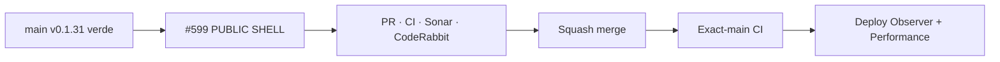

# BRVTAL — Último deploy

  
  
  

> **Development dashboard** · snapshot de **solo el deploy actual** para Issue #599.

## Progress convention

- ✅ ~~Struck through~~ = completed and verified through the required delivery gates.
- 🚧 Normal text = pending or currently in progress.

## Estado del deploy

| Señal | Estado | Evidencia |
| --- | --- | --- |
| Work line | 🚧 **#599 · Concept 05 public shell authored 1440/390** | parent #583 |
| Base exacta | ✅ ~~main v0.1.31 validado + deploy/performance observados~~ | `546ae7efbdd78d44425abd8ae4e6bd8884437c83` |
| Versión | 🚧 **0.1.32** | cambio visible de shell/runtime público |
| Producción | 🚧 pendiente de PR → merge → exact-main | sin migración de esquema |

## Huella del cambio

<!-- brvtal:git-delta -->

| Archivos | Inserciones | Eliminaciones | Neto |
| ---: | ---: | ---: | ---: |
| **13** | **+801** | **−69** | **732** |

## Calidad y entrega

<!-- brvtal:gate-plan -->

| Control | Estado / contrato |
| --- | --- |
| Gates | **preflight · coordination · fast[PHP+JS] · database · chromium · real-stack · webkit** |
| PR integrity | **PR + snapshot exacto** · Issue #599 · `work/issue-599` |
| Browser | 🚧 header 1440/1024 · mobile 390 · active state · modal lock · footer/legal · Contact · reduced motion |
| Sonar | 🚧 Quality Gate sobre head estable |
| CodeRabbit | 🚧 review final sobre head estable |
| Exact-main | 🚧 **CI del SHA exacto de main** después del squash merge |

## Flujo de entrega

## Qué se hizo

- Header Concept 05 queda como una barra editorial compacta con BRVTAL, NIGHTS / ARTISTS / SOUND / RECORDS / JOURNAL / CONNECTED y origen `PEREIRA / COLOMBIA`.
- El CTA rojo **TICKETS →** solo aparece cuando el Next Experience ya seleccionado expone un destino HTTP(S) canónico; no se hace un segundo lookup ni un segundo fetch.
- El contador/escena legacy del header se neutraliza en Concept 05 para evitar una sexta columna implícita y colisiones.
- El overlay MENU deja la IA legacy y usa el vocabulario público Concept 05, conservando el mismo modal/focus trap/scroll lock accesible.
- Mobile bottom nav mantiene NIGHTS / ARTISTS / SOUND / RECORDS / JOURNAL con icono + label, targets >=44 px, active state por sección/hash y safe-area.
- Cuando el menú modal está abierto, el bottom nav queda oculto, `aria-hidden` e `inert`; vuelve a estar disponible al cerrar.
- Footer se convierte en un cierre editorial con wordmark grande, origen, tagline administrable, destinos reales, CONTACT/COLLABORATE → `/contact`, sociales configurables y copyright dinámico.
- Socials arrancan ocultos y reutilizan los hooks `data-social` existentes; Instagram/SoundCloud/YouTube/Website siguen a `settings.social` y Spotify a Theme Branding Sync.
- PRIVACY aparece únicamente si el payload público compartido contiene una Page publicada con slug compatible; en caso contrario permanece fail-closed.
- El runtime del shell reutiliza `BRVTALPublicDataPromise`; no crea requests, rutas, CMS ni estado paralelo.

## Archivos modificados en este deploy

- `README.md` — snapshot exacto del deploy y gates.
- `config/public_home.php` — header/menu/footer authored + Tickets CTA canónico.
- `config/version.php` — versión pública 0.1.32.
- `css/public-concept05-shell.css` — geometría authored desktop/mobile del shell.
- `index.php` — elimina rewrites legacy ya absorbidos por el renderer canónico.
- `js/public-concept05-shell.js` — active navigation, modal interlock, privacy Page y year.
- `package.json` — sincronización de versión 0.1.32.
- `tests/e2e/public-concept05-shell.spec.mjs` — 1440/1024/390, modal lock, privacy y reduced motion.
- `tests/public-contact-contract.php` — valida `/contact` contra los renderers Concept 05 en lugar del rewrite legacy eliminado.
- `tests/public-concept05-dressing-contract.php` — contrato de menú/footer/mobile nav e idempotencia.
- `tests/public-concept05-foundation-contract.php` — carga/idempotencia de assets del shell.
- `tests/public-home-contract.php` — Next Experience → overlay/header Tickets.
- `tests/public-home-phase-a-contract.php` — Tickets válido/unsafe/sold-out también en header.

## Validación

- Base exacta `546ae7efbdd78d44425abd8ae4e6bd8884437c83`: BRVTAL CI/`validate`, Sonar, Deploy Observer y Production Performance verdes antes de iniciar #599.
- #599 fue reservado atómicamente antes de modificar `work/issue-599`.
- #596/#598 ya está integrado en la base v0.1.31; #599 parte de ese exact-main y no duplica esa entrega.
- CI del head previo detectó dos regresiones de prueba: el contrato Contact seguía atado al rewrite legacy y la geometría 1024 medía un origin intencionalmente oculto; ambos contratos se corrigieron sin reintroducir código legacy.
- No hay nuevo fetch público, migraciones, nuevas rutas ni campos CMS.
- Producción se observará por separado; CI verde no se presentará como prueba de deploy.

## Qué sigue

| Lane | Trabajo |
| --- | --- |
| **NOW** | 🚧 [#599](https://github.com/pl0n3r/brvtal/issues/599) · cerrar public shell y validar exact-main. |
| **NEXT** | 🚧 [#583](https://github.com/pl0n3r/brvtal/issues/583) · evaluar cierre del contrato público y pendientes reales de fidelidad. |
| **LATER** | 🚧 [#351](https://github.com/pl0n3r/brvtal/issues/351) Theme Studio + [#529](https://github.com/pl0n3r/brvtal/issues/529) Preview; luego #398. |
| **BLOCKED / EXTERNAL** | — |

## Panorama general pendiente

| Lane | Frente | Issues |
| --- | --- | --- |
| **NOW** | 🚧 Concept 05 public shell | 🚧 [#599](https://github.com/pl0n3r/brvtal/issues/599) |
| **NEXT** | 🚧 Concept 05 public fidelity | 🚧 [#583](https://github.com/pl0n3r/brvtal/issues/583) |
| **LATER** | 🚧 customization / preview / cultural archive | 🚧 [#351](https://github.com/pl0n3r/brvtal/issues/351), [#529](https://github.com/pl0n3r/brvtal/issues/529), [#398](https://github.com/pl0n3r/brvtal/issues/398) |
