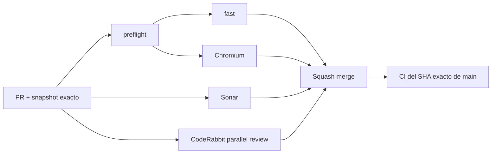

# BRVTAL — Último deploy

  
  
  

> **Development dashboard** · snapshot profesional de **solo el deploy actual**.

## Progress convention

- ✅ ~~Struck through~~ = completed and verified through the required delivery gates.
- 🚧 Normal text = pending or currently in progress.
- Completed roadmap items remain visible and crossed out.

## Estado del deploy

| Señal | Estado | Evidencia |
| --- | --- | --- |
| Work line | 🚧 **#149 ADMIN APPEARANCE** | Dark / Light / Glass coherentes + login |
| Base exacta | ✅ **VALIDATED IN CODE** | `main` `b7ece8293ad6695b3fbaf86f3a14c018fc08b77b` · exact-main `validate` verde |
| Version | 🚧 **0.1.4 → 0.1.5** | patch deploy bump · pre-1.0 |
| Producción | ⛔ **BLOCKED / EXTERNAL** | Hostinger marker tracked in [#534](https://github.com/pl0n3r/brvtal/issues/534) |

## Huella del cambio

<!-- brvtal:git-delta -->

| Archivos | Inserciones | Eliminaciones | Neto |
| ---: | ---: | ---: | ---: |
| **6** | **+619** | **−96** | **+523** |

## Calidad y entrega

<!-- brvtal:gate-plan -->

| Control | Estado / contrato |
| --- | --- |
| Gates seleccionados | **preflight · fast[JS] · chromium** |
| Browser | selector, persistencia, login, Light moderno y Glass |
| Sonar | Clean-as-You-Code en paralelo |
| CodeRabbit | full review del head estable en paralelo |
| Exact-main | **CI del SHA exacto de main** obligatorio tras squash merge |

## Flujo de entrega

## Qué se hizo

- Centraliza superficies, texto, bordes, inputs, hover, overlays y sombras en tokens semánticos de apariencia.
- Completa Light para Settings, System Status, Content Health, Admin Activity, SEO y Global Search.
- Refuerza Glass con material translúcido, blur, highlights/bordes y fondo multicapa.
- Lleva el selector Dark / Light / Glass al login y conserva la preferencia al hacer Logout/volver a entrar.
- Corrige el selector para que solo trate botones como controles y no marque accidentalmente el elemento `html`.
- Mantiene el bootstrap temprano existente para minimizar el flash a Dark.
- Incrementa BRVTAL a **0.1.5**.

## Archivos modificados en este deploy

- `AGENTS.md`
- `README.md`
- `config/version.php`
- `discadmin/admin-appearance.css`
- `discadmin/admin-appearance.js`
- `tests/e2e/admin-appearance.spec.mjs`

## Validación

- Playwright valida selector lateral, persistencia, teclado/touch y cambio de modo.
- Playwright valida que Light alcance Dashboard, Settings, System Status, Content Health, Admin Activity, SEO y Global Search.
- Playwright valida material Glass translúcido con blur.
- Playwright valida selector pre-auth y persistencia al reemplazar el shell por login.
- No hay migración ni operación destructiva de producción.

## Qué sigue

| Lane | Trabajo |
| --- | --- |
| **NOW** | 🚧 [#149](https://github.com/pl0n3r/brvtal/issues/149) · cerrar gates y exact-main. |
| **NEXT** | 🚧 [#514](https://github.com/pl0n3r/brvtal/issues/514) · tipografía/espaciado y sistema visual premium de baja fatiga. |
| **NEXT** | 🚧 [#516](https://github.com/pl0n3r/brvtal/issues/516) · Settings Advanced + consolidación 2FA. |
| **BLOCKED / EXTERNAL** | 🚧 [#534](https://github.com/pl0n3r/brvtal/issues/534) · Hostinger Git auto-deploy marker. |

## Panorama general pendiente

| Lane | Frente | Issues |
| --- | --- | --- |
| **DONE** | ✅ ~~Phase 1 + Admin IA~~ | ✅ ~~[#527](https://github.com/pl0n3r/brvtal/issues/527), [#520](https://github.com/pl0n3r/brvtal/issues/520), [#521](https://github.com/pl0n3r/brvtal/issues/521), [#526](https://github.com/pl0n3r/brvtal/issues/526), [#522](https://github.com/pl0n3r/brvtal/issues/522), [#479](https://github.com/pl0n3r/brvtal/issues/479), [#517](https://github.com/pl0n3r/brvtal/issues/517), [#221](https://github.com/pl0n3r/brvtal/issues/221), [#348](https://github.com/pl0n3r/brvtal/issues/348)~~ |
| **NOW** | 🚧 Appearance | 🚧 [#149](https://github.com/pl0n3r/brvtal/issues/149) |
| **NEXT** | 🚧 Premium Admin / Settings | 🚧 [#514](https://github.com/pl0n3r/brvtal/issues/514), [#516](https://github.com/pl0n3r/brvtal/issues/516) |
| **NEXT** | 🚧 Shell reliability / perf | 🚧 [#523](https://github.com/pl0n3r/brvtal/issues/523), [#193](https://github.com/pl0n3r/brvtal/issues/193), [#216](https://github.com/pl0n3r/brvtal/issues/216) |
| **LATER** | 🚧 Editorial productivity | 🚧 [#519](https://github.com/pl0n3r/brvtal/issues/519), [#518](https://github.com/pl0n3r/brvtal/issues/518), [#525](https://github.com/pl0n3r/brvtal/issues/525), [#528](https://github.com/pl0n3r/brvtal/issues/528) |
| **BLOCKED / EXTERNAL** | 🚧 Deploy observation | 🚧 [#534](https://github.com/pl0n3r/brvtal/issues/534) |
