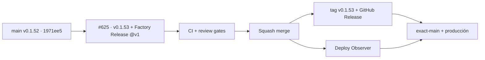

# BRVTAL — Último deploy

> Snapshot actual: #625 adopta `release.yml@v1` como único creador de tag/GitHub Release para cambios de versión. Base exacta `main 1971ee5a38e09d5e48634b517ee6ba3dab07c072` / v0.1.52; candidato deploy-bound **v0.1.53**.

## Estado del deploy

| Señal | Estado | Evidencia |
| --- | --- | --- |
| Work line | 🚧 **#625 · Factory Release v1** | `work/issue-625`; reserva `0b0f011d-1a58-4dc3-bcb6-2a982824cfb9` |
| Base exacta | ✅ **v0.1.52 GREEN** | `1971ee5a38e09d5e48634b517ee6ba3dab07c072`; BRVTAL CI + Deploy Observer success |
| Candidato | 🚧 **v0.1.53** | `config/version.php` + `package.json` sincronizados |
| Release Factory | 🚧 pendiente | solo `push main` cuando cambia `config/version.php` |
| Tags / Releases actuales | ✅ **ninguno** | el primer tag se crea después del merge |
| Producción | ✅ **v0.1.52 observada** | v0.1.53 se valida por separado después del merge |

## Huella del cambio

<!-- brvtal:git-delta -->

| Archivos | Inserciones | Eliminaciones | Neto |
| ---: | ---: | ---: | ---: |
| **5** | **+0** | **−0** | **+0** |

## Calidad y entrega

<!-- brvtal:gate-plan -->

| Control | Estado / contrato |
| --- | --- |
| Gates esperados | **preflight · coordination · fast[PHP+JS] · database · chromium · real-stack · webkit** |
| Factory Release | `release.yml@v1` · `php-const` · `BRVTAL_APP_VERSION` · solo `contents: write` |
| Trigger | `push` a `main` solo si cambia `config/version.php` |
| Existing gates | BRVTAL CI, Factory CI, Policy, Privacy, Sonar, CodeQL y CodeRabbit permanecen activos |

## Flujo

## Qué se hizo

- Añade `.github/workflows/factory-release.yml` como caller mínimo de `pl0n3r/factory/.github/workflows/release.yml@v1`.
- El caller no corre en mantenimiento repository-only: solo responde a cambios de `config/version.php` en `main`.
- Factory lee la versión sin ejecutar PHP con `version_format: php-const` y `version_key: BRVTAL_APP_VERSION`.
- El único permiso de escritura es `contents: write`, necesario para tag anotado y GitHub Release; no hay secretos ni refs dinámicas.
- Añade regresión contra triggers extra, dispatch manual, secretos, `kit_ref`, bootstrap y lógica local de `git tag`/`gh release`.
- Sincroniza el candidato a **v0.1.53** en PHP y `package.json`.
- `update-release-metadata.yml` sigue siendo BRVTAL CI; no crea tags ni Releases y no compite con Factory Release.

## Archivos modificados

- `.github/workflows/factory-release.yml`
- `README.md`
- `config/version.php`
- `package.json`
- `tests/factory-release-contract.php`

## Validación

- 🚧 BRVTAL CI debe validar la transición exacta v0.1.52 → v0.1.53 y la matriz seleccionada.
- 🚧 Factory CI, Factory Policy, Privacy, Sonar, CodeQL y CodeRabbit deben cerrar sobre el HEAD estable.
- 🚧 Tras merge: comprobar tag anotado `v0.1.53`, GitHub Release, exact-main CI, Deploy Observer y producción.

## Qué sigue

| Lane | Trabajo |
| --- | --- |
| **NOW** | 🚧 #625 — Factory Release v1 + primera evidencia real. |
| **NEXT** | 🚧 #627 — labels Factory sin `pull_request_target`. |
| **LATER** | 🚧 #624 — coordinación/carga GitHub y cierre por kit. |
| **EPIC** | 🚧 #630 — continuar TANDA 2 hacia deploy/rollback. |

## Panorama general pendiente

- 🚧 **NOW**: demostrar Release Factory con v0.1.53.
- 🚧 **NEXT**: adoptar gobierno de labels reusable.
- 🚧 **LATER**: coordinación, observación/deploy con rollback, métricas y prueba end-to-end.
- 🚧 **BLOCKED / EXTERNAL**: ninguna dependencia externa bloquea este slice.
