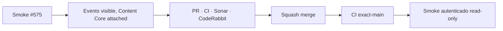

# BRVTAL — Último deploy

  
  
  

> **Development dashboard** · snapshot de **solo el deploy actual**. PR #576 corrige smoke E2E; sin cambios en el runtime del producto.

## Progress convention

- ✅ ~~Struck through~~ = completed and verified through the required delivery gates.
- 🚧 Normal text = pending or currently in progress.

## Estado del deploy

| Señal | Estado | Evidencia |
| --- | --- | --- |
| Work line | 🚧 **#575 · smoke autenticado Events** | Content Core interno, ninguna escritura productiva |
| Base exacta | ✅ ~~main v0.1.23~~ | `e8182922f1ee62fe7f9a9c158c995bb1a037b2cb` · PR #578 fusionado |
| Versión | ✅ ~~0.1.23 sin cambios~~ | Test/README no alteran runtime |
| Producción | 🚧 Smoke por comprobar | CI de código no prueba producción |

## Huella del cambio

<!-- brvtal:git-delta -->

| Archivos | Inserciones | Eliminaciones | Neto |
| ---: | ---: | ---: | ---: |
| **2** | **+56** | **−48** | **+8** |

## Calidad y entrega

<!-- brvtal:gate-plan -->

| Control | Estado / contrato |
| --- | --- |
| Gates | **preflight · coordination · fast[JS] · chromium** |
| Reserva | Issue #575 · `work/issue-575` · PR #576 |
| PR integrity | **PR + snapshot exacto** |
| Sonar / CodeRabbit | Revisar el head estable; espera de heading y wrapper corregida |
| Exact-main | **CI del SHA exacto de main** tras squash merge |

## Flujo de entrega

## Qué se hizo

- Smoke autenticado exige Events visible, heading y búsqueda, pero Content Core solo montado internamente.
- El wrapper interno debe existir antes de declararlo oculto; elemento ausente ya no cuenta como éxito.
- Se conservan comprobaciones de fecha de evento, relaciones de Set y Hero Slider, sin crear contenido ni mutar producción.
- Se incluye snapshot exacto de #575 con versión humana v0.1.23 para cambios exclusivos de pruebas.

## Archivos modificados en este deploy

- `README.md` — snapshot del smoke #575.
- `tests/e2e/production-authenticated-smoke.mjs` — comprobar Events/Content Core canónicos.

## Validación

- Base `e8182922f1ee62fe7f9a9c158c995bb1a037b2cb`; CI exact-main previa y CI del PR se verifican separadamente.
- Smoke productivo autenticado se ejecuta solo lectura tras la fusión, sin inferirlo de Chromium sintético.
- Sin migración SQL ni cambio del runtime productivo.

## Qué sigue

| Lane | Trabajo |
| --- | --- |
| **NOW** | 🚧 [#575](https://github.com/pl0n3r/brvtal/issues/575) / PR #576 · smoke Events. |
| **NEXT** | 🚧 [#257](https://github.com/pl0n3r/brvtal/issues/257) / PR #574 · cambios sin guardar y revisión. |
| **LATER** | 🚧 [#525](https://github.com/pl0n3r/brvtal/issues/525), [#524](https://github.com/pl0n3r/brvtal/issues/524), [#528](https://github.com/pl0n3r/brvtal/issues/528), [#529](https://github.com/pl0n3r/brvtal/issues/529). |
| **BLOCKED / EXTERNAL** | 🚧 Evidencia autenticada de Hostinger separada de CI. |

## Panorama general pendiente

| Lane | Frente | Issues |
| --- | --- | --- |
| **NOW** | 🚧 Smoke productivo | 🚧 [#575](https://github.com/pl0n3r/brvtal/issues/575) |
| **NEXT** | 🚧 Unsaved editor protection | 🚧 [#257](https://github.com/pl0n3r/brvtal/issues/257) |
| **LATER** | 🚧 Editor / colectivo / drafts / preview | 🚧 [#525](https://github.com/pl0n3r/brvtal/issues/525), [#524](https://github.com/pl0n3r/brvtal/issues/524), [#528](https://github.com/pl0n3r/brvtal/issues/528), [#529](https://github.com/pl0n3r/brvtal/issues/529) |
| **BLOCKED / EXTERNAL** | 🚧 Deploy y producción | Monitoreo independiente |
