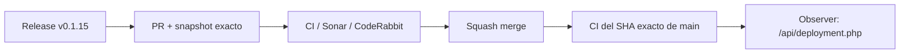

# BRVTAL — Último deploy

  
  
  

> **Development dashboard** · snapshot profesional de **solo el deploy actual**.

## Progress convention

- ✅ ~~Struck through~~ = completed and verified through the required delivery gates.
- 🚧 Normal text = pending or currently in progress.

## Estado del deploy

| Señal | Estado | Evidencia |
| --- | --- | --- |
| Work line | 🚧 **#216 Editor/modal navigation lifecycle (v0.1.15)** | retire legacy editor only after successful navigation |
| Base exacta | ✅ **VALIDATED IN CODE** | `main` `fcbf149cf525f1ab05f5ad040a9d1f9aacdaf49b` |
| Version | 🚧 **0.1.14 → 0.1.15** | patch deploy |
| Producción | 🚧 **PENDING MERGE / OBSERVATION** | release `v0.1.15` after squash merge |

## Huella del cambio

<!-- brvtal:git-delta -->

| Archivos | Inserciones | Eliminaciones | Neto |
| ---: | ---: | ---: | ---: |
| **6** | **+123** | **−34** | **+89** |

## Calidad y entrega

<!-- brvtal:gate-plan -->

| Control | Estado / contrato |
| --- | --- |
| Gates seleccionados | **preflight · fast[PHP+JS] · database · chromium · real-stack · webkit** |
| Modal lifecycle | success retires previous editor; failure/stale keeps current editor |
| Browser history | Back/Forward uses the same lifecycle boundary |
| Save safety | retired legacy editor loses editing marker + stale Save handler |
| Sonar + CodeRabbit | paralelo sobre head estable |
| Exact-main | CI del SHA exacto de main tras squash merge |

## Flujo de entrega

## Qué se hizo

- La navegación canónica retira el modal editorial heredado solo después de que el nuevo destino haya cargado correctamente.
- Un destino fallido o stale conserva el editor actual y su contexto, en línea con la navegación transaccional de #193.
- Al retirar el editor se limpian `state.editing` y el handler de Save para que no sobreviva una acción del módulo anterior.
- Back/Forward queda cubierto por la misma política.
- Playwright protege éxito, fallo y navegación histórica.
- `AGENTS.md` deja #193 como completado y #216 como frente activo.
- Versión **0.1.15**.

## Archivos modificados en este deploy

- `AGENTS.md`
- `README.md`
- `config/version.php`
- `discadmin/admin-information-architecture.js`
- `package.json`
- `tests/e2e/discadmin-information-architecture.spec.mjs`

## Validación

- Regresiones browser cubren cierre tras navegación exitosa, conservación ante fallo y cierre por Browser Back.
- No hay mutaciones de datos, SQL de producción ni migraciones.
- BRVTAL CI, Sonar y CodeRabbit deben cerrar sobre este único head estable antes del merge.
- No se declara producción validada desde CI.

## Qué sigue

| Lane | Trabajo |
| --- | --- |
| **NOW** | 🚧 [#216](https://github.com/pl0n3r/brvtal/issues/216) · cerrar lifecycle de editores durante navegación. |
| **NEXT** | 🚧 [#558](https://github.com/pl0n3r/brvtal/issues/558), [#174](https://github.com/pl0n3r/brvtal/issues/174) · deflake record navigation + proteger cambios de Banners. |
| **LATER** | 🚧 [#519](https://github.com/pl0n3r/brvtal/issues/519), [#518](https://github.com/pl0n3r/brvtal/issues/518), [#257](https://github.com/pl0n3r/brvtal/issues/257) · productividad editorial y protección general de editores. |
| **BLOCKED / EXTERNAL** | 🚧 [#534](https://github.com/pl0n3r/brvtal/issues/534) · Hostinger sigue sirviendo una release anterior; verificación hPanel separada. |

## Panorama general pendiente

| Lane | Frente | Issues |
| --- | --- | --- |
| **DONE** | ✅ ~~Navigation transaction~~ | ✅ ~~[#193](https://github.com/pl0n3r/brvtal/issues/193) · v0.1.14 / PR #561~~ |
| **NOW** | 🚧 Editor lifecycle | 🚧 [#216](https://github.com/pl0n3r/brvtal/issues/216) |
| **NEXT** | 🚧 Browser/navigation closeout | 🚧 [#558](https://github.com/pl0n3r/brvtal/issues/558), [#174](https://github.com/pl0n3r/brvtal/issues/174) |
| **LATER** | 🚧 Editorial productivity | 🚧 [#519](https://github.com/pl0n3r/brvtal/issues/519), [#518](https://github.com/pl0n3r/brvtal/issues/518), [#257](https://github.com/pl0n3r/brvtal/issues/257) |
| **BLOCKED / EXTERNAL** | 🚧 Hostinger deploy observation | 🚧 [#534](https://github.com/pl0n3r/brvtal/issues/534) |
